With the release of the new Eldar codex and Wraithknight, I have a major new challenge to face. Without only a single lose in the last 10+ solo games, for the first time in a long time I was rather unsure how the game would go. Apologies for the terrible photography and old fantasy scenery, you'll be glad to know there have been some significant upgrades in the last 2 years! Anyway, lets jump right in!

## Eldar

All have Ancient Doom (hate against Slaanesh) and all bar Wraiths and Dark Reapers have Battle Focus (run shoot run).

**HQs**

**Maugan Ra: 195  
**-Split fire, Hatred (Chaos Daemons), Eternal Warrior, Fearless, Fleet,  Relentless, Marksman’s Eye, Night vision, Fast Shot

**Farseer: 125  
**-Fleet, Psyker lvl3 (Doom, Shrouded/Reveal, Destructor/Renewer, Fortune)  
-Uldanorthi Long Rifle – R120″ Sx AP3 – Heavy, Sniper

**Warlock Council (3): 105  
**- Warlock powers for Blades – Protect/Jinx + Empower/Enervate  
-Warlock powers for Scorps – Protect/Jinx + Enhance/Drain  
-Warlock powers for Banshees – Protect/Jinx + Empower/Enervate

**Total: 425**

**Troops**

**Dire Avengers (10): 140  
**-Counter Attack, Fleet, Plasma Grenades

**Guardian Defenders (10) x2: 210  
**-Fleet, Shuriuken Cannon x2

**Rangers (5) x3: 180  
**-Infiltrate, Fleet, Move through Cover, Stealth

**Total: 530**

**Elites**

**Banshees (5): 105  
**-Fear, Banshee Mask, Acrobatic, Fleet,  
-Exarach Executioner

**Scorpions (10): 220  
**-Infiltrate, Fleet, Move through Cover, Stealth, Plasma grenades, Mandiblasters  
-Exarach Claw, Crushing Blow

**Wraith Blades (5): 160  
**-Ghost Axe + Force Shield, Dedicated Transport (waver serpent), Fearless

**Total: 485**

**Fast Attack**

**Crimson Hunter Exarach: 180  
**-Marksmans Eye

**Total: 180**

**Heavy Support**

**Dark Reapers (5): 150  
**-Reaper Range Finder, Slow and Purposeful

**Fire Prism: 125  
**-Power Field

**Wraith Lord: 165  
**-x2 S Catapults, Ghost Glave, BrightLance, Scatter Laser, Fearless

**Wraith Knight: 320  
**-Suncannon, Shield, 2x Star Cannons, Fearless

**Total: 760**

**Transport**

**Wave Serpent: 120  
**-Serpent Shield, Power Field, TL Star Cannon

**Total 120**

## Grey Knights

**HQ**

**Inquisitor Coteaz – 100**

**Ordo Xenos Inquisitor – 50**  
-Ulumeathi Plasma Syphon  
-Psychotroke Grenades

**5 Grey Knight Terminators – 200**  
-4 Nemesis Halberds  
-1 Nemesis Demon Hammer

**Troops**

**5 Grey Knight Terminator Squad – 205**  
-1 Incinerator  
-5 Halberds

**5 Grey Knight Terminator Squad – 215**  
-1 Psilencer  
-4 Halberds  
-1 Daemon Hammer

**5 Grey Knight Terminator Squad – 225**  
-1 Psycannon  
-4 Halberds  
-1 Daemon Hammer

**10 Grey Knight Strike Squad – 220**  
-2 Psycannons

**Transport**

**Razorback – 80**  
-Twin Linked Lascannon

**Fast Attack**

**Stormraven – 205**  
-Twin-Linked Multi Melta  
-Twin-Linked Lascannon

**Heavy Support**

**5 Purgation Squad – 200**  
-4 Psycannons  
-Psybolt Ammo

**Dreadknight – 260**  
-Heavy Incinerator  
-Nemesis Greatsword  
-Personal Teleporter

**Land Raider Redeemer – 255**  
-Multimelta

## Space Wolves

**HQ**

**Rune Priest – 100**

**Troops**

**10 Grey Hunters – 185**  
-Rhino

**Heavy Support**

**Vindicator – 115**

**Whirlwind – 85**

Here’s the start up. Unfortunately at home I only have old fantasy scenery so it had to make do. Don’t worry, I’m saving up for some realm of battle boards and the new wall of martyrs set. At least it’s better than a grey mat with boxes on it! Again, sorry about the photos. This will be the last post with low quality photos!

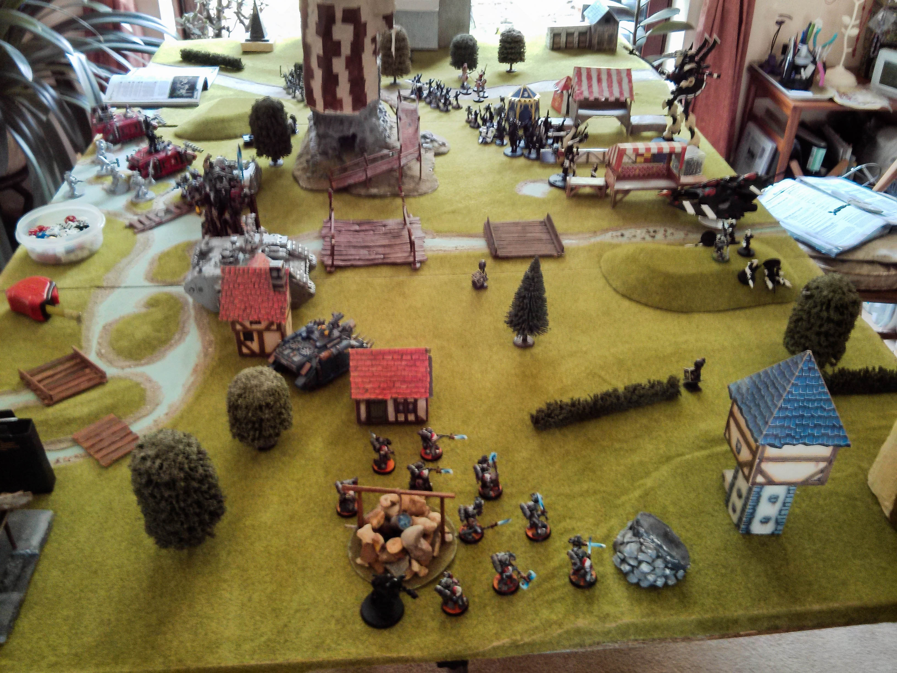

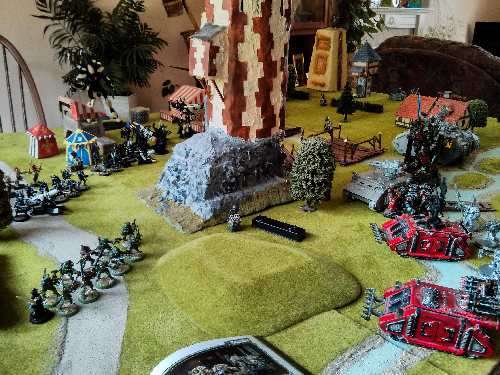

This is the initial setup. Eldar had the first turn and infiltrated onto the tower with two squads of rangers. The Striking Scorpions also infiltrated along my left flank. Both of these really worried me because in the board edge I was given there was no building to keep my purgation squad out of line of sight, so I was forced to hide them behind my razorback. However, all three sets of infiltrators had line of sight of the squad, so I wasn’t expecting them to live very long.

I had a squad of terminators and my stormraven held in reserve. A unit of terminators were in the land raider along with my inquisitor. My grey hunters were in the rhino and my whirlwind and other terminator squad are just out of the photo on the bottom left.

Eldar had their dire avengers in a wave serpent and Crimson Hunter Exarach in reserve. A warlock was attached to the striking scorpions, banshees and wraithblades and the farseer was next to the wraithknight.

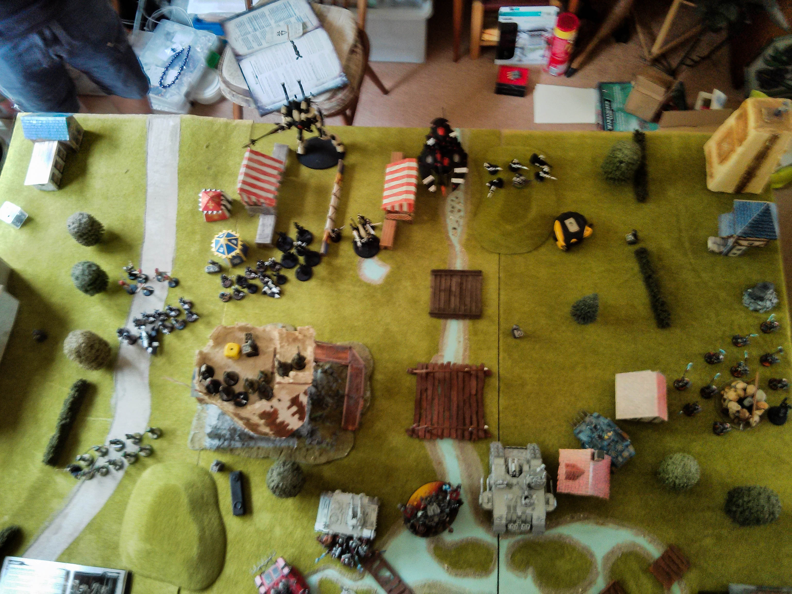

**Eldar Turn 1**

The warlocks gave the striking scorpions and wraithblades a 2+ save and the banshees a 3+ save. This was going to make defeating them in combat far harder, as all my nemesis force weapons are ap3, which would normally deal with the units, but with that losing effect, I was going to have a massive disadvantage.

A large amount of fire went into taking down my vindicator. The wraithknight managed to take 2 wounds off my dreadknight and the rangers and guardians managed to kill Coteaz and 2 of my purgation squad. The scorpions then charged my whirlwind and managed to take down my whirlwind.

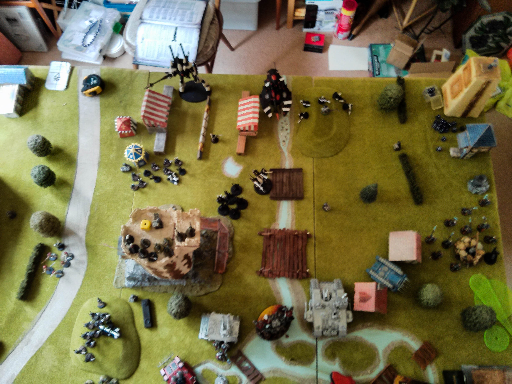

**Grey Knights Turn 1**

Unfortunately, my photo for my first turn was too blurry (as if the rest were that good!).My strike squad managed to kill Maugan Ra and a couple of reapers. My land raider, terminators from the land raider and dreadknight managed to kill a few of the wraithblades and took all but 1 wound from the wraithlord.

My razorback took out the front gun of the guardians and my purgation squad and grey hunters managed to shoot down most of the guardians.

The grey hunters then charged the guardians, losing a few due to them being i5, but managed to cut most of them down. The terminators nearby charged the scorpions, but due to a 2+ armour save were pretty ineffective, only killing 2 and losing 2 in return.

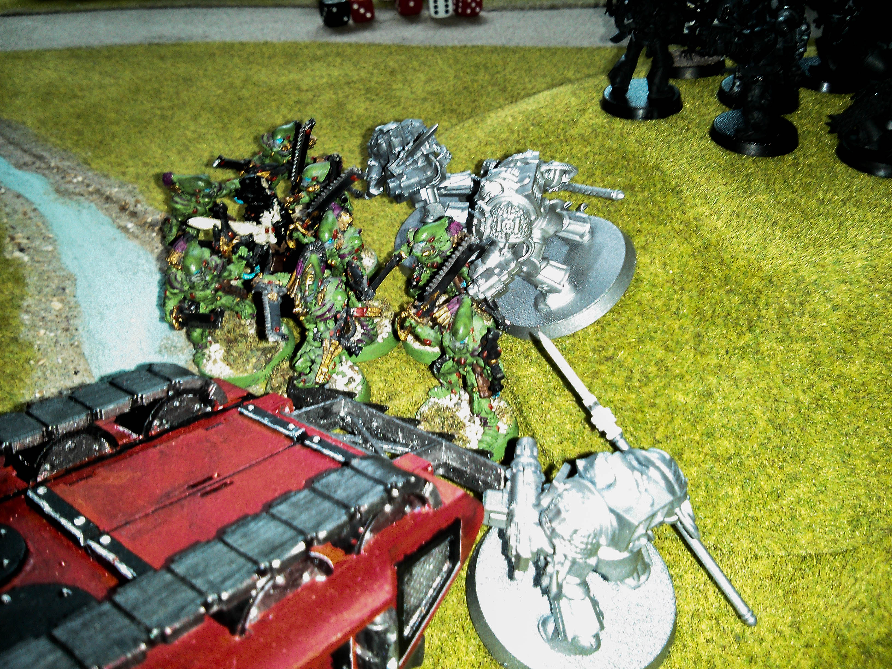

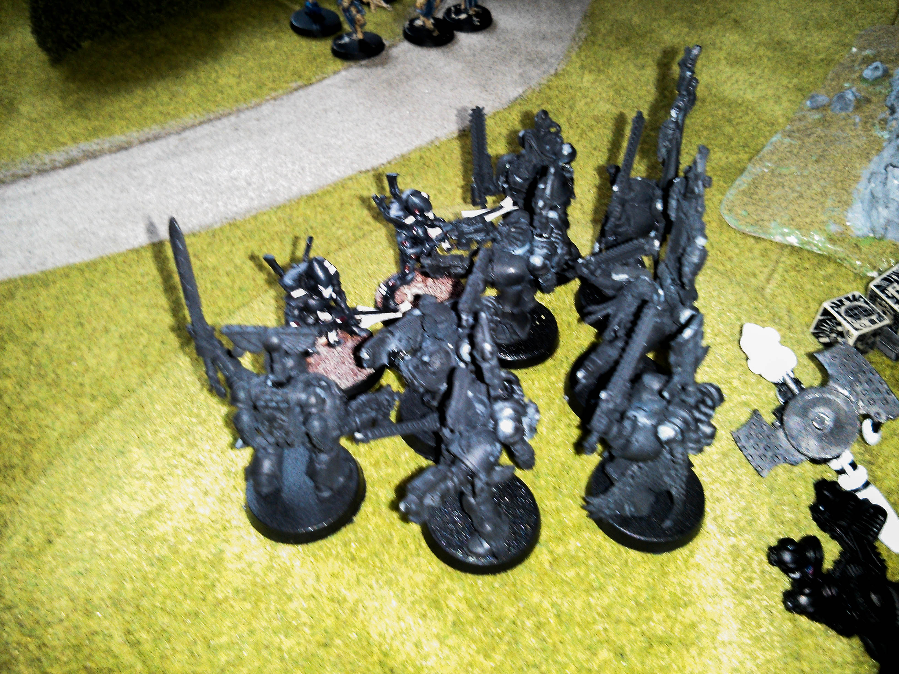

My terminators from the land raider overran charging both the wraithblades and the wraithlord. My inquisitor used his grenade, meaning all my units hit automatically and all his models were down to 1 attack each. My justicar was challenged by the wraithlord and accepted. He managed to shrug off the hit on him and with his daemon hammer managed to take it down in return!

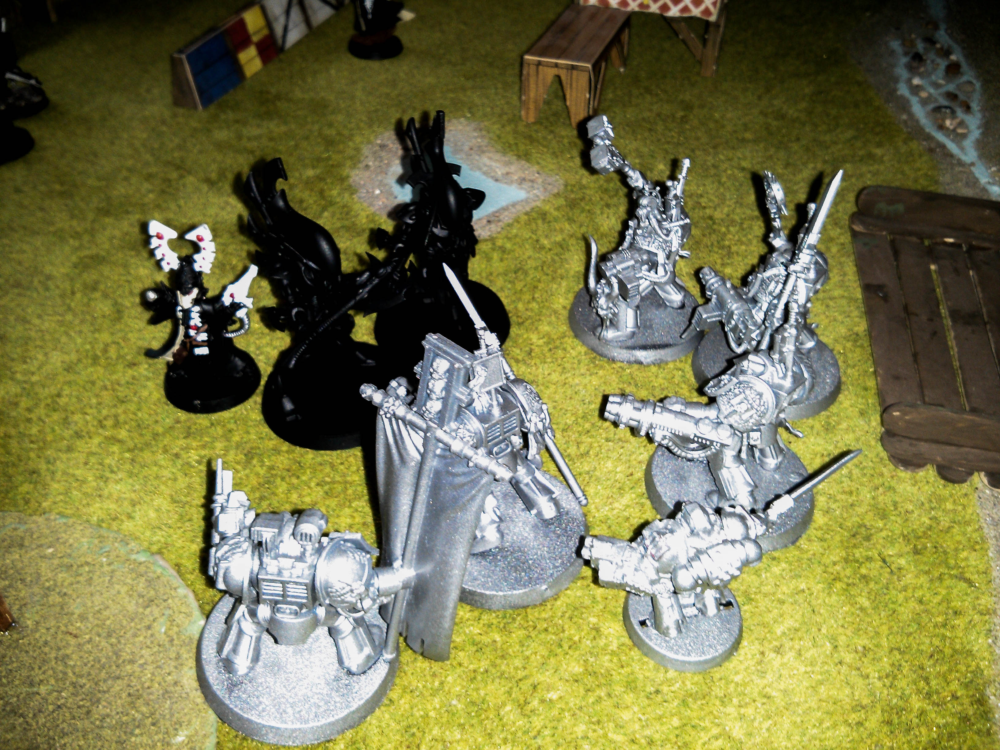

Unfortunately although my dreadknight took down 2 (really should have taken them all) of the wraithblades, the remaining two took him down. That was a massive hit. If I knew they hit at AP2, I may well not have charged. Lesson learnt!

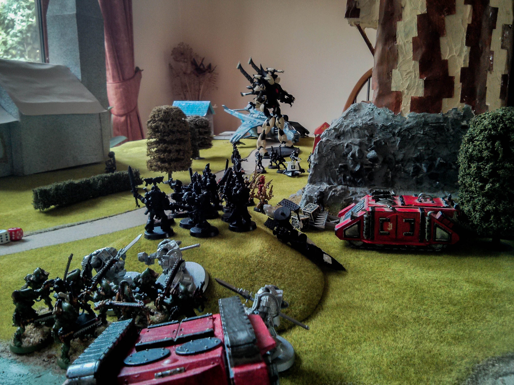

**Eldar Turn 2**

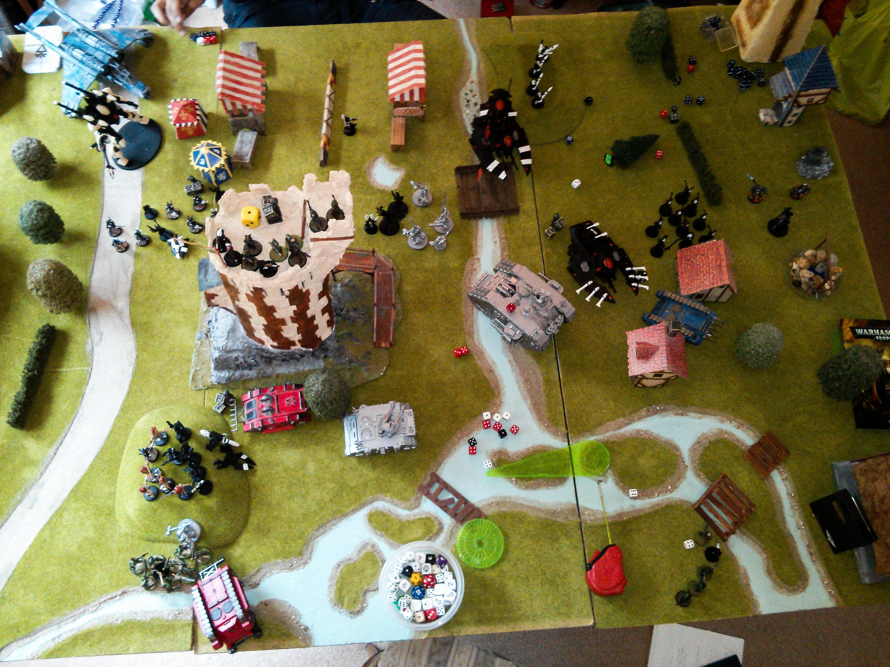

All the eldar reserves came in. The dire avengers and reapers managed to kill all but 2 of my strike squad. The fire prism, crimson hunter and wraithknight took 2 hull points from my land raider. The rangers then managed to remove the rest of my purgation squad. In combat the scorpions took my terminator squad down to 1, and the banshees and guardians took out half my grey hunters, losing all but 1 guardian in return.

My other terminators lost 2 to the wraithblades, with no casualties in return thanks to fortune.

**Grey Knights Turn 2**

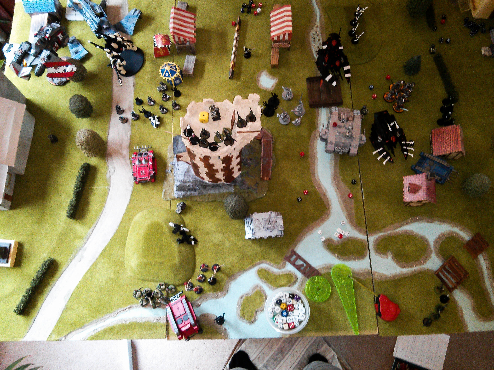

At this point I knew I was never going to win this. All my units I was expecting to tear him apart in combat with were failing horribly due to the warlocks boosting their units armour. My best two units were out the game and my others were dwindling.

My stormraven came on and took out the crimson hunter and took a wound from the wraithknight. My terminators deep striked and took out most of the dire avengers and my land raider took a hull point off the fire prism. My razorback also took a hull point off the transport.

In combat my last terminator died to the scorpions and only a single grey hunter survived, but at least he killed that last guardian! What would normally be a great unit simply could not deal with I6 and 5.

Against the wraithknights I took down the warlock, with no losses in return.

**Turn 3 – The end!**

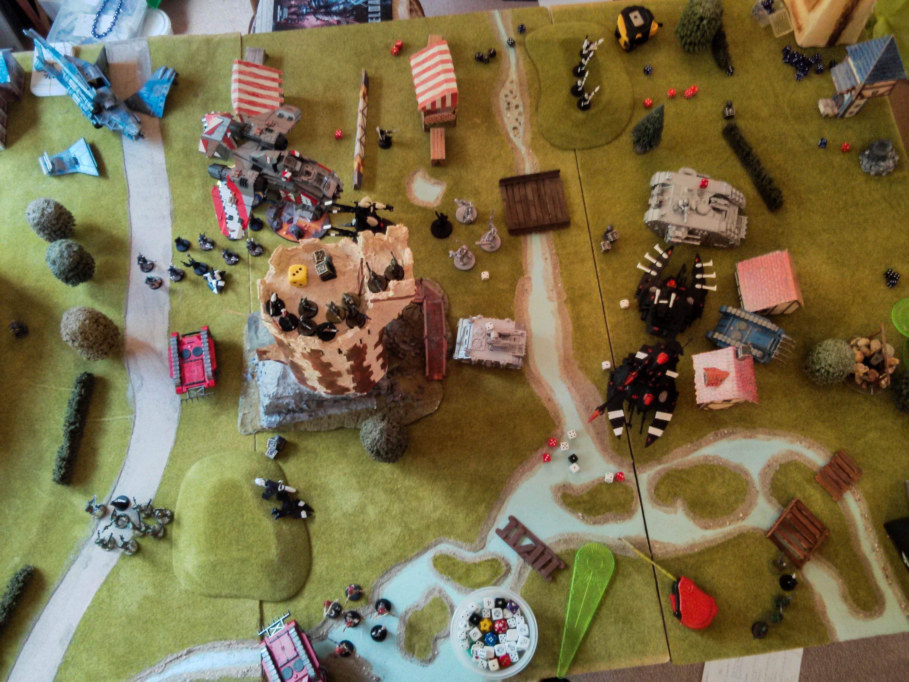

This was a rushed turn each as we had to finish in 40mins, but there wasn’t that much that happened.

The wraithknight and reapers took out my deep striked terminator squad, the rangers killed my last grey hunter, the guardians popped my rhino and the fire prism took a hull point off my razorback.

In my shooting phase I took the fire prism and transport down to 1 hull point each (the transport would have exploded if it wasn’t for its force field!

In assault my terminators were unable to kill the last wraithblade, still with a 2+ save and fortune.

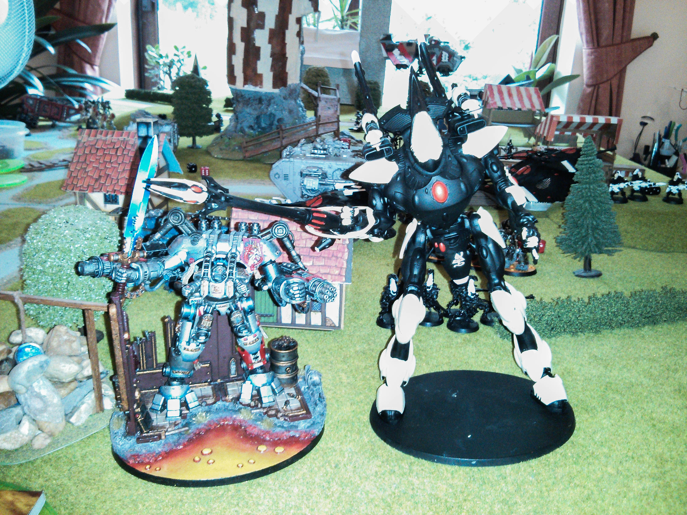

And that was it! It was an enjoyable game and taught me a lot about the new Eldar codex! Without the warlocks, I think I could have taken the army. But with them it made it very difficult to do much. I would have been better staying out of combat and trying to shoot down the units with warlocks and hoping I might get some precision shots. Other than that I'm not sure what else I could have done, I would have needed a completely different list to deal with the army, something I will have to prepare for in the future!

Oh and for the wraith knight, because I didn't have much infantry it wasn't that effective. It ended the game on 5 wounds, down from 6\. I think it could be very difficult for infantry heavy armies to deal with unless they are able to bog it down asap, as it would take too much fire power to take it down, especially with it being immune to instant death!!
