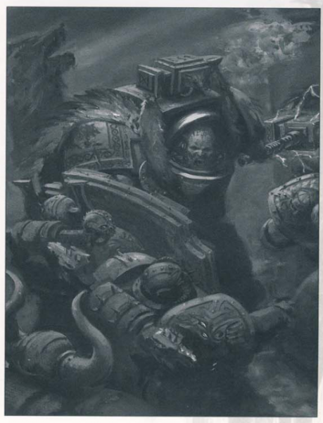
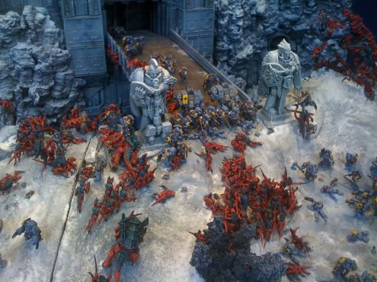
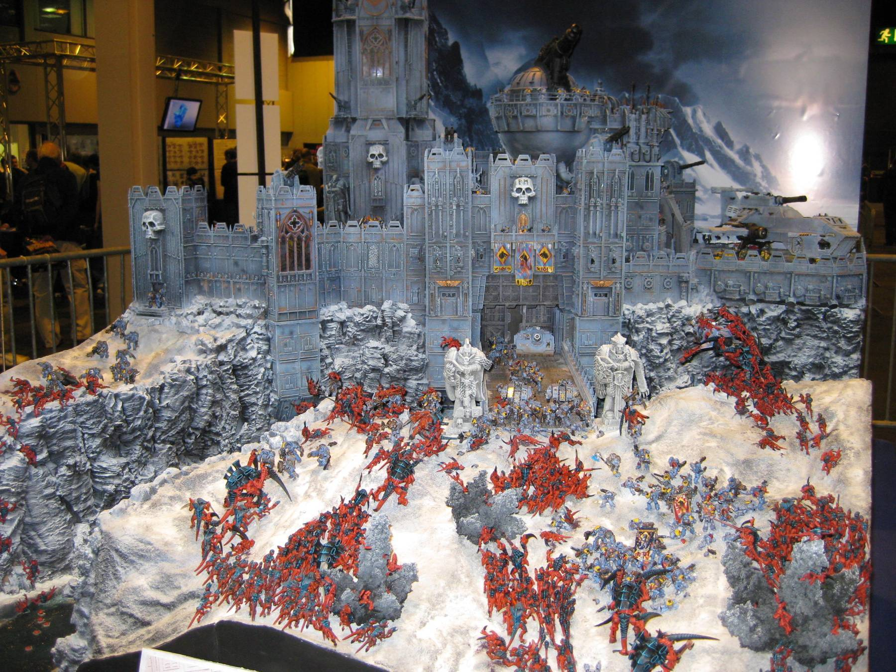

## _“The Man-Mountain, Grimnar’s Champion, Anvil of Fenris”_

With Arjac Rockfist being my favourite character in 40k I had to buy this book, especially with it being a limited
edition.

Funnily enough I don’t actually own the model. I remember reading the 5th edition Codex when it first came out,
before there was a model, and being really drawn to this picture:

Even for space marine size, even for terminator size, he is massive! I’ve always been a fan of storm shields as well,
and what he carries is a slab of solid stone the size it seems of a space marine. Oh, also he can throw his hammer as
hard as anything and have it return back to his hand via an in-build teleporter. How do you top that!?

So why no model? Well I have so many models to paint, I don’t want it sat around covered up unpainted. If I got it I
know I would rush it, as I have so many other models I need to paint. I plan to get him once I finally move back to
painting my Space Wolves, paint my core detachment and finish with him, allowing me to paint him to the best of my
ability. A real treat to finish the core of my army with!

Anyway back to the review.

There are only 3000 copies of this book worldwide and has been hand signed by Ben Counter. He is one of my favourite
Black Library authors along with Dan Abnett, from reading 9 of the Horus Heresy series, so it’s a very nice touch.
It also contains:

- Rune embossed slipcase
- Hardback novella
- Exclusive chapbook
- Exclusive art card

The art card is nice, like a large blank postcard. Not sure what I’ll be doing with it though. The slipcase as seen
in the picture is really nice, and the book itself (shown in the middle) i made of the same material and has the
same symbol embossed on the front when you remove the cover that’s shown that completely surrounds the book. It
also as a ribbon bookmark attached, in the same way as the Forgeworld Horus Heresy books.

## Twelve Wolves

The included short story, ‘Twelve Wolves’, has Arjac as the story teller telling a tale in  the Age of Apostasy.

> “_The homeworld of the Space Wolves swarms with traitors and heretics sworn to the service of the Apostate Cardinal
> Bucharis. As the enemy lay siege to the Fang, two Space Wolves – a venerable Long Fang and his impetuous Blood Claw
> charge – work to disrupt the enemy lines, following the principles of the Twelve Wolves_.”

The story is meant to be discussing the twelve, or thirteen, ‘pillars’ of the Space Wolves. Nothing really new,
but perhaps more interesting to people new to Space Wolves. Also, I don’t believe all twelve pillars were there
and I would have liked each to have been expanded far more.

All in all it was OK. I think alone it’s worth £1.50, which for its length and quality is probaly about right.

## Anvil of Fenris

> “_Take up your ale, warrior of the Space Wolves, and heed the words of the skjald as he tells the tale of one of
> our mightiest brothers. Hear of the humble beginnings of the one we know as the Anvil of Fenris, and how he
> answered the call of destiny when the Kraken invaded Asaheim itself. Hear of his heroic actions in fighting the
> spawn of the tyranids and saving the Fang from their depredations. Hear the story of Arjac Rockfist, and glory
> that such a warrior walks among us!_“

The main story itself is rather short which was disappointing. Where as a Horus Heresy novel normally takes over a
month for me to get through (reading on the train to work each day) I finished this book in under a week.

The story follows the short history text covered on his page in the 5th ed Codex. It is written in the same style
as Prospero Burns, narrated by a skald. It really shows the personality of Arjac, which is not what you would expect
from looking at him. It shows a different side to the Space Wolves and the trophies and treasure they keep in The Fang.
The fact that they still have vials of blood of Leman Russ I found incredibly interesting.

Overall I found the book really well made and the story as a whole was really good. I just wish it had been longer.
At the back are a few close ups of his weapons, which I have included below.
