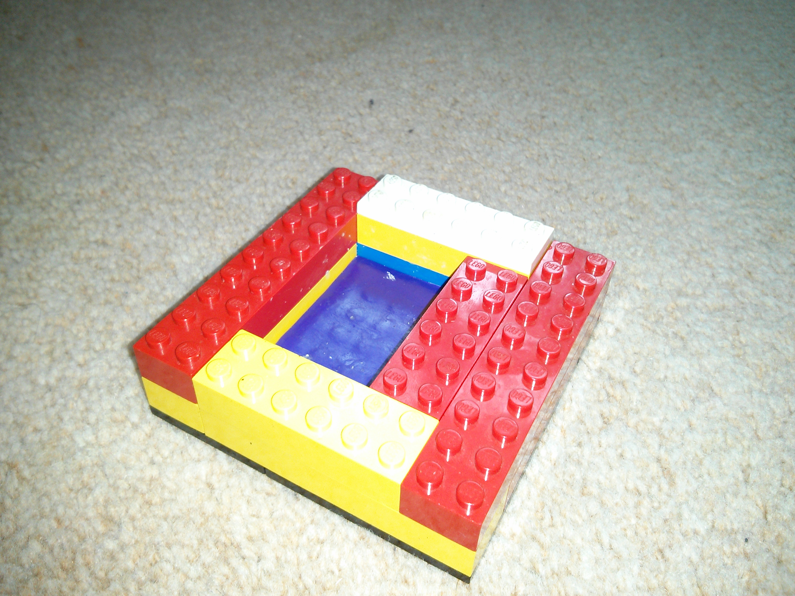
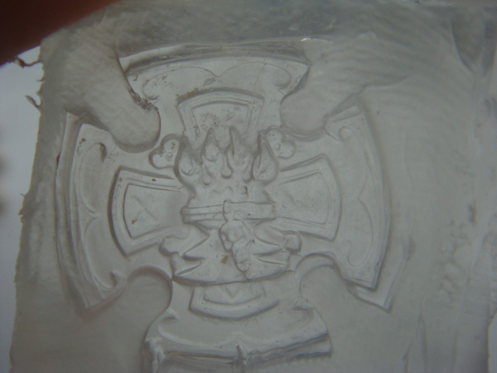
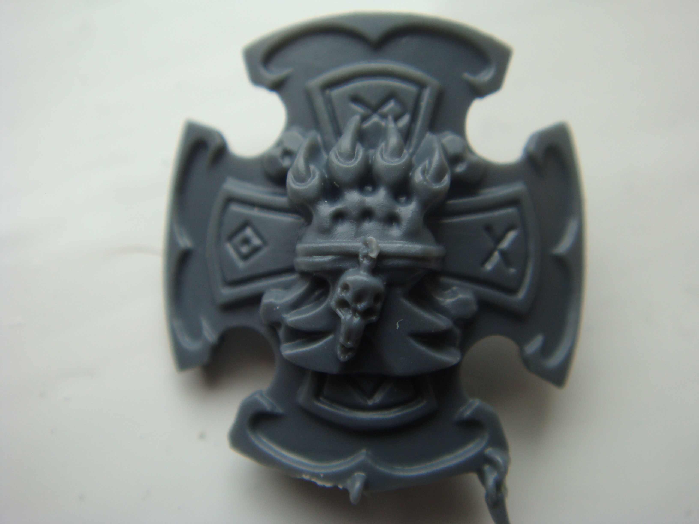
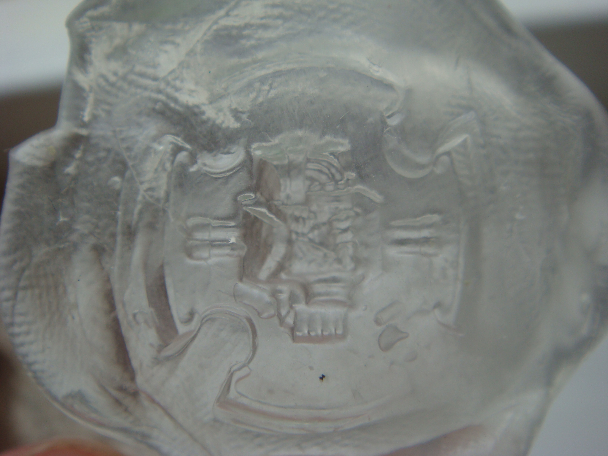
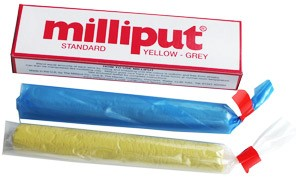
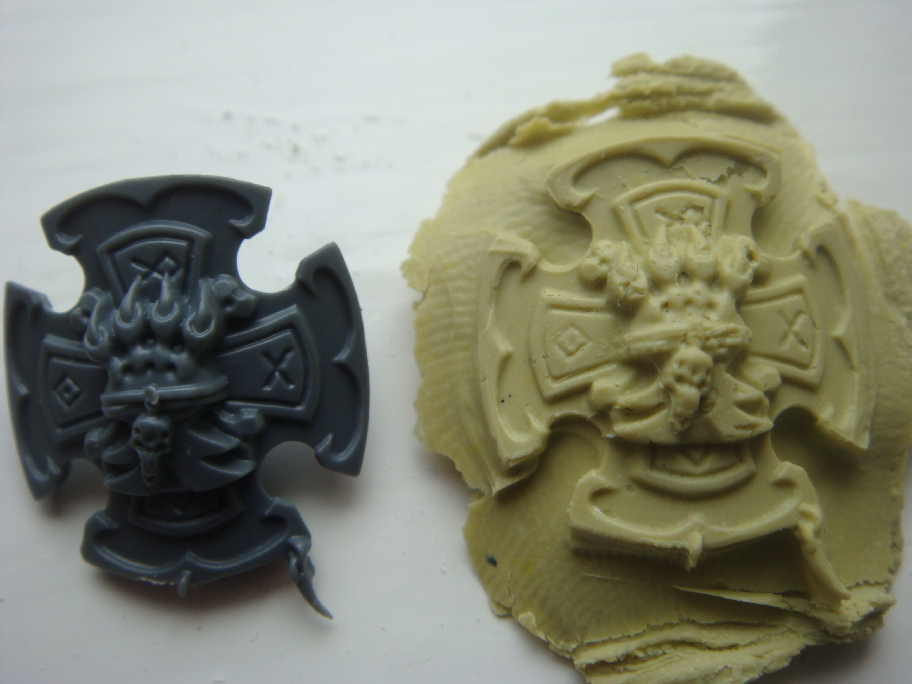
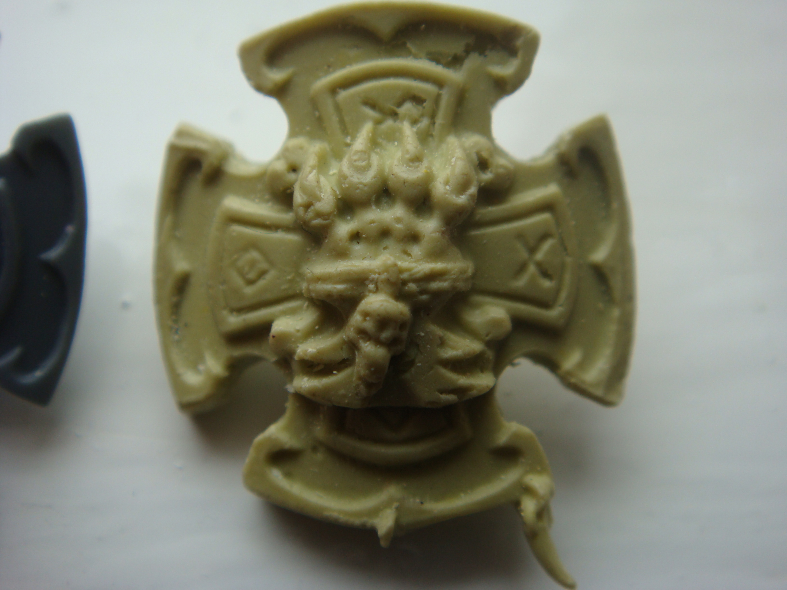
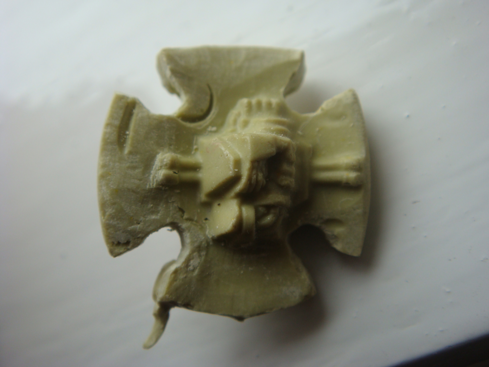

## Tutorial

So something I've been using for a while is Instant Mold. It's really quick and simple way of making a copy of different bits I know I only have a limited supply of and will need more of in the future.

The first thing I strongly recommend for making two part molds (casting both sides of an object) is to create a set template to mold within. You want both parts of the mold to have the same shape, so that when you take the original piece out and put in your putty you can easy line the two sides back up correctly.

For this I have used pieces of Lego and stuck some plastic to the bottom to give it a smooth finish. The advantage of using Lego is that once the mold is set you can break it apart to get it out, then put it back together for the next one.

Here you can see the difference between using the template and not using it. Lining the square back up in the template is far more accurate than trying to line two odd shaped pieces by hand.

So once you have the piece you want to cast boil some water and place the Instant Mold in for a couple of minutes. Once it has become easily malleable take it out of the water and dry it quickly with your hands, then squash enough into the template so that it fills the bottom with about a cm thickness. Now squash your bit into the mold, then quickly take a second piece of the Instant Mold and place it over the top so again it fills the shape of the template.

Now that it's over really squash it as best you can, you don't want there to be any air bubbles. Over time the material gets stiffer and stiffer, so if you are too slow just place the whole thing in boiling water and then once it becomes more pliable take it out and continue squashing it in.

While still partly malleable push a brush or pencil into a couple of empty areas to create some plugs. Again, these will make it easier to ensure that later on you can line both sides of the mold back up again. When you're happy run the mold under some cold water and it will set hard. Peel the two pieces apart and you will be left with something like this:

Now that you have a mold, you need something to fill it with. I suggest [Milliput](http://www.milliput.com/), a two part epoxy putty. It's very cheap at only [£3 for 100g](http://www.amazon.co.uk/dp/B001OBBTMW) and is very easy to shape. It also takes a long enough time to set that you'll never have any problem molding it.

Once you have the putty mixed together place the bottom part of the mold back into the template and squash enough of the putty in to fill the imprint made, with enough on top to fill the imprint of the top cast. Now place the top half of the mold on top and really push down as hard as you can to really make sure the Milliput is squashed into every part of the imprint.

With this done leave it for 12-24 hours until the Milliput fully sets. Once it has fully set take it apart and your should be left with something like this.

Ideally you want the least amount of excess as possible, as it can be pretty time consuming to cut it all off. Once you're done you'll be left with something like this:

As you can see the front of the mold came out pretty well capturing the most most detailed areas. It just needs a small amount of [Liquid Green Stuff](http://www.games-workshop.com/en-GB/Citadel-Technical?s=99189956004) to fill in the air bubbles. As I forgot to add in the plugs for this cast, even with the template I didn't quite line up the two halves of the mold correctly so the front and back didn't quite line up.

You can see it's pretty rough on the back but nothing some Green Stuff once again won't fix.The quality is still there on the details though which is the important part.

## Review - Instant Mold

The quality of the mold itself is very high. For one-part molds it's perfect, for two-part molds it takes time and practice creating a template and plugs in each mold but it can produce really great results.

It's really quick to heat up, just a couple of minutes in boiling water, and is very easy to shape, although it cools very quickly. It sets almost instantly when run under cold water and the best part is it can be reshaped by placing it back in boiling water when you're done. That means you can use it over and over again. I bought one pack with 6 pieces in two years ago and it's still producing great quality casts.

It's something I can definitely recommend, just for how quick and easy it is and for the fact that you can use it over and over again. It's obviously not for making larger casts, but for creating a few spare bits to avoid you having to look online at bits stores that always seem to be sold out of what you need, it's ideal.

## Review - Milliput

I also strongly recommend Milliput. I've used it for a large number of projects and is far easier to shape and far cheaper than [Green Stuff](http://www.games-workshop.com/en-GB/Green-Stuff). It also takes a lot longer to set, which I find really useful as it gives me the time to shape it and rework it as needed without worrying I'm running out of time. You can also add water to make a much softer putty if required and even turn it into the equivalent of Liquid Green Stuff if you add enough.

## Conclusion

All in all that's my quick tutorial and review for both Instant Mold and Milliput. I strongly recommend picking both up, it's a nice cheap purchase and I can assure you that they'll stay great tools in your toolbox for the years ahead!
