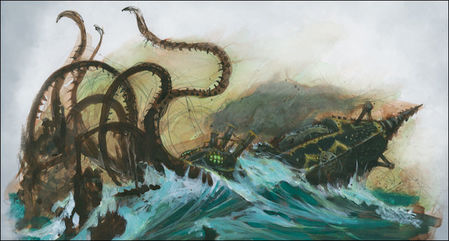

import Paint from "../../../../../components/paint";

> The Black Kraken, Tordrek Hackhart's ingenious creation, really captures the spirit of a terrifying sea creature - if
> anyone could build such a metallic behemoth, then it would be a crazed Chaos Dwarf Engineer. The articulated tentacles
> lend a sense of the sinister to what is already an esoteric submersible. Its twin paddles are visible, safely
> ensconced within the 'abdomen'.

## Miniature Review

So I'm onto the next ship, and again I'm really avoiding painting the ships by this time focusing on the submarine of
the fleet, the Back Kraken piloted by a Chaos Dwarf Engineer.

Powered by warpstone and believed to have a mind of its own, this monster has both an array of cannons and Torpedoes
for ranged combat as well as a number of tentacles for getting up close and personal. It also seems to have a large
harpoon or drill for cracking the hardest of hulls.

The tentacles are great, and the dripping water gives them a great sense of movement. The gears and pistons make you
look over the miniature to try to figure out what they're all doing and how the machine works which is always fun.

## Painting Techniques

### Black Plate
<Paint name={'Corvus Black'} />
<Paint name={'Eshin Grey'} />
<Paint name={'Dawnstone'} />
<Paint name={'Mechanicus Standard Grey'} />

### Steel
<Paint name={'Leadbelcher'} />
<Paint name={'Nuln Oil'} />
<Paint name={'Leadbelcher'} />
<Paint name={'Runefang Steel'} />
<Paint name={'Necron Compound'} />

### Bronze
<Paint name={'Retributor Armour'} />
<Paint name={'Agrax Earthshade'} />
<Paint name={'Castellax Bronze'} />
<Paint name={'Sycorax Bronze'} />

### Warpstone
<Paint name={'Warpstone Glow'} />
<Paint name={'Moot Green'} />
<Paint name={'Gauss Blaster Green'} />
<Paint name={'Corax White'} />

### Torpedoes
<Paint name={'Khorne Red'} />
<Paint name={'Mephiston Red'} />
<Paint name={'Evil Sunz Scarlet'} />
<Paint name={'Wild Rider Red'} />

## Basing

### Ocean

<Paint name={'Kantor Blue'} />
<Paint name={'Caledor Sky'} />
<Paint name={'Teclis Blue'} />
<Paint name={'Ahriman Blue'} />
<Paint name={'Biel Tan Green'} />
<Paint name={'Drakenhof Nightshade'} />
<Paint name={'Ahriman Blue'} />
<Paint name={'Lothern Blue'} />
<Paint name={'Etherium Blue'} />
<Paint name={'Corax White'} />

## Roundup

Although the tentacles are great, I felt the miniature really came alive once adding the warpstone glow effects to it.
It's a dark model, so the green really makes it stand out. The torpedoes are quick to spot being the only red used, but
they help to draw your eye to the finer details like the dwarf symbol and all the rivets.

I went similarly dark with the cog and painted the symbol on the sail the same way as the warpstone to tie the two
together nicely. I think a small robotic squid would have matched with the Kraken better though!