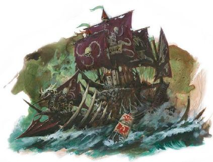

import Paint from "../../../../../components/paint";

> The Bloody Reaver was created by Count Noctilus himself. From his mystical realm, he used powerful sorcery to bind
> the wreckage of the ships he found there, to forge a warship of staggering proportions with which to dominate the
> seas and drown the mortal world in blood.

## Miniature Review

The Bloody Reaver began as a Sylvanian castle, but has since been built around with the shattered hulls of the grandest
ships destroyed by the vampire lord. The rocky crag, path and bridge to Noctilus' lair have also been torn from their
original resting place and form the core of the ship.

The Reaver is by far the largest ship of the Dreadfleet and even bigger than the Heldenhammer. The sails are massive
in order to pull the mammoth ship along, and have a lot of great detail.

Overall it's a really great miniature and the real focal point of the boxset. There's so much detail, and it's just so
different from any other ship you'll see anywhere else. I mean it has a castle at it's center! There's some nice detail
on the various ships that make up its hull, as well as anchors and over items scattered around the former cliff face.
It's easy to spend a good amount of time just looking around it and spotting new trinkets and other features.

## Painting Techniques

### Sails
<Paint name={'Barak Nar Burgundy'} />
<Paint name={'Khorne Red'} />
<Paint name={'Mephiston Red'} />
<Paint name={'Agrax Earthshade'} />
<Paint name={'Carroburg Crimson'} />
<Paint name={'Screamer Pink'} />
<Paint name={'Mephiston Red'} />

### Sail symbols
<Paint name={'Corax White'} />
<Paint name={'Seraphim Sepia'} />
<Paint name={'Corax White'} />

### Ship Hull (Red)
<Paint name={'Khorne Red'} />
<Paint name={'Mephiston Red'} />
<Paint name={'Agrax Earthshade'} />
<Paint name={'Carroburg Crimson'} />
<Paint name={'Mephiston Red'} />
<Paint name={'Evil Sunz Scarlet'} />

### Ship Hull (Purple)
<Paint name={'Phoenician Purple'} />
<Paint name={'Xereus Purple'} />
<Paint name={'Agrax Earthshade'} />
<Paint name={'Xereus Purple'} />
<Paint name={'Genestealer Purple'} />

### Ship Hull (Green)
<Paint name={'Nocturne Green'} />
<Paint name={'Caliban Green'} />
<Paint name={'Waaagh Flesh'} />
<Paint name={'Agrax Earthshade'} />
<Paint name={'Waaagh Flesh'} />
<Paint name={'Warpstone Glow'} />

### Ship Hull (Cammo)
<Paint name={'Nocturne Green'} />
<Paint name={'Castellan Green'} />
<Paint name={'Athonian Camoshade'} />
<Paint name={'Loren Forest'} />

### Ship Hull (Blue)
<Paint name={'Night Lords Blue'} />
<Paint name={'Kantor Blue'} />
<Paint name={'Nuln Oil'} />
<Paint name={'Altdorf Guard Blue'} />

### Ship Hull (Brown)
<Paint name={'Dryad Bark'} />
<Paint name={'Rhinox Hide'} />
<Paint name={'Nuln Oil'} />

### Rock
<Paint name={'Abaddon Black'} />
<Paint name={'Eshin Grey'} />
<Paint name={'Skavenblight Dinge'} />
<Paint name={'Nuln Oil'} />
<Paint name={'Dawnstone'} />
<Paint name={'Administratum Grey'} />

### Castle Walls
<Paint name={'Corax White'} />
<Paint name={'Nuln Oil'} />
<Paint name={'Grey Seer'} />
<Paint name={'Corax White'} />

### Castle Roof
<Paint name={'Khorne Red'} />
<Paint name={'Mephiston Red'} />
<Paint name={'Agrax Earthshade'} />
<Paint name={'Carroburg Crimson'} />
<Paint name={'Mephiston Red'} />
<Paint name={'Evil Sunz Scarlet'} />

### Dirt
<Paint name={'Doombull Brown'} />
<Paint name={'Mournfang Brown'} />
<Paint name={'Agrax Earthshade'} />
<Paint name={'Mournfang Brown'} />
<Paint name={'Steel Legion Drab'} />

### Bone
<Paint name={'Morghast Bone'} />
<Paint name={'Rakarth Flesh'} />
<Paint name={'Seraphim Sepia'} />
<Paint name={'Ushabti Bone'} />
<Paint name={'Screaming Skull'} />

### Rope
<Paint name={'Morghast Bone'} />
<Paint name={'Rakarth Flesh'} />
<Paint name={'Seraphim Sepia'} />
<Paint name={'Ushabti Bone'} />
<Paint name={'Screaming Skull'} />

### Wood
<Paint name={'Dryad Bark'} />
<Paint name={'Rhinox Hide'} />
<Paint name={'Nuln Oil'} />
<Paint name={'Steel Legion Drab'} />

### Steel
<Paint name={'Leadbelcher'} />
<Paint name={'Nuln Oil'} />
<Paint name={'Leadbelcher'} />
<Paint name={'Runefang Steel'} />
<Paint name={'Necron Compound'} />

### Gold
<Paint name={'Retributor Armour'} />
<Paint name={'Agrax Earthshade'} />
<Paint name={'Retributor Armour'} />
<Paint name={'Liberator Gold'} />

## Basing

### Ocean
<Paint name={'Kantor Blue'} />
<Paint name={'Caledor Sky'} />
<Paint name={'Teclis Blue'} />
<Paint name={'Ahriman Blue'} />
<Paint name={'Biel Tan Green'} />
<Paint name={'Drakenhof Nightshade'} />
<Paint name={'Ahriman Blue'} />
<Paint name={'Lothern Blue'} />
<Paint name={'Etherium Blue'} />
<Paint name={'Corax White'} />

### Sail & Bone
<Paint name={'Morghast Bone'} />
<Paint name={'Rakarth Flesh'} />
<Paint name={'Seraphim Sepia'} />
<Paint name={'Ushabti Bone'} />
<Paint name={'Screaming Skull'} />

### Wood
<Paint name={'Dryad Bark'} />
<Paint name={'Rhinox Hide'} />
<Paint name={'Nuln Oil'} />
<Paint name={'Steel Legion Drab'} />

## Roundup

I'm glad the detail has been sculpted onto the sails, as what's there is far better than anything I could ever freehand.
Having different ship hulls gave a chance to experiment with a few new colours that I rarely use, but painting them in
a way where they blend nicely together to form a single ship.

The cog was painted using the same palette once again, with a small freehand skull painted onto the sail to help tie it
with the Reaver. With that the Dreadfleet is complete, next up the Imperial Fleet!
