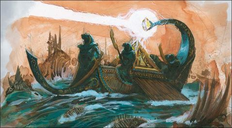

import Paint from "../../../../../components/paint";

> Even by the standards of the Undead fleets of Nehekhara, King Amanhotep's warship the Curse of Zandri is a strange
> and wondrous craft. It is propelled through the waters by hundreds of skeletal oarsmen, undying soldiers whose
> strength is drawn from the tides of magic so that they will never tire in their task.
>
> The Great Blade of Kharpesh, forged anew, has been mounted as the Curse's prow. The blade bears the most potent
> curses the Liche Priests of Zandri can muster; aside from the physical damage it can inflict, any craft that it
> strikes will find itself plagued by the most terrible misfortunes.

## Miniature Review

Ok so finally onto some real ships, although this one still doesn't have a sail. Baby steps!

Instead of sails are statues of Nehekharan gods which stand ready to protect the ship and its many catapults that line
the deck. The most lethal weapon however is the Jewel of the River Mortis, that on command can release captured
sunlight onto the pyramid below creating a column of light that can swathe even the mightiest of enemy vessels in flame.

It's really great to see a such a unique idea for a ship in miniature form, which not only has such elaborate detail
but also really follows the ancient Egyptian theme of the old Tomb Kings. I think this is easily one of my favorite
ships in the fleet.

## Painting Techniques

### Stone
<Paint name={'Night Lords Blue'} />
<Paint name={'Stegadon Scale Green'} />
<Paint name={'Thousand Sons Blue'} />
<Paint name={'Sotek Green'} />
<Paint name={'Ahriman Blue'} />

I lightly stippled each of the colours on to create a mottled stone effect.

### Triangle Patterns
<Paint name={'Thousand Sons Blue'} />
<Paint name={'Ahriman Blue'} />
<Paint name={'Temple Guard Blue'} />
<Paint name={'Averland Sunset'} />
<Paint name={'Yriel Yellow'} />
<Paint name={'Dorn Yellow'} />

### Gold
<Paint name={'Retributor Armour'} />
<Paint name={'Agrax Earthshade'} />
<Paint name={'Retributor Armour'} />
<Paint name={'Liberator Gold'} />

### Wood
<Paint name={'Dryad Bark'} />
<Paint name={'Rhinox Hide'} />
<Paint name={'Nuln Oil'} />
<Paint name={'Steel Legion Drab'} />

### Rope, Deck & Cog Sail
<Paint name={'Morghast Bone'} />
<Paint name={'Rakarth Flesh'} />
<Paint name={'Seraphim Sepia'} />
<Paint name={'Ushabti Bone'} />
<Paint name={'Screaming Skull'} />

### Jewel
<Paint name={'Warpstone Glow'} />
<Paint name={'Moot Green'} />
<Paint name={'Gauss Blaster Green'} />
<Paint name={'Corax White'} />

## Basing

### Ocean
<Paint name={'Kantor Blue'} />
<Paint name={'Caledor Sky'} />
<Paint name={'Teclis Blue'} />
<Paint name={'Ahriman Blue'} />
<Paint name={'Biel Tan Green'} />
<Paint name={'Drakenhof Nightshade'} />
<Paint name={'Ahriman Blue'} />
<Paint name={'Lothern Blue'} />
<Paint name={'Etherium Blue'} />
<Paint name={'Corax White'} />

### Bone
<Paint name={'Morghast Bone'} />
<Paint name={'Rakarth Flesh'} />
<Paint name={'Agrax Earthshade'} />
<Paint name={'Ushabti Bone'} />
<Paint name={'Screaming Skull'} />

## Roundup

I always really enjoy using turquoise paints. Unless painting a Tzeentch army I find it is rarely used elsewhere other
than maybe an odd potion or gem. The yellow and gold really complement it, and the single green jewel makes the
dangerous weapon of the ship clearly visible.

Once again I painted the cog using the same colour palette. I went to add a single Egyptian eye to the sail but got my
scale wrong. I was really happy with it and didn't want to start over again, so I ended up adding another two on. I'm
not fully happy with it and would have preferred a single eye but it'll do for now. I also wanted to represent the jewel
somehow so added it to the top flag, but I think there might have been a better way to represent it.

