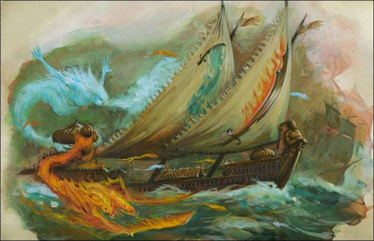

import Paint from "../../../../../components/paint";

> The Scimitar's hull is trimmed in gold and precious stones, and its lower decks are complete with an extensive harem,
> libraries of occult tomes, a fountain of healing water and - as the less savoury rumours have it -legions of captive
> warriors that languish in its bilges. It skims across the seas of the world powered by sails made from acres of folded
> silk, each one a work of art blessed with spells of protection that keep it safe from the fiercest storms. Despite its
> lavish and regal appearance, Flaming Scimitar is a warship capable of tremendous feats of violence.

## Miniature Review

The Scimitar's deck is filled with ornate bronze cannons hidden behind keyhole windows, but its real weapon is the
Golden Magus himself. He has bound many elemental spirits that he can command in battle, setting his enemies aflame
with Fire Efreets, or filling his sails with the roaring breath of Tempest Djinns.

The exotic nature of the minarets really help to set it apart from the other warships of the fleet, each housing one
of the great elementals, giving it interest similarly to the Seadrake. The designs of the sails themselves echo the
elementals and give the chance for some additional colour.

## Painting Techniques

### Hull
<Paint name={'Phoenician Purple'} />
<Paint name={'Xereus Purple'} />
<Paint name={'Agrax Earthshade'} />
<Paint name={'Xereus Purple'} />
<Paint name={'Genestealer Purple'} />

### Deck
<Paint name={'Morghast Bone'} />
<Paint name={'Rakarth Flesh'} />
<Paint name={'Agrax Earthshade'} />
<Paint name={'Ushabti Bone'} />
<Paint name={'Screaming Skull'} />

### Sails
<Paint name={'Morghast Bone'} />
<Paint name={'Rakarth Flesh'} />
<Paint name={'Seraphim Sepia'} />
<Paint name={'Ushabti Bone'} />
<Paint name={'Screaming Skull'} />

### Gold
<Paint name={'Retributor Armour'} />
<Paint name={'Agrax Earthshade'} />
<Paint name={'Retributor Armour'} />
<Paint name={'Liberator Gold'} />

### Fire
<Paint name={'Khorne Red'} />
<Paint name={'Mephiston Red'} />
<Paint name={'Evil Sunz Scarlet'} />
<Paint name={'Wild Rider Red'} />
<Paint name={'Squig Orange'} />
<Paint name={'Troll Slayer Orange'} />
<Paint name={'Fire Dragon Bright'} />
<Paint name={'Averland Sunset'} />
<Paint name={'Yriel Yellow'} />
<Paint name={'Dorn Yellow'} />
<Paint name={'Corax White'} />

### Smoke
<Paint name={'Corax White'} />
<Paint name={'Nuln Oil'} />
<Paint name={'Grey Seer'} />
<Paint name={'Corax White'} />

### Water
<Paint name={'Caledor Sky'} />
<Paint name={'Teclis Blue'} />
<Paint name={'Lothern Blue'} />
<Paint name={'Etherium Blue'} />
<Paint name={'Corax White'} />

### Swords
<Paint name={'Abaddon Black'} />
<Paint name={'Eshin Grey'} />
<Paint name={'Dawnstone'} />
<Paint name={'Administratum Grey'} />
<Paint name={'Corax White'} />

## Basing

### Ocean
<Paint name={'Kantor Blue'} />
<Paint name={'Caledor Sky'} />
<Paint name={'Teclis Blue'} />
<Paint name={'Ahriman Blue'} />
<Paint name={'Biel Tan Green'} />
<Paint name={'Drakenhof Nightshade'} />
<Paint name={'Ahriman Blue'} />
<Paint name={'Lothern Blue'} />
<Paint name={'Etherium Blue'} />
<Paint name={'Corax White'} />

## Roundup

I ended up painting the purple on the Scimitar in a very similar way to one of the ships that make up the Bloody Reaver.
In contrast to the Seadrake I went with a bright, highly polished gold to create regal effect that I'd expect from a
Magus.

I decided to paint the fire elemental using the same colours as the lava on one of the islands, meaning to reverse the
colours but still ending up with the same effect. I noticed too late and couldn't be bothered to fix it, I'll 100%
remember for the future now!

As always I painted the cog with the same colours and painted a freehand flaming scimitar onto the sail which I'm mostly
happy with considering how small it is.