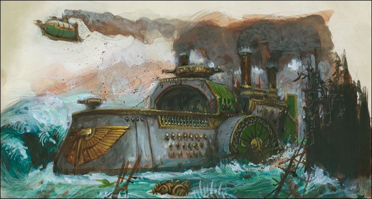

import Paint from "../../../../../components/paint";

> The Thunder holds not only hundreds of Dwarf Engineers, but also tight-knit Ironbreaker boarding parties, warbands of
> Trollslayers hungry to meet a glorious death in the jaws of titanic sea monsters, and an entire war dirigible dock
> able to send lighter-than-air reconnaissance engines into the skies. The self-loading, pump-action cannons of the
> Thunder bear magical runes of destruction upon their barrels, and its metre thick gromril-plated hull is so durable
> that even an iceberg cannot breach it.

## Miniature Review

Grimnir's Thunder is an impregnable floating fortress and aircraft carrier, built from heavy plated silversteel.
There's a lot of dwarven engineering gone into the steam-driven paddles in their armoured shells to self-loading,
swivel-mounted Flame Cannons and industrial-sized engines.

The dirigibles grant unparalleled scouting capability, required due to the slow speed of the battleship to ensure
maximum destruction can be achieved, regardless of wind or tide to sate their Dwarf-held grudge.

The design of the Grimnir's Thunder is fairly simple, but very ornate and a couple of points of interest with the
dirigibles and beer barrel. There are also plenty of cannons visible, as well as some dwarven iconography.

## Painting Techniques

### Steel
<Paint name={'Leadbelcher'} />
<Paint name={'Nuln Oil'} />
<Paint name={'Leadbelcher'} />
<Paint name={'Runefang Steel'} />
<Paint name={'Necron Compound'} />

### Gold
<Paint name={'Retributor Armour'} />
<Paint name={'Agrax Earthshade'} />
<Paint name={'Retributor Armour'} />
<Paint name={'Liberator Gold'} />

### Green Plates
<Paint name={'Caliban Green'} />
<Paint name={'Waaagh Flesh'} />
<Paint name={'Agrax Earthshade'} />
<Paint name={'Waaagh Flesh'} />
<Paint name={'Warpstone Glow'} />
<Paint name={'Warboss Green'} />

### Fabric
<Paint name={'Corax White'} />
<Paint name={'Agrax Earthshade'} />
<Paint name={'Grey Seer'} />
<Paint name={'Corax White'} />

### Wood
<Paint name={'Dryad Bark'} />
<Paint name={'Rhinox Hide'} />
<Paint name={'Nuln Oil'} />
<Paint name={'Steel Legion Drab'} />

## Basing

### Ocean
<Paint name={'Kantor Blue'} />
<Paint name={'Caledor Sky'} />
<Paint name={'Teclis Blue'} />
<Paint name={'Ahriman Blue'} />
<Paint name={'Biel Tan Green'} />
<Paint name={'Drakenhof Nightshade'} />
<Paint name={'Ahriman Blue'} />
<Paint name={'Lothern Blue'} />
<Paint name={'Etherium Blue'} />
<Paint name={'Corax White'} />

### Steel
<Paint name={'Leadbelcher'} />
<Paint name={'Nuln Oil'} />
<Paint name={'Agrax Earthshade'} />
<Paint name={'Leadbelcher'} />
<Paint name={'Runefang Steel'} />
<Paint name={'Necron Compound'} />

### Gold
<Paint name={'Retributor Armour'} />
<Paint name={'Agrax Earthshade'} />
<Paint name={'Retributor Armour'} />
<Paint name={'Liberator Gold'} />

## Roundup

Grimnir's Thunder was fairly simple to paint in terms of colours as it uses a limited palette, but the colours are
spread out nicely, so it's not boring to look at. I also used the shades on the armour in a bit more of a patchy manor
to help break up the flat panels.

The green really felt like it brought the whole thing to life, adding some brightness and colour to the miniature with
the mottled effect helping it tie in with the ornate effect.

The dirigibles were painted with the same colours, as well as a dirty white for the fabric of the balloon to add a bit
more brightness to the pair.
