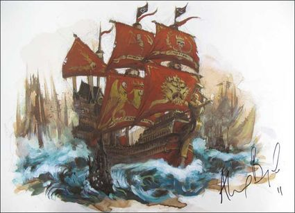

import Paint from "../../../../../components/paint";

> The Heldenhammer was once the personal flagship of the Grand Theogonist. That Jaego Roth had both the courage and
> temerity to steal such an illustrious warship is a testament to his grim determination to rid the Galleon's
> Graveyard of Count Noctilus once and for all.

## Miniature Review

The Heldenhammer is a true monster of a warship, large enough to hold a multiple battalions of soldiers. It resembles a
three-masted galleon, but on an unprecedented scale. The aftcastle towers over the decks, which in turn are lined with
the most cannons of any ship, as well as batteries of siege mortars and murder holes for snipers.

The warship is unmistakably of the Empire, fish-tailed mer-gryphons on the sails adding a naval touch. At its aft
stands a grand temple, said to be so redolent with faith that it is proof against evil magic. Then there is the
titanic figurehead of Sigmar mounted on its prow, statue cast in blessed metal and larger than a wizard's tower.

The statue itself, Sigmar's Wrath, is held in place by great steel chains and can be released from its upright position
to come crashing down hammer-first upon an enemy vessel, impacting with a force of a twin-tailed comet before being
winched back into place using cantilevers and steam pistons.

Similar to the Bloody Reaver this truly is a unique ship. Although at first it seems fairly normal, once you understand
the scale and see it homes an entire cathedral everything else becomes much more impressive. The details on the sails
once again are amazing and I'm so glad they were sculpted on.

## Painting Techniques

### Sails & Hull
<Paint name={'Khorne Red'} />
<Paint name={'Mephiston Red'} />
<Paint name={'Agrax Earthshade'} />
<Paint name={'Carroburg Crimson'} />
<Paint name={'Mephiston Red'} />
<Paint name={'Evil Sunz Scarlet'} />

### Flags & Roof
<Paint name={'Corvus Black'} />
<Paint name={'Eshin Grey'} />
<Paint name={'Dawnstone'} />
<Paint name={'Mechanicus Standard Grey'} />

### Deck, Masts & Parchment
<Paint name={'Morghast Bone'} />
<Paint name={'Rakarth Flesh'} />
<Paint name={'Seraphim Sepia'} />
<Paint name={'Ushabti Bone'} />
<Paint name={'Screaming Skull'} />

### Stone
<Paint name={'Eshin Grey'} />
<Paint name={'Dawnstone'} />
<Paint name={'Nuln Oil'} />
<Paint name={'Dawnstone'} />
<Paint name={'Mechanicus Standard Grey'} />

### Gold
<Paint name={'Retributor Armour'} />
<Paint name={'Agrax Earthshade'} />
<Paint name={'Retributor Armour'} />
<Paint name={'Liberator Gold'} />

### Steel
<Paint name={'Leadbelcher'} />
<Paint name={'Nuln Oil'} />
<Paint name={'Leadbelcher'} />
<Paint name={'Runefang Steel'} />
<Paint name={'Necron Compound'} />

### White Iconography
<Paint name={'Corax White'} />
<Paint name={'Agrax Earthshade'} />
<Paint name={'Wraithbone'} />
<Paint name={'Corax White'} />

## Basing

### Ocean
<Paint name={'Kantor Blue'} />
<Paint name={'Caledor Sky'} />
<Paint name={'Teclis Blue'} />
<Paint name={'Ahriman Blue'} />
<Paint name={'Biel Tan Green'} />
<Paint name={'Drakenhof Nightshade'} />
<Paint name={'Ahriman Blue'} />
<Paint name={'Lothern Blue'} />
<Paint name={'Etherium Blue'} />
<Paint name={'Corax White'} />

## Roundup

When I first started painting the boxset I thought painting the Heldenhammer would be a monumental task, but now I've
got into the routine of painting ships it turned out not to be that bad. As I've already said I'm so thankful for the
icons on the sails being there, it made painting them fairly simple, but I still had to be careful not to ruin the sails
I had already painted.

I tried to make everything look super new and shiny as I see this as being the pinnacle of ships in the Empire's fleet.
The cog uses the same colour with a freehand golden meteor to represent Sigmar.

With that the Dreadfleet boxset is complete! I'll post one last time with a roundup of everything in the box, then onto
the next project!