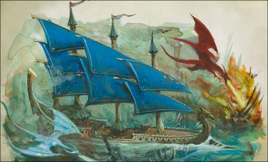

import Paint from "../../../../../components/paint";

> The fastest ship in the Ulthuan navy, the Seadrake can even outpace the Dragons that accompany it to battle. Its
> lateen sails propel the Seadrake through the water as if it were barely touching the surface, and its tillers allow
> the warship to turn with almost magical dexterity. Upon the decks are dozens of Eagle Claw bolt throwers, designed
> to slay enemy crew whilst leaving their warships intact. When the Seadrake levels a broadside, it does so not with
> cannonballs, but with tight patterns of six-foot bolts that kill dozens of enemy crewmen with each volley.

## Miniature Review

Swift and graceful, the Seadrake's elegance is beautifully represented by its sleek sails and long, narrow hull set
low in the water. The mast towers further reinforce the warship's scale and magnificence.

The rearmost tower is where Yrellian communicates with his Dragon allies. These mighty Fire Dragons are almost as
powerful as warships, taking to the skies and immolating their enemies with dragonfire.

The amount of detail on the ship itself is fairly minimal, with the real interest being the narrow shape, the shaped
sails and the dragons.

## Painting Techniques

### Gold
<Paint name={'Retributor Armour'} />
<Paint name={'Agrax Earthshade'} />
<Paint name={'Retributor Armour'} />
<Paint name={'Liberator Gold'} />

### Steel
<Paint name={'Leadbelcher'} />
<Paint name={'Nuln Oil'} />
<Paint name={'Leadbelcher'} />
<Paint name={'Runefang Steel'} />
<Paint name={'Necron Compound'} />

### Sails
<Paint name={'Kantor Blue'} />
<Paint name={'Caledor Sky'} />
<Paint name={'Drakenhof Nightshade'} />
<Paint name={'Caledor Sky'} />
<Paint name={'Teclis Blue'} />
<Paint name={'Corax White'} />

### Hull
<Paint name={'Corax White'} />
<Paint name={'Nuln Oil'} />
<Paint name={'Grey Seer'} />
<Paint name={'Corax White'} />

### Bone
<Paint name={'Morghast Bone'} />
<Paint name={'Rakarth Flesh'} />
<Paint name={'Seraphim Sepia'} />
<Paint name={'Ushabti Bone'} />
<Paint name={'Screaming Skull'} />

### Dragon Skin
<Paint name={'Khorne Red'} />
<Paint name={'Mephiston Red'} />
<Paint name={'Evil Sunz Scarlet'} />
<Paint name={'Agrax Earthshade'} />
<Paint name={'Mephiston Red'} />
<Paint name={'Evil Sunz Scarlet'} />
<Paint name={'Wild Rider Red'} />

### Dragon Spines
<Paint name={'Corvus Black'} />
<Paint name={'Eshin Grey'} />
<Paint name={'Mechanicus Standard Grey'} />

## Basing

### Ocean
<Paint name={'Kantor Blue'} />
<Paint name={'Caledor Sky'} />
<Paint name={'Teclis Blue'} />
<Paint name={'Ahriman Blue'} />
<Paint name={'Biel Tan Green'} />
<Paint name={'Drakenhof Nightshade'} />
<Paint name={'Ahriman Blue'} />
<Paint name={'Lothern Blue'} />
<Paint name={'Etherium Blue'} />
<Paint name={'Corax White'} />

### Sea Dragon

<Paint name={'Corax White'} />
<Paint name={'Drakenhof Nightshade'} />
<Paint name={'Corax White'} />

## Roundup

The Seadrake was a strange one to paint as it's mostly built from bone, not something I realised initially. I ended up
painting them darker than I wanted just to contrast with the hull, but perhaps I should have brightened both to give
it a more elegant look.

Despite not being happy from that, I do like how the sails came out and especially with the red of the dragon make it
stands out on the table despite its smaller size.
