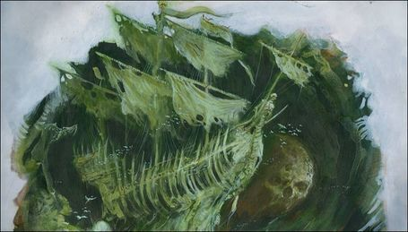

import Paint from "../../../../../components/paint";

> Previously known as the Stormbreaker, the cadaverous warship now known as the Shadewraith rotted away long ago,
> yet its essence still clings to the mortal world. Shunned by the moon and the sea alike, it bears a terrible stigma,
> for the dread vessel floats above the waves as if Manann himself cannot bear to suffer its touch.
>
> Draped in icy chains and foul streamers of rot, the cursed galleon carries with it an aura of cold that freezes the
> blood of those under its shadow.

## Miniature Review

The Shadewraith is a ghost ship, captained by the undead and floating above the waves, held aloft by the
tortured souls of the crew, the sea beneath it recoiling from its touch.

Compared to the other ships I don't think the Shadewraith compares well in terms of detail, but perhaps as a ghost ship
that was designed intentionally. I would have liked the detail that is there to be more obvious though, for example the
spirits below the ship look more like seaweed until you really look in close. When everything is the same colour it's
harder to pick out small details like that.

## Painting Techniques

### Ship
<Paint name={'Corax White'} />
<Paint name={'Hexwraith Flame'} />
<Paint name={'Nighthaunt Gloom'} />
<Paint name={'Corax White'} />

The Hexwraith Flame was applied over the entire miniature, with a focus around the recesses. The Nighthaunt Gloom was
then added to the deepest recesses and thinned in a few flat areas to help break up the colour. Corax White was used as
a drybrush to re-highlight the raised areas and make the detail more visible again.

## Basing

### Ocean
<Paint name={'Kantor Blue'} />
<Paint name={'Caledor Sky'} />
<Paint name={'Teclis Blue'} />
<Paint name={'Ahriman Blue'} />
<Paint name={'Biel Tan Green'} />
<Paint name={'Drakenhof Nightshade'} />
<Paint name={'Ahriman Blue'} />
<Paint name={'Lothern Blue'} />
<Paint name={'Etherium Blue'} />
<Paint name={'Corax White'} />

## Roundup

The Shadewraith was a pretty simple one, painted in the same way as the other shipwrecks, just with a bit more time
spent on highlighting. I tried to make the spirits darker to stand out more, but I'm not convinced it worked. I think
painting them a different colour would look odd though so for now I'll leave it how it is.

I tried getting some photos in natural sunlight as well as with lamps just to show off the difference in colour, it's
amazing how much deeper the green looks with some natural light and shadows.
