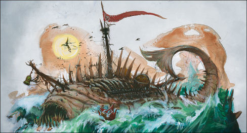

import Paint from "../../../../../components/paint";

> An enormous cadaver the size of a Skaven underwarren, the sea-monster's insides have become a maze of crude scaffold
> and pitted brass spheres, each of which buzzes with tainted warp lightning. It is this fell energy that sustains the
> crew and powers the crackling warpstone weaponry bound to the monster's exposed ribs.

## Miniature Review

So does starting with Skabrus count as painting a ship? Maybe it's more of a monster than a ship..., but it does have a
sail and some crew!

Skabrus is the Zombie of the Dreadfleet. The Skaven have built around its remains, using warp generators and the gases
of the decaying corpse as a propellant and to power their deadly arsenal of warp cannons. In place of its former
glowing lure is a warpstone-forged Screaming Bell, likely used to draw lost ships towards it in  hope of salvation,
instead promising doom.

All of this detail is beautifully sculpted and adds enough to make it look lik enough of a ship to fit in with the rest
of the fleet.

## Painting Techniques

### Skin
<Paint name={'Wraithbone'} />
<Paint name={'Magos Purple'} />
<Paint name={'Carroburg Crimson'} />
<Paint name={'Blood For The Blood God'} />

The Magos Purple was heavily thinned with Contrast Medium for the first layer, then applied in a few patches to create
a bruised look. Carroburg Crimson was then applied in several thin layers around the skin creases.
Blood For The Blood God was applied to the deepest creases and around cuts.

### Tongue & Entrails
<Paint name={'Screamer Pink'} />
<Paint name={'Pink Horror'} />
<Paint name={'Emperors Children'} />
<Paint name={'Carroburg Crimson'} />
<Paint name={'Blood For The Blood God'} />

### Teeth & Bone
<Paint name={'Morghast Bone'} />
<Paint name={'Rakarth Flesh'} />
<Paint name={'Seraphim Sepia'} />
<Paint name={'Ushabti Bone'} />
<Paint name={'Screaming Skull'} />

### Wood
<Paint name={'Dryad Bark'} />
<Paint name={'Rhinox Hide'} />
<Paint name={'Nuln Oil'} />
<Paint name={'Steel Legion Drab'} />

### Rope
<Paint name={'Morghast Bone'} />
<Paint name={'Rakarth Flesh'} />
<Paint name={'Seraphim Sepia'} />
<Paint name={'Ushabti Bone'} />
<Paint name={'Screaming Skull'} />

### Sails
<Paint name={'Khorne Red'} />
<Paint name={'Mephiston Red'} />
<Paint name={'Evil Sunz Scarlet'} />
<Paint name={'Agrax Earthshade'} />
<Paint name={'Mephiston Red'} />
<Paint name={'Evil Sunz Scarlet'} />
<Paint name={'Wild Rider Red'} />

### Sail Symbols
<Paint name={'Abaddon Black'} />
<Paint name={'Dawnstone'} />
<Paint name={'Corax White'} />

### Bronze
<Paint name={'Retributor Armour'} />
<Paint name={'Agrax Earthshade'} />
<Paint name={'Castellax Bronze'} />
<Paint name={'Sycorax Bronze'} />
<Paint name={'Nihilakh Oxide'} />

### Steel
<Paint name={'Leadbelcher'} />
<Paint name={'Nuln Oil'} />
<Paint name={'Leadbelcher'} />
<Paint name={'Runefang Steel'} />
<Paint name={'Necron Compound'} />

### Warpstone
<Paint name={'Warpstone Glow'} />
<Paint name={'Moot Green'} />
<Paint name={'Gauss Blaster Green'} />
<Paint name={'Corax White'} />

### Stone
<Paint name={'Eshin Grey'} />
<Paint name={'Skavenblight Dinge'} />
<Paint name={'Nuln Oil'} />
<Paint name={'Dawnstone'} />

## Basing

### Ocean

<Paint name={'Kantor Blue'} />
<Paint name={'Caledor Sky'} />
<Paint name={'Teclis Blue'} />
<Paint name={'Ahriman Blue'} />
<Paint name={'Biel Tan Green'} />
<Paint name={'Drakenhof Nightshade'} />
<Paint name={'Ahriman Blue'} />
<Paint name={'Lothern Blue'} />
<Paint name={'Etherium Blue'} />
<Paint name={'Corax White'} />

### Acid
<Paint name={'Warpstone Glow'} />
<Paint name={'Moot Green'} />
<Paint name={'Drakenhof Nightshade'} />

## Roundup

I really like how the skin came out, not as pale as in the book but the bruising and bloody effect looks really
realistic. I may have gone a bit over the top with the green when painting the warp cannons, but I wanted them to not
just look like regular old cannons.

I painted the cog with matching colours, and a large chunk of warpstone to guide it. I added a matching symbol to the
said, using a black and grey background to make it stand out.
