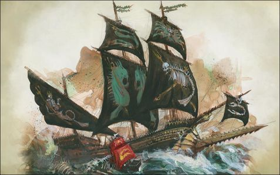

import Paint from "../../../../../components/paint";

> The Swordfysh is a mighty square-rigged galleon, antique in design but no less lethal for it. Around its hull are
> swirling designs of waves, razorshells and tritons, and upon its prow is a giant ram in the likeness of a saw-shark's
> blade. The Swordfysh's every timber and plank is engraved with symbols of the Seafather Manann; its sails fly the
> crossed tridents of the sea-lords, and its hundred-plus cannons are decorated with carefully placed barnacles and
> knotted latch-eels.

## Miniature Review

The Swordfysh is a pirate ship with a strong fishy theme with crown shells and teeth of sea monsters decorating the
hull, seaweed pennants and the addition of a large fin in place of a rudder. Other defining details include Unicorn
Whale horns on the masts, a ram made from a massive sea beast, and a Sea Giant skull figurehead with colossal jewels
set in its eye sockets.

The iconography on the sails is also great and adds a lot more character to the ship, as well as the shark or other
beasts swimming alongside. All put together it's obvious that it's a pirate ship but still fits in with the rest of
the fleet.

## Painting Techniques

### Sails
<Paint name={'Abaddon Black'} />
<Paint name={'Eshin Grey'} />
<Paint name={'Skavenblight Dinge'} />
<Paint name={'Nuln Oil'} />
<Paint name={'Dawnstone'} />
<Paint name={'Administratum Grey'} />

### Sail Icons & Flags
<Paint name={'Corax White'} />
<Paint name={'Nighthaunt Gloom'} />
<Paint name={'Corax White'} />

### Brass
<Paint name={'Runelord Brass'} />
<Paint name={'Brass Scorpion'} />
<Paint name={'Screaming Bell'} />
<Paint name={'Canoptek Alloy'} />

### Steel
<Paint name={'Leadbelcher'} />
<Paint name={'Nuln Oil'} />
<Paint name={'Leadbelcher'} />
<Paint name={'Runefang Steel'} />
<Paint name={'Necron Compound'} />

### Wood
<Paint name={'Dryad Bark'} />
<Paint name={'Rhinox Hide'} />
<Paint name={'Nuln Oil'} />
<Paint name={'Steel Legion Drab'} />

### Bone
<Paint name={'Morghast Bone'} />
<Paint name={'Rakarth Flesh'} />
<Paint name={'Seraphim Sepia'} />
<Paint name={'Ushabti Bone'} />
<Paint name={'Screaming Skull'} />

## Basing

### Ocean
<Paint name={'Kantor Blue'} />
<Paint name={'Caledor Sky'} />
<Paint name={'Teclis Blue'} />
<Paint name={'Ahriman Blue'} />
<Paint name={'Biel Tan Green'} />
<Paint name={'Drakenhof Nightshade'} />
<Paint name={'Ahriman Blue'} />
<Paint name={'Lothern Blue'} />
<Paint name={'Etherium Blue'} />
<Paint name={'Corax White'} />

### Ghost Shark
<Paint name={'Corax White'} />
<Paint name={'Hexwraith Flame'} />
<Paint name={'Corax White'} />

### Diseased Shark
<Paint name={'Corax White'} />
<Paint name={'Druchii Violet'} />
<Paint name={'Nuln Oil'} />

## Roundup

Using brass rather than gold was definitely the right choice, it drops some consistency with the other ships but creates
more of a gloomy pirate feel than bright gold would.

I was also careful with the black sails, as I wanted to add a lot of highlighting, but it's easy to go overboard and
end up with a much lighter grey. With the ghostly icons I think it works together well and still looks dark but with
a decent amount of highlights to bring out the 3D effect.

The cog was painted in the same way with a freehand fish as the symbol on the sail.