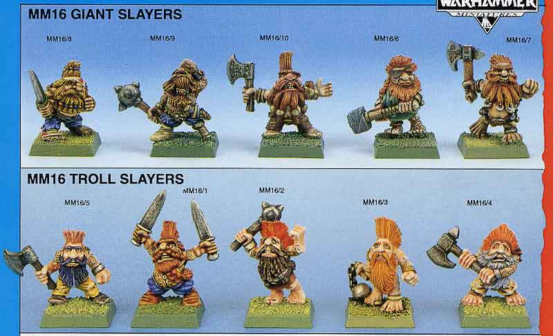

import Paint from "../../../../../components/paint";

> It is said of the Doomseeker that his axe scorches the air with every swing, that he spits glowing cinders with every
> war cry, and that the wrath of the forge burns in his glare. This is no dishonourable mercenary, but a religious
> crusader whose word is his bond.

## Miniature Review

When it comes to dwarfs I've always liked slayers. I always think back to the old Toll and Giant slayers. Half looking
fearsome, while the other half look terrified. My favorite was always the dwarf trying to peer up high into the sky to
see his giant opposition in the face.

Looking back at those miniatures things really have come a long way. The length of the hair helps prevent him looking
too small when compared to the rest of the party, and along with his beard and runes on his back gives a lot of
opportunity to add some colour.

## Painting Techniques

### Hair (Red)
<Paint name={'Khorne Red'} />
<Paint name={'Mephiston Red'} />
<Paint name={'Evil Sunz Scarlet'} />
<Paint name={'Agrax Earthshade'} />
<Paint name={'Mephiston Red'} />
<Paint name={'Evil Sunz Scarlet'} />
<Paint name={'Wild Rider Red'} />
<Paint name={'Squig Orange'} />

### Hair (Orange)
<Paint name={'Squig Orange'} />
<Paint name={'Troll Slayer Orange'} />
<Paint name={'Agrax Earthshade'} />
<Paint name={'Troll Slayer Orange'} />
<Paint name={'Fire Dragon Bright'} />

### Skin
<Paint name={'Bugmans Glow'} />
<Paint name={'Cadian Fleshtone'} />
<Paint name={'Reikland Fleshshade'} />
<Paint name={'Carroburg Crimson'} />
<Paint name={'Cadian Fleshtone'} />

Apply Carroburg Crimson in the recesses around the eyes and nose.

### Silver
<Paint name={'Leadbelcher'} />
<Paint name={'Nuln Oil'} />
<Paint name={'Leadbelcher'} />
<Paint name={'Runefang Steel'} />
<Paint name={'Necron Compound'} />

### Gold
<Paint name={'Retributor Armour'} />
<Paint name={'Agrax Earthshade'} />
<Paint name={'Retributor Armour'} />
<Paint name={'Liberator Gold'} />

### Blacks
<Paint name={'Corvus Black'} />
<Paint name={'The Fang'} />
<Paint name={'Fenrisian Grey'} />
<Paint name={'Ulthuan Grey'} />

### Fire
<Paint name={'Corax White'} />
<Paint name={'Casandora Yellow'} />
<Paint name={'Troll Slayer Orange'} />

The final layer was heavily thinned.

### Runes
For the runes I followed the gold steps above, and then completed the fire steps backwards. I washed with thinned down
orange, then with yellow and then added a Flash Gitz Yellow layer with a touch of white in the brightest spots.

Instructions for the bases can be found [here](/showcase/board-games/silver-tower/kairic-acolytes/).

## Roundup

It wasn't too dissimilar painting the Fyreslayer compared to the Darkoath Chieftain. They compliment each other, despite
the dwarf being painted with a much warmer palette. I'm happy with the torch in the axe, a reminder back to the original
game where you had to decide who was going to be the torch-bearer throughout the dungeon exploration.