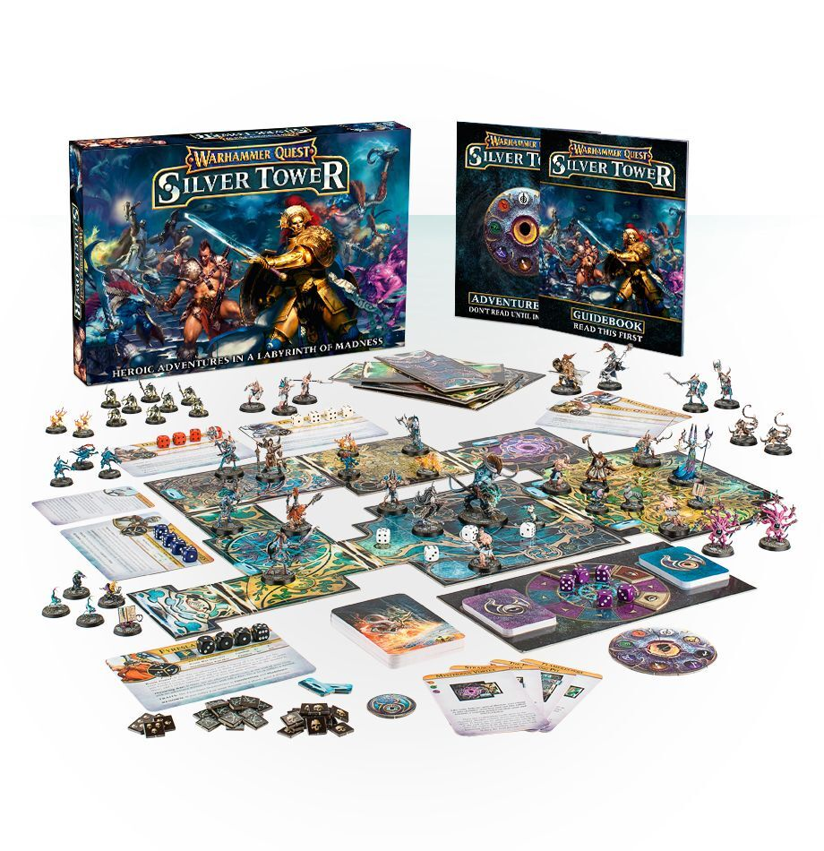

First up, if you missed it in my previous posts, I used to be a BIIIIG fan of the original Warhammer Quest. It's one of
the few boxed games I think I ever fully painted.

I played it so much I went beyond the main characters and played with the expansion characters, including the Dwarf
Trollslayer, Warrior Priest, Wardancer and my favorite the Witch Hunter. I even played with characters developed by the
community and even made a few of my own.

Aside from all the unique characters and play styles I really enjoyed the long dungeon crawls. It was great to explore
and never know what was coming up and when you'd reach the final room. Every game was different, and it always felt like
a great accomplishment when you had a large completed dungeon laid out at the end of the game.

So given that, what is my opinion on the first of Games Workshop's dive back into the world of Warhammer Quest?

## Box Contents

> - 51 (count ‘em!) Citadel miniatures:
>   - Fyreslayer Doomseeker, Darkoath Chieftain, Excelsior Warpriest (with loyal Gryph-hound), Knight-Questor,
>     Mistweaver Saih and Tenebrael Shard
>   - Gaunt Summoner of Tzeentch
>   - Ogroid Thaumaturge
>   - 2 Skaven Deathrunners
>   - 2 Pink Horrors
>   - 4 Blue Horrors
>   - 4 pairs of Brimstone Horrors
>   - 6 Tzaangors
>   - 8 Grot Scuttlings
>   - 8 Kairic Acolytes
>   - 8 Chaos Familiars!
> - A 40-page guidebook containing the rules, and a 40-page adventure book filled with the trials of the Silver Tower;
> - 36 skill & treasure cards, and 40 exploration cards;
> - 13 gorgeously-realised double-sided board tiles, bringing the dungeon to your table;
> - 6 character cards, allowing you to track your heroes as they level up and grow ever more capable of tackling the Tower

To me Games Workshop has had two phases of board game types in recent years. Since 2018 there has been a big push for
long-term supported games with seasons of new content and communities built around them. These include Adeptus
Titanicus, Aeronautica Imperialis, Blood Bowl, Kill Team, Necromunda, Underworlds and Warcry.

Between 2009-2017 Games Workshop seemed to focus more on releasing one off games with no long-term support other than a
few White Dwarf additions. I've always felt these games focused on the miniatures, with a board game built around them
as an afterthought in order to sell them. These games include Dreadfleet, Deathwatch Overkill and Assassinorum:
Execution Force.

Silver Tower released in 2016, back when GW seemed to have a huge focus on releasing as many new board games as
possible. Gorechosen and Lost Patrol released around the same time, which didn't even rely on new miniatures and had
very basic rules.

For games released in this period I always viewed it that you were paying the price (in the case of Silver Tower £95)
for the miniatures only. In that way the game itself was a bonus, so it wouldn't be too disappointing if it was trash
and would be a great surprise if it turned out to be good enough to keep coming back to.

For me I loved the variety of miniatures I would never otherwise own and with most characters likely to sell between
£10-£20 separately it seemed like a great deal, especially when that potential bonus could be another great
Warhammer Quest dungeon crawler!

## Miniature Review

I've created a showcase post for each set of miniatures and in each I've detailed my thoughts on the miniatures as well
as how I went about painting them if you want a bit more detail. I really like sculpts as there's a lot of fine detail,
such as around their faces and the many intricate armour panels. There's also some bolder sculpts to help contrast the
rest, with large flowing cloaks and lots of demonic skin.

My only real criticism is that for the units they're only created half the number of sculpts and doubled them up.
I understand this was likely to keep manufacturing costs down, but I wish they could have been designed to make
different poses possible. It's not so bad when there's 8 in a group as they can be spread out, but when there's only 4
it's not great seeing duplicates.

## Game Review

Players: 2-4
Time: 60-120 mins

Your party is travelling through the Silver Tower with the task of completing eight unique trials. Each trial is broken
down into a series odf rounds and each round consists of four phases:

### Destiny Phase
You roll all five of the destiny dice that become available for use in any of the heroes in later turns. However, all
doubles are removed and in later turns there become consequences based on the rolls as the Gaunt Summoner's Familiars
get up to mischief.

### Hero Phase
You have four dice that represent your hero's health, but they also represent the number of actions you have during the
course of your turn. Your hero has a number of basic actions they can perform, such as explore, move and recuperate.
They also have more complex abilities such as different attacks that require the value of the dice to be high enough to
perform.

### Adversary Phase
The daemons of chaos now have a chance to respond using a behaviour table, performing a different action based on your
dice roll.

### End Phase
Final cleanup to prepare yourself for the next round.

Exploring the dungeon is not too dissimilar to the original. As you explore, random rooms are encountered along with
random enemies determined by rolling against the encounter table defined on the room. Ambushes have also made a return
when trying to rest or loot rooms.

Despite not having many actions to perform, although you do gain new skills as you level up, turns feel quite tactical
when considering how to use your action dice along with sharing the destiny dice between all of you. There is a lot of
randomness though, as your initial roll determines which actions you can attempt to take, requiring a further roll to
see if they are successful.

There are a lot of rooms in the game, and you won't get close fighting your way through each of them. Each trial
consists of around 5-8 rooms that need to be cleared in order to reach the end of that dungeon and complete that trial.
Although this means much shorter adventures than the original, it also means there's great replay-ability.

The rules are fairly simple, and the rulebook makes it very easy to understand, but is maybe not laid out in the best
way. For example rules for the destiny dice are split between page 8, 19 and the back of the book. It has some great
artwork and text to help flesh out the world and characters, but I wish it was separated out from the core rules to
help make rules easier to find when you're playing the game.

The Adventure Book is a great addition, not messing with the rules but adding a lot of narrative to each of the trials
and giving the heroes new abilities. Adding the extra level of storytelling really makes up for some of the games
shortfalls.

## Roundup

### The Pros
- A good variety of miniatures with great sculpts and lots of detail
- Good-looking and high quality components
- Simple, yet reasonably fun gameplay with great storytelling and interesting additions like the mini-game
- Random dungeon building, with skills and loot to acquire

### The Cons
- The rules could have been organised a lot better
- Heavily depends on the luck of dice rolling which can be frustrating
- A very lightweight game compared to the original

## Final Grade
7 / 10
