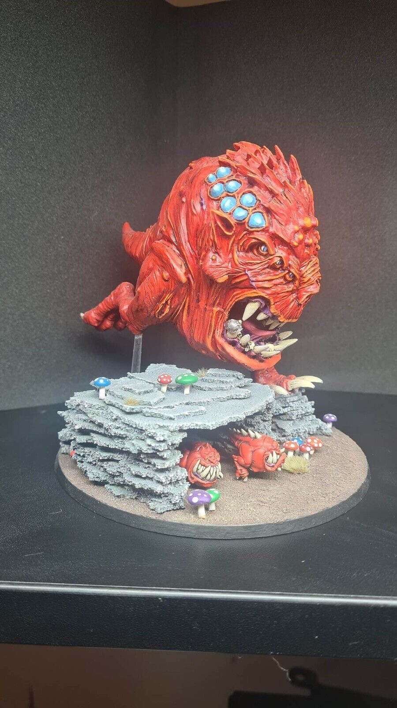
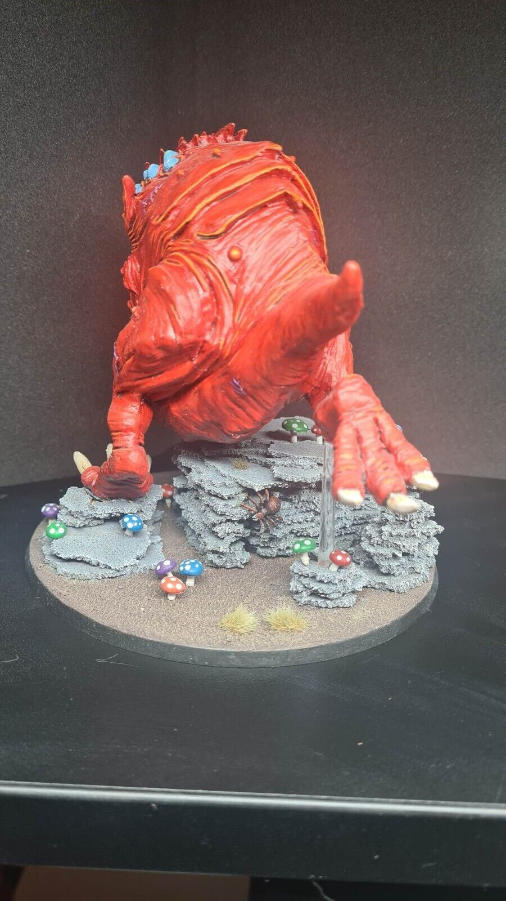

import Paint from '../../../../components/paint';

> With their large, fleshy mouths and boundless energy, Colossal Squigs unleash untold
> havoc in battle. These insatiable fungoid beasts messily devour swathes of foes in an
> instant, squashing everything in their path as they careen towards their next meal.

With Blackstone Fortress, Assassinorum: Execution Force and Lost Patrol all painted I wanted to go back to some army
painting for a bit. I was between my Space Wolves, Grey Knights and Gloomspite Gitz and then a few things happened that
made the choice easy.

First my wife bought me the Forgeworld Squig Gobba for my birthday. At around the same time the Stampeding Squigalanche
boxset was released with an absolute ton of squigs (25 in fact!!!). Finally, Forgeworld suddenly removed all their Age
of Sigmar miniatures and I was determined to pick them up off of eBay before they became too rare.

So now I have a huge number of squigs, I think I need to get them all painted! I've actually been slowly batch painting
them behind the scenes for the last few months but not quite getting anything finished. As it's been a few weeks since
I've posted now I decided to choose a unit to finish off so I can share it. Let's start with the biggest!

## Miniature Review

Here you can see my eBay purchase. I really love the base, the cave with the squigs coming out is an amazing idea I
never would have thought of. It gives so much interest to the Colossal Squig that can sometimes look a bit dull when on
a completely flat base. The mushrooms are a nice touch too.

In terms of the paint job it's great as although it's a bit flat, it provides a great base coat for me to work from as
it uses a very similar colorscheme to how I've ben painting the rest of my army. All it needed was some a number of
washes, then highlighting back up to boost the contrast.

The miniature itself is fairly simple as its 90% skin, but that skin has a lot of ridges, folds, scars and boils to add
some color and contrast to stop it looking too flat. The teeth and claws are huge and give that real sense of danger.
The main appeal for me though isn't necessarily the sculpt, just the pure size.

## Painting Techniques

### Squig Skin

<Paint name={'Blood Angels Red'} />
<Paint name={'Flesh Tearers Red'} />
<Paint name={'Evil Sunz Scarlet'} />
<Paint name={'Wild Rider Red'} />
<Paint name={'Kislev Flesh'} />

All highlights are applied as a glaze. I also used a 50:50 mix of Wild Rider Red and Kislev Flesh between using the
pure colors to help blend them.

### Gums

<Paint name={'Volupus Pink'} />
<Paint name={'Pink Horror'} />
<Paint name={'Kislev Flesh'} />
<Paint name={'Pink Horror'} />
<Paint name={'Pallid Wych Flesh'} />

Pink horror is applied first, then a 50:50 mix of Pink Horror and Kislev Flesh, then a final 5:50 mix of
Pink Horror and Pallid Wych Flesh.

### Teeth, Claws & Bone

<Paint name={'Aggaros Dunes'} />
<Paint name={'Agrax Earthshade'} />
<Paint name={'Rhinox Hide'} />
<Paint name={'Morghast Bone'} />
<Paint name={'Wraithbone'} />
<Paint name={'White Scar'} />

### Eyes & Spores

<Paint name={'Caledor Sky'} />
<Paint name={'Talassar Blue'} />
<Paint name={'Caledor Sky'} />
<Paint name={'Teclis Blue'} />
<Paint name={'Lothern Blue'} />
<Paint name={'White Scar'} />

### Eyes (Smaller Squigs)

<Paint name={'White Scar'} />
<Paint name={'Bad Moon Yellow'} />
<Paint name={'Nazdreg Yellow'} />
<Paint name={'White Scar'} />

### Steel Helmet

<Paint name={'Iron Hands Steel'} />
<Paint name={'Agrax Earthshade'} />
<Paint name={'Grey Knights Steel'} />
<Paint name={'Stormhost Silver'} />

## Base

The cave is made from corkboard and the ground was covered in a texture paint. As with the squig I gave everything a
shade with Nuln Oil to darken it right down, then highlighted it back up with Dawnstone and Mechanicus Grey.

I then applied a mix of flocks, rocks, tufts, flowers, leaves, plants and water effects, grouped below by company:

### Games Workshop

- [Citadel Skulls](https://www.games-workshop.com/en-GB/Citadel-Skulls-2017)

### Geek Gaming Scenics

- [Patchy Plains](https://www.geekgamingscenics.com/collections/base-ready-range/products/lukes-aps-base-ready-patchy-plains)
- [Scrublands](https://www.geekgamingscenics.com/collections/base-ready-range/products/lukes-aps-base-ready-scrublands)

### Army Painter

- [Green Grass](https://www.thearmypainter.com/shop/us/bf4113p)
- [Steppe Grass](https://www.thearmypainter.com/shop/us/bf4115p)
- [Battlefield Rocks](https://www.thearmypainter.com/shop/us/bf4117p)
- [Meadow Flowers Tufts](https://www.thearmypainter.com/shop/us/bf4231p)
- [Woodland Tufts](https://www.thearmypainter.com/shop/us/bf4224p)
- [Lowland Shrubs Tufts](https://www.thearmypainter.com/shop/us/bf4232p)

### Woodland Scenics

- [Clump Foliage Light Green](https://woodlandscenics.woodlandscenics.com/show/item/CF-LG)
- [Clump Foliage Medium Green](https://woodlandscenics.woodlandscenics.com/show/item/CF-MG)
- [Clump Foliage Dark Green](https://woodlandscenics.woodlandscenics.com/show/item/CF-DG)

### Gamers Grass

- [Wild Flowers](https://gamersgrass.com/product/wild-flowers-set/)
- [Bracken](https://gamersgrass.com/product/bracken/)
- [Alien Rosette](https://gamersgrass.com/product/alien-rosette/)
- [Alien Flytrap](https://gamersgrass.com/product/alien-flytrap/)

### AK Interactive

- [28mm Birch Dark Green Leaves](https://ak-interactive.com/product/birch-dark-green-leaves-28mm-172/)
- [28mm Oak Autumn Leaves](https://ak-interactive.com/product/oak-autumn-leaves-28mm-172/)
- [Puddles](https://ak-interactive.com/product/puddles-60ml/)

Finally I painted the outside of the base.

<Paint name={'Gore Grunta Fur'} />
<Paint name={'Rhinox Hide'} />

## Roundup

I think this was a first for me, buying an already painted miniature online. I have to say it was great, as the final
result is far better than what I would have created myself. I was able to complete it far quicker too, with the base
structure built and a base layer and some highlighting already applied. I will 100% do it again (I already have) and
now fairly regularly look on eBay as well as instagram for ideas.

I really went to town on the base and I'm really happy with the result. I love the puddles and the plants from
Gamers Grass, so will have to keep an eye out for similar products to improve my bases further in the future. As for
the paint job I'm happy with the contrast on the skin. I could have picked out the scars and boils a bit more, maybe
with some different colors, but I've got so much to paint I want to keep it simple for now so I can get the whole army
done.
