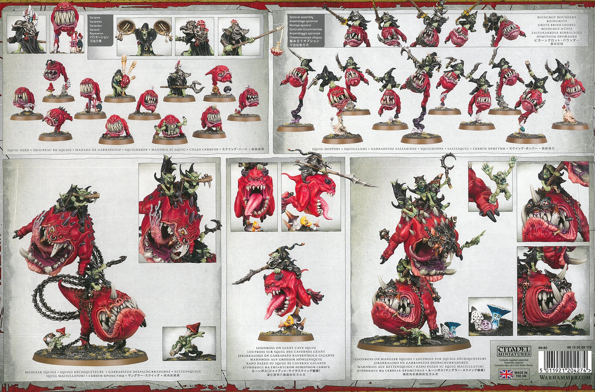

import Paint from '../../../../components/paint';

> Giant Cave Squigs are especially huge and ferocious beasts that make excellent steeds for the more daring grot
> Loonbosses. They hurtle into battle like rubbery meteors - all fangs, prodding spikes and shrieked war cries.

As mentioned in my previous post I recently purchased the Stampending Squigalanche boxset. In it you get:

- 1x Loonboss on Giant Cave Squig
- 2x Loonboss on Mangler Squig
- 10x Squig Hoppers
- 10x Cave Squigs
- 2x Squig Herder

I've been batch painting the box set but its been taking a while, there' an awful lot of squigs! For this week I
managed to get the Loonboss on Giant Cave Squig finished.

## Miniature Review

I'm a little bit conflicted about this one. I really love the size of the squig and it has an amazing pose leaping
forward off the mushroom. I also love the huge open jaw and the massive tongue. I think there's just something about
the shape or maybe of the eyes I'm not entirely happy with. It feels very tall, and I think I prefer more squat round
squigs. I think the eyes are too small and bug-like too. I think making them bigger would allow for a lot more character.

I really like the grot sat on top, it feels like their take on Bretonnian Knights which I loved in the old Warhammer
days. Because of this guy I have to build the Squig Hoppers as Boingrot Bounderz as the armour and lances look great
on squigs.

Lastly I like the moon spider running along underneath, and thought it was a good idea to add a terrified snotling
running away from both of them.

## Painting Techniques (Squig)

### Squig Skin

<Paint name={'Blood Angels Red'} />
<Paint name={'Flesh Tearers Red'} />
<Paint name={'Evil Sunz Scarlet'} />
<Paint name={'Wild Rider Red'} />
<Paint name={'Kislev Flesh'} />

All highlights are applied as a glaze. I also used a 50:50 mix of Wild Rider Red and Kislev Flesh between using the
pure colors to help blend them.

### Gums

<Paint name={'Volupus Pink'} />
<Paint name={'Pink Horror'} />
<Paint name={'Kislev Flesh'} />
<Paint name={'Pink Horror'} />
<Paint name={'Pallid Wych Flesh'} />

Pink horror is applied first, then a 50:50 mix of Pink Horror and Kislev Flesh, then a final 50:50 mix of
Pink Horror and Pallid Wych Flesh.

### Teeth

<Paint name={'Aggaros Dunes'} />
<Paint name={'Agrax Earthshade'} />
<Paint name={'Rhinox Hide'} />
<Paint name={'Morghast Bone'} />
<Paint name={'Wraithbone'} />
<Paint name={'White Scar'} />

### Claws

<Paint name={'Black Legion'} />
<Paint name={'Thunderhawk Blue'} />
<Paint name={'Russ Grey'} />
<Paint name={'Fenrisian Grey'} />

### Eyes

<Paint name={'White Scar'} />
<Paint name={'Bad Moon Yellow'} />
<Paint name={'Nazdreg Yellow'} />
<Paint name={'White Scar'} />

## Painting Techniques (Grots)

### Skin

<Paint name={'Gutrippa Flesh'} />
<Paint name={'Biel Tan Green'} />
<Paint name={'Warboss Green'} />
<Paint name={'Orruk Flesh'} />
<Paint name={'Ogryn Camo'} />
<Paint name={'Skarsnik Green'} />
<Paint name={'Volupus Pink'} />
<Paint name={'Kislev Flesh'} />

Volupus Pink is watered down and applied around the gums and face

### Eyes

<Paint name={'Blood Angels Red'} />
<Paint name={'Flesh Tearers Red'} />
<Paint name={'Flash Gitz Yellow'} />
<Paint name={'Phalanx Yellow'} />

### Yellow Armour

<Paint name={'White Scar'} />
<Paint name={'Bad Moon Yellow'} />
<Paint name={'Nazdreg Yellow'} />
<Paint name={'Magmadroth Flame'} />
<Paint name={'Rhinox Hide'} />

<Paint name={'Yriel Yellow'} />
<Paint name={'Flash Gitz Yellow'} />
<Paint name={'Phalanx Yellow'} />
<Paint name={'Dorn Yellow'} />

Magmadroth Flame is applied in patches, as well as Rhinox Hide to simulate chips. Dorn Yellow is applied to edges
as well as under the chips.

### Yellow Pattern on Cloak

<Paint name={'Averland Sunset'} />
<Paint name={'Yriel Yellow'} />
<Paint name={'Phalanx Yellow'} />

### Cloak

<Paint name={'Black Legion'} />
<Paint name={'Thunderhawk Blue'} />
<Paint name={'Russ Grey'} />
<Paint name={'Fenrisian Grey'} />

### Wood

<Paint name={'Wyldwood'} />
<Paint name={'Steel Legion Drab'} />
<Paint name={'Tallarn Sand'} />

### Leather

<Paint name={'Snakebite Leather'} />
<Paint name={'Agrax Earthshade'} />
<Paint name={'Skrag Brown'} />

### Rope

<Paint name={'Aggaros Dunes'} />
<Paint name={'Agrax Earthshade'} />
<Paint name={'Rakarth Flesh'} />
<Paint name={'Morghast Bone'} />

### Steel

<Paint name={'Iron Hands Steel'} />
<Paint name={'Agrax Earthshade'} />
<Paint name={'Grey Knights Steel'} />
<Paint name={'Stormhost Silver'} />
<Paint name={'Nuln Oil Gloss'} />

Nuln Oil Gloss is added as a final step when the metal has been highlighted too brightly.

### Copper

<Paint name={'Hashut Copper'} />
<Paint name={'Agrax Earthshade'} />
<Paint name={'Fulgurite Copper'} />
<Paint name={'Stormhost Silver'} />

## Painting Techniques (Mushrooms)

### Stems

<Paint name={'Aggaros Dunes'} />
<Paint name={'Morghast Bone'} />
<Paint name={'Screaming Skull'} />
<Paint name={'Wraithbone'} />

### Purple

<Paint name={'Luxion Purple'} />
<Paint name={'Genestealer Purple'} />
<Paint name={'Kakophoni Purple'} />
<Paint name={'Kislev Flesh'} />

### Red

<Paint name={'Doomfire Magenta'} />
<Paint name={'Wild Rider Red'} />
<Paint name={'Pink Horror'} />
<Paint name={'Kislev Flesh'} />

### Blue

<Paint name={'Pylar Glacier'} />
<Paint name={'Temple Guard Blue'} />
<Paint name={'Baharroth Blue'} />

## Base

I applied a mix of flocks, rocks, tufts, flowers and plants, grouped below by company:

### Games Workshop

- [Citadel Skulls](https://www.games-workshop.com/en-GB/Citadel-Skulls-2017)

### Geek Gaming Scenics

- [Patchy Plains](https://www.geekgamingscenics.com/collections/base-ready-range/products/lukes-aps-base-ready-patchy-plains)
- [Scrublands](https://www.geekgamingscenics.com/collections/base-ready-range/products/lukes-aps-base-ready-scrublands)

### Army Painter

- [Green Grass](https://www.thearmypainter.com/shop/us/bf4113p)
- [Steppe Grass](https://www.thearmypainter.com/shop/us/bf4115p)
- [Battlefield Rocks](https://www.thearmypainter.com/shop/us/bf4117p)
- [Meadow Flowers Tufts](https://www.thearmypainter.com/shop/us/bf4231p)
- [Woodland Tufts](https://www.thearmypainter.com/shop/us/bf4224p)
- [Lowland Shrubs Tufts](https://www.thearmypainter.com/shop/us/bf4232p)

### Gamers Grass

- [Wild Flowers](https://gamersgrass.com/product/wild-flowers-set/)
- [Lords-and-Ladies](https://gamersgrass.com/product/lords-and-ladies/)

Finally I painted the outside of the base.

<Paint name={'Gore Grunta Fur'} />
<Paint name={'Rhinox Hide'} />

## Roundup

It's great ot have finally finished something in the box set. I really like how the skin on the squig came out, even
though it's not smooth the quickly highlighted lines give a great effect. I'm also fairly happy with the yellow
armour, it adds a lot more interest than everything just being steel. I'd mainly like to improve the steel for the
Bounderz and maybe the spear/lance shafts.
