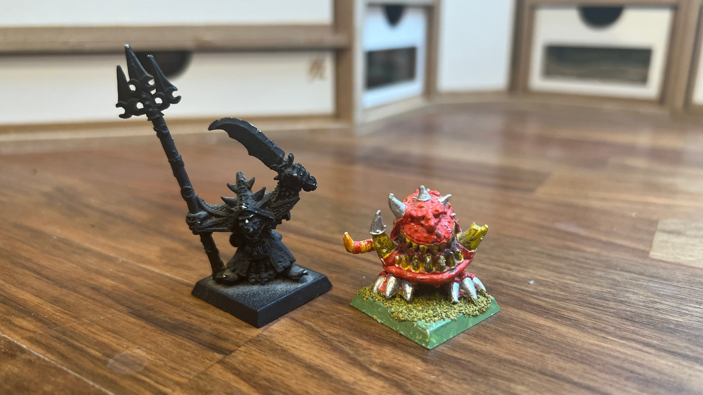

import Paint from '../../../../components/paint';

> Clad in filthy cloaks, Moonclan Grots infest dank caves and subterranean lands. Screaming reedy prayers to the
> Bad Moon, they raid the kingdoms of the free peoples and Chaos alike. The most tricksy (or just lucky) of the
> Moonclan Grots inevitably become Grot Warbosses, directing their armies towards the enemy.

As I've been adding more to my Gloomspite Gitz army I needed to clear out some space. This meant taking out my old
Orc and Goblin army I partly painted over 20 years ago. However, rather than putting them in a box or selling them I
decided to try and incorporate them into my new army. In upcoming posts you should start to spot some minis from
the 80s and 90s added to bigger bases.

## Miniature Review

This one however gets to stay as its own unit, as it remains one of my favourite miniatures of all time.
Last year I painted the newer version of Skarsnik and Gobbla, and I've kept thinking about the original and how
I never finished it because I didn't feel I was good enough at the time.

Now I've finally got to paint it and its great! I love the expressions on the pair of them, big wide grins. There's
so much detail on them both.

Gobbla is covered in boils and has a number of stitches, including a zip which is perhaps best left unthought about.
His teeth are great, both larger ones being broken but one having a cap. He even has a rat tail, not something I've
spotted on any modern day squigs.

Skarsnik is covered in skulls and other goblin symbols, along with a number of rings, gems, dwarf beards and bags.
His face is really highly detailed and his skin is covered in warts. His weapons are uniquely shaped and give him a
lot of height, so as not to be dwarved by Gobbla.

As the new scult has a snotling included on the base, I decided to add one from the 1995 Lair of the Orc Lord box.
I used to play a lot of Warhammer Quest so it's great to add as another memory.

## Painting Techniques (Squig)

### Squig Skin

<Paint name={'Blood Angels Red'} />
<Paint name={'Flesh Tearers Red'} />
<Paint name={'Evil Sunz Scarlet'} />
<Paint name={'Wild Rider Red'} />
<Paint name={'Kislev Flesh'} />

All highlights are applied as a glaze. I also used a 50:50 mix of Wild Rider Red and Kislev Flesh between using the
pure colors to hep blend them.

### Gums & Tail

<Paint name={'Volupus Pink'} />
<Paint name={'Pink Horror'} />
<Paint name={'Kislev Flesh'} />
<Paint name={'Pink Horror'} />
<Paint name={'Pallid Wych Flesh'} />

Pink horror is applied first, then a 50:50 mix of Pink Horror and Kislev Flesh, then a final 50:50 mix of
Pink Horror and Pallid Wych Flesh.

### Teeth & Horns

<Paint name={'Aggaros Dunes'} />
<Paint name={'Agrax Earthshade'} />
<Paint name={'Rhinox Hide'} />
<Paint name={'Morghast Bone'} />
<Paint name={'Wraithbone'} />
<Paint name={'White Scar'} />

### Claws

<Paint name={'Black Legion'} />
<Paint name={'Thunderhawk Blue'} />
<Paint name={'Russ Grey'} />
<Paint name={'Fenrisian Grey'} />

### Eyes

<Paint name={'White Scar'} />
<Paint name={'Bad Moon Yellow'} />
<Paint name={'Nazdreg Yellow'} />
<Paint name={'White Scar'} />

## Painting Techniques (Grots)

### Skin

<Paint name={'Gutrippa Flesh'} />
<Paint name={'Biel Tan Green'} />
<Paint name={'Warboss Green'} />
<Paint name={'Orruk Flesh'} />
<Paint name={'Ogryn Camo'} />
<Paint name={'Skarsnik Green'} />
<Paint name={'Volupus Pink'} />
<Paint name={'Kislev Flesh'} />

Volupus Pink is watered down and applied around the gums and face

### Eyes

<Paint name={'Blood Angels Red'} />
<Paint name={'Flesh Tearers Red'} />
<Paint name={'Flash Gitz Yellow'} />
<Paint name={'Phalanx Yellow'} />

### Yellow Armour

<Paint name={'Bad Moon Yellow'} />
<Paint name={'Ironjawz Yellow'} />
<Paint name={'Nazdreg Yellow'} />
<Paint name={'Flash Gitz Yellow'} />

The first contrast paint was applied the entire area, then the following contrast paints were applied to the outer
edges. The final layer paint was used as a highlight.

### Cloak

<Paint name={'Black Legion'} />
<Paint name={'Thunderhawk Blue'} />
<Paint name={'Russ Grey'} />
<Paint name={'Fenrisian Grey'} />

### Leather

<Paint name={'Snakebite Leather'} />
<Paint name={'Agrax Earthshade'} />
<Paint name={'Skrag Brown'} />

### Rope

<Paint name={'Aggaros Dunes'} />
<Paint name={'Agrax Earthshade'} />
<Paint name={'Rakarth Flesh'} />
<Paint name={'Morghast Bone'} />

### Steel

<Paint name={'Iron Hands Steel'} />
<Paint name={'Agrax Earthshade'} />
<Paint name={'Grey Knights Steel'} />
<Paint name={'Stormhost Silver'} />

### Copper

<Paint name={'Hashut Copper'} />
<Paint name={'Agrax Earthshade'} />
<Paint name={'Fulgurite Copper'} />
<Paint name={'Stormhost Silver'} />

### Fire

<Paint name={'White Scar'} />
<Paint name={'Bad Moon Yellow'} />
<Paint name={'Magmadroth Flame'} />
<Paint name={'Rhinox Hide'} />

## Base

First I added a couple of layers of corkboard to the base, then filled in the gaps and smoothed over areas with
miliput. I then applied a layer of Stirland Battlemire over the base to give it some texture.

I then applied a mix of flocks, rocks, tufts, flowers and plants, grouped below by company:

### Geek Gaming Scenics

- [Patchy Plains](https://www.geekgamingscenics.com/collections/base-ready-range/products/lukes-aps-base-ready-patchy-plains)
- [Scrublands](https://www.geekgamingscenics.com/collections/base-ready-range/products/lukes-aps-base-ready-scrublands)

### Army Painter

- [Battlefield Rocks](https://www.thearmypainter.com/shop/us/bf4117p)
- [Meadow Flowers Tufts](https://www.thearmypainter.com/shop/us/bf4231p)
- [Woodland Tufts](https://www.thearmypainter.com/shop/us/bf4224p)
- [Lowland Shrubs Tufts](https://www.thearmypainter.com/shop/us/bf4232p)

### Gamers Grass

- [Wild Flowers](https://gamersgrass.com/product/wild-flowers-set/)

### AK Interactive

- [Puddles](https://ak-interactive.com/product/puddles-60ml/)

Finally I painted the outside of the base.

<Paint name={'Gore Grunta Fur'} />
<Paint name={'Rhinox Hide'} />

## Roundup

I really enjoyed painting these guys finally. Suprisingly I found them really easy to paint, although I didn't feel
they were too simple at all as I would epect compared to the newer more complex miniatures. They look great mixed in
with the rest of the army, and I'm looking forward to including more of the older grots elsewhere in the army!
