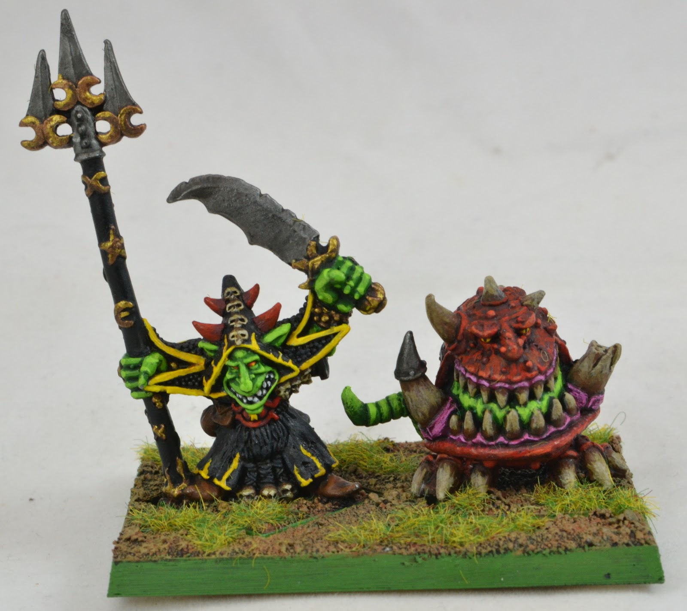

import Paint from '../../../../components/paint';

> Warlord Skarsnik, known by his official title as King of the Eight Peaks, or simply just the King under the Mountain,
> is the chieftain of the Crooked Moon Tribe and the most powerful Night Goblin Warlord in the whole of the southern
> Worlds Edge Mountains.

## Miniature Review

Back in the day I started collecting Orcs and Goblins largely due to the original Skarsnik and Gobbla miniature.
I loved squigs, and he was by far the biggest at the time. It makes me really happy that they redesigned the miniature,
even if they've dropped the character name.

As squigs have since grown in size, they've made Gobbla truly huge to ensure he stands out on the battlefield. I love
the huge tongue as it gives him a lot of character and makes him look a lot more ferocious than the other more comedic
squigs.

Skarsnik's hat has also grown and having him stood on a rock gives him the height to make him still look in
control of this beast of a squig. The smaller snotling also helps to make Skarsnik appear larger than he really is.

There's a few little details on him like a moon potion and sickle, but sadly not to the level of Skragrott. I guess
this is due to him being an older miniature from the finecast days. Overall though I'm still really happy that he's been
given a new life and can be at the centre of my Gloomspite army.

## Painting Techniques

### Gobbla

#### Gums

<Paint name={'Barak Nar Burgundy'} />
<Paint name={'Druchii Violet'} />
<Paint name={'Barak Nar Burgundy'} />
<Paint name={'Bugmans Glow'} />
<Paint name={'Bugmans Glow'} />
<Paint name={'Cadian Fleshtone'} />
<Paint name={'Kislev Flesh'} />

Barak Nar Burgundy & Bugmans Glow 1:1

#### Skin

<Paint name={'Squig Orange'} />
<Paint name={'Mephiston Red'} />
<Paint name={'Khorne Red'} />
<Paint name={'Gal Vorbak Red'} />
<Paint name={'Squig Orange'} />
<Paint name={'Fire Dragon Bright'} />

Mephiston, Khorne Red and Gal Vorbak Red thinned as a glaze, focusing in deeper recesses each time.
Also use Gal Vorbak Red to add some freckles to the skin.

Squig Orange & Fire Dragon Bright 1:1 to highlight raised areas

#### Scales

<Paint name={'Gal Vorbak Red'} />
<Paint name={'Khorne Red'} />
<Paint name={'Mephiston Red'} />
<Paint name={'Squig Orange'} />

#### Eyes

<Paint name={'Averland Sunset'} />
<Paint name={'Yriel Yellow'} />
<Paint name={'Flash Gitz Yellow'} />
<Paint name={'Fuegan Orange'} />
<Paint name={'Abaddon Black'} />

#### Teeth & Horns

<Paint name={'Deepkin Flesh'} />
<Paint name={'Baneblade Brown'} />
<Paint name={'Deepkin Flesh'} />
<Paint name={'Baneblade Brown'} />
<Paint name={'Steel Legion Drab'} />
<Paint name={'Deepkin Flesh'} />
<Paint name={'Screaming Skull'} />

Baneblade Brown & Deepkin Flesh 1:1 mix, and watered down to glaze on.
Then use watered down Baneblade Brown to shade the recesses, then the same again with Steel Legion Drab.

#### Claws

<Paint name={'Abaddon Black'} />
<Paint name={'Dark Reaper'} />
<Paint name={'Thunderhawk Blue'} />
<Paint name={'Fenrisian Grey'} />

Use thinned Dark Reaper to add a chunky edge highlight.
Then Thunderhawk Blue as a thinner edge highlight on the sharper points.
Finally, use Fenrisian Grey as a dot highlight.

#### Staples

<Paint name={'Iron Warriors'} />
<Paint name={'Nuln Oil'} />
<Paint name={'Nuln Oil Gloss'} />
<Paint name={'Iron Hands Steel'} />

Mix Nuln Oil & Nuln Oil Gloss 1:1

### Skarsnik & Snotling

#### Red Cloth

<Paint name={'Mephiston Red'} />
<Paint name={'Incubi Darkness'} />
<Paint name={'Mephiston Red'} />
<Paint name={'Mephiston Red'} />
<Paint name={'Evil Sunz Scarlet'} />
<Paint name={'Wild Rider Red'} />
<Paint name={'Deathclaw Brown'} />

Mephiston Red & Incubi Darkness 1:1 mix thinned recess wash, then apply again 2:1 in the deepest recesses
Glaze on Mephiston Red to help smooth blends.

#### Skin

<Paint name={'Skarsnik Green'} />
<Paint name={'Ork Flesh'} />
<Paint name={'Incubi Darkness'} />
<Paint name={'Nurgling Green'} />
<Paint name={'Screaming Skull'} />
<Paint name={'Nurgling Green'} />

Thin the Ork Flesh and glaze a few times to build contrast. Use thinned Incubi Darkness as a recess shade.
Use Nurgling Green as a thin glaze to highlight the raised areas.
Mix Screaming Skull & Nurgling Green 1:1 for the final highlight

#### Robe

<Paint name={'Abaddon Black'} />
<Paint name={'Dark Reaper'} />
<Paint name={'Thunderhawk Blue'} />
<Paint name={'Fenrisian Grey'} />

Use thinned Dark Reaper to add a chunky edge highlight.
Then Thunderhawk Blue as a thinner edge highlight on the sharper points.
Finally, use Fenrisian Grey as a dot highlight.

#### Steel

<Paint name={'Iron Warriors'} />
<Paint name={'Nuln Oil'} />
<Paint name={'Nuln Oil Gloss'} />
<Paint name={'Iron Hands Steel'} />

Mix Nuln Oil & Nuln Oil Gloss 1:1

#### Teeth

<Paint name={'Ushabti Bone'} />
<Paint name={'Agrax Earthshade'} />
<Paint name={'Screaming Skull'} />

#### Eyes

<Paint name={'Mephiston Red'} />
<Paint name={'Wild Rider Red'} />
<Paint name={'Flash Gitz Yellow'} />

#### Cloth, Bone & Mushroom Stalk

<Paint name={'Ushabti Bone'} />
<Paint name={'Reikland Fleshshade'} />
<Paint name={'Rhinox Hide'} />
<Paint name={'Doombull Brown'} />
<Paint name={'Ushabti Bone'} />
<Paint name={'Screaming Skull'} />

Rhinox Hide & Doombull Brown 1:1 mix thinned recess wash

#### Golds

<Paint name={'Retributor Armour'} />
<Paint name={'Reikland Fleshshade'} />
<Paint name={'Reikland Fleshshade Gloss'} />
<Paint name={'Liberator Gold'} />

Shade with a 1:1 of Reikland Fleshshade & Reikland Fleshshade Gloss.

#### Teeth

<Paint name={'Ushabti Bone'} />
<Paint name={'Agrax Earthshade'} />
<Paint name={'Screaming Skull'} />

#### Bottle

<Paint name={'Caledor Sky'} />
<Paint name={'Teclis Blue'} />
<Paint name={'Fenrisian Grey'} />
<Paint name={'Blue Horror'} />

#### Eyes

<Paint name={'Mephiston Red'} />
<Paint name={'Evil Sunz Scarlet'} />
<Paint name={'Wild Rider Red'} />
<Paint name={'Phalanx Yellow'} />

### Base

<Paint name={'Rhinox Hide'} />

#### Rock

<Paint name={'Dawnstone'} />
<Paint name={'Agrax Earthshade'} />
<Paint name={'Nuln Oil'} />
<Paint name={'Dawnstone'} />

#### Mud

<Paint name={'Rhinox Hide'} />
<Paint name={'Stirland Battlemire'} />
<Paint name={'Stirland Mud'} />

## Roundup

I'm really happy with how he's come out. I used a lot more colours and a much longer process than I normally would,
but as a centrepiece it really makes him stand out from the rest. I wouldn't paint infantry this way, but will at least
take forward some techniques used in the future for other characters.
