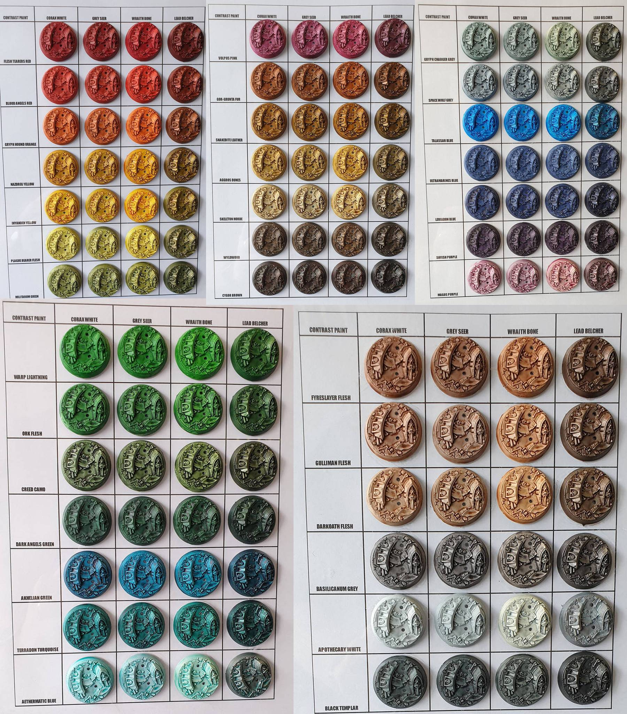

import Paint from '../../../../components/paint';

> Skragrott the Loonking is the self-styled overlord the Gloomspite Gitz. His sinister presence upon the field of
> battle ensures his fellow grots fight with greater spite and cunning than ever.

## Miniature Review

With the new range of Gloomspite Gitz (maybe not that new now!) I decided I had to get at least one, so I decided to go
for the leader, Skragrott the Loonking. I've always added mushrooms to my Gloomspite miniatures, so having one that is
half mushrooms, with them even growing out of his brains is amazing.

Having both the crown mixed amongst the mushrooms, and the loyal squigs carrying his royal robe behind him really
identifies him on the battlefield as the leader. The moon fungus gives him both additional height, and a bright beacon
to easily spot him amongst the rest of the army.

It's also great to see a lot of little details. Mushroom potion vials, talismans, moons, jewelry, a spider skeleton and
tons and tons of various fungi. It gives you a lot to look at, but because they're all mostly small it doesn't draw your
focus away from the focal points.

## Painting Techniques

Along with Skragrott I also purchased the full range of contrast paints. They're marketed as an alternative method of
painting. You either use the traditional method of base, layer and highlight, or you use the contrast range and just
add a bit of highlighting.

Personally I plan to use them alongside each other. I think they'll work great for softer materials where I normally
rely on shades to quickly get a base level of shading and highlighting which can then be added to when needed. For
harder materials like metals I don't think they'll create the smooth finish I'm after, but could work great to replace
the old glaze paints when thinned down.

Before starting, I gave the miniature an initial basecoat of Grey Seer. Whenever starting an area with a contrast paint
I made sure to paint over any spills with the Grey Seer paint to ensure an even base layer.

### Skin

<Paint name={'Ork Flesh'} />
<Paint name={'Warboss Green'} />
<Paint name={'Skarsnik Green'} />

### Cloth

<Paint name={'Black Templar'} />
<Paint name={'Ultramarine Blue'} />
<Paint name={'Hoeth Blue'} />

Use multiple layers of Black Templar and a thin layer of Ultramarine Blue.

### Silver

<Paint name={'Leadbelcher'} />
<Paint name={'Nuln Oil'} />
<Paint name={'Leadbelcher'} />
<Paint name={'Runefang Steel'} />
<Paint name={'Necron Compound'} />

### Copper

<Paint name={'Hashut Copper'} />
<Paint name={'Agrax Earthshade'} />
<Paint name={'Fulgurite Copper'} />

### Bark

<Paint name={'Gore Grunta Fur'} />
<Paint name={'Wyldwood'} />
<Paint name={'Sylvaneth Bark'} />

Only apply a thin layer of Gore Grunta Fur to give some variation when the Wyldwood is applied over the top.

### Fur

<Paint name={'Gore Grunta Fur'} />
<Paint name={'Golgfag Brown'} />
<Paint name={'Tallarn Sand'} />

### Leather

<Paint name={'Gore Grunta Fur'} />
<Paint name={'Doombull Brown'} />
<Paint name={'Mournfang Brown'} />

### Bone

<Paint name={'Morghast Bone'} />
<Paint name={'Rakarth Flesh'} />
<Paint name={'Agrax Earthshade'} />
<Paint name={'Ushabti Bone'} />
<Paint name={'Screaming Skull'} />
<Paint name={'Blood Angels Red'} />
<Paint name={'Flash Gitz Yellow'} />

The Blood Angels Red and Flash Gitz Yellow were used to create the eye glow effect.

### Teeth

<Paint name={'Skeleton Horde'} />
<Paint name={'Ushabti Bone'} />
<Paint name={'Screaming Skull'} />

### Yellows

<Paint name={'Iyanden Yellow'} />
<Paint name={'Dorn Yellow'} />
<Paint name={'Flash Gitz Yellow'} />
<Paint name={'Terradon Turquoise'} />

### Red Mushrooms

<Paint name={'Blood Angels Red'} />
<Paint name={'Wild Rider Red'} />
<Paint name={'Corax White'} />

The Corax White is used for the dots.

### Bottles & Mushrooms

<Paint name={'Aethermatic Blue'} />
<Paint name={'Terradon Turquoise'} />
<Paint name={'Corax White'} />

The Terradon Turquoise was painted into the recesses, and the Corax White was thinned and applied to reflective areas.

### Squigs

#### Skin

<Paint name={'Blood Angels Red'} />
<Paint name={'Flesh Tearers Red'} />
<Paint name={'Mephiston Red'} />
<Paint name={'Evil Sunz Scarlet'} />

The Flesh Tearers Red was applied to areas of shadow.

#### Spines

<Paint name={'Abaddon Black'} />
<Paint name={'Mechanicus Standard Grey'} />
<Paint name={'Dawnstone'} />

#### Eyes & Spots

<Paint name={'Averland Sunset'} />
<Paint name={'Dorn Yellow'} />
<Paint name={'Flash Gitz Yellow'} />

#### Teeth

<Paint name={'Morghast Bone'} />
<Paint name={'Rakarth Flesh'} />
<Paint name={'Agrax Earthshade'} />
<Paint name={'Ushabti Bone'} />

## Basing

I started by adding a thick layer of Stirland Battlemire, then applied a shade of Agrax Earthshade and a drybrush of
Tallarn Sand. I then applied some Citadel Scorched Grass in patches as well as some
[Leaf Litter](http://www.greenstuffworld.com/en/model-leaves/277-leaf-scatter-litter-natural-leaves.html). Finally, I
painted around the edge of the base with Rhinox Hide, then Mournfang Brown.

## Roundup

It was interesting testing out the contrast paints on a Games Workshop miniature. I had already tested them out on
some miniatures I wouldn't otherwise paint just to see how quickly I could produce half decent results (it turned out
to be around an hour a model). This was the first time using them when painting at a high standard (for me at least!).

I find the paints to produce quite unpredictable results, which isn't always ideal but can produce natural results.
I am new still new to them so maybe after some more use I can learn to apply them in a more predictable way. It can be
a pain going over every mistake with Grey Seer but at least the next layer always goes on quick.

I'll be messing around a lot more with the contrast range, but it certainly won't be replacing my current technique.
Having them will definitely be a great tool to have at hand though, much like the technical paints and weathering
paints and powders.
