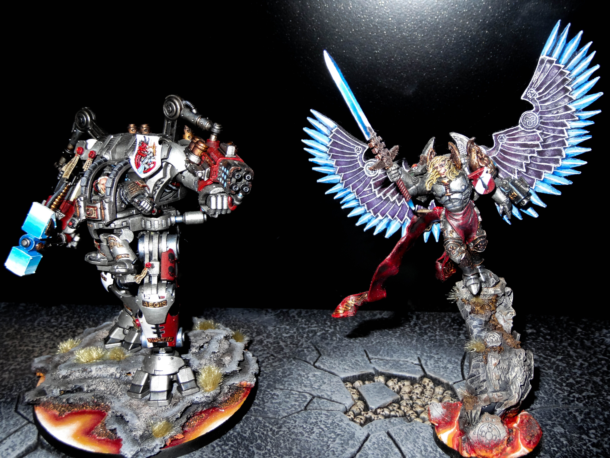

With my second Dreadknight (see my first here) I wanted to create a new pose, to stop them looking too similar. I largely followed [this](http://www.bolterandchainsword.com/topic/226502-re-posed-dreadknight/) post. It basically involved cutting the left leg in half just below the joint, following the rounded joint and re-positioning it and giving it a bend. I also reshaped the joint at the hip allowing me to twist the entire leg at an angle. The main issue this gives is that the pilots leg no longer fits were it should. I ended up cutting the pilots leg in a couple of places to give it a more realistic position. It was very difficult to get it in the right place without looking silly, but I think it came out looking OK in the end.

I also cut the left arm at the elbow, straightening it up to give the appearance of the pilot aiming at a nearby enemy. I cut it at the ribbed joint and added greenstuffed ribbing to fill in the gap. Unfortunately as with everything this caused a chain reaction, as now the top piston wouldn’t fit into the socket. I had to cut out the inner pistons and stick the rest back together, making them shorter.

Finally for both the arm and leg, reposing them meant that the wires were now too long and didn’t fit. I cut them off, shorted them down and reattached them at the right angle to make them fit correctly. I also had to shave down the feet sockets just so I could get them in at the right angles.

I also tried a new painting method. I ensured all parts that needed to be painted differently were kept separate (armour plates on legs, shoulder pads, weapons, pilot etc). I always mean to do this, but because I don’t want the model to sit in a box unassembled forever, I always end up sticking it all together. Wow it makes painting so much quicker when its all kept separate! Hopefully with this knowledge it will force me to paint new models straight away to make it easier and not have them hidden away forever!

I also did very little wet blending on the model. The silver was a basecoat, followed by several washes, then a couple of drybrushes and a final highlight. Honestly I’m surprised how well it came out and it was easily 5-10 times quicker! The only wet blending I used was for the red armour plates, the base and the weapons.

The model is fully magnetised as well. The hammer, sword and basic hand are interchangeable. As are the weapon heads and the ammo, along with the top pistons to allow the weapons to be fully removed. It is also magnetised to the base with strong magnets. It can come off, but only if you pull it. Using it in a game you can lift the model as the usual without any fear of it coming off.

Well that’s it. Let me know what you think, if anyone needs further help reposing their Dreadknight feel free to drop a comment and I’ll do my best to help!

