Back in 2015 I backed [Iron Battlefield on Indiegogo](https://www.indiegogo.com/projects/iron-battlefield#/).
A range of 28mm Sci Fi terrain with an industrial style design, with a focus on being highly configurable for both
indoor and outdoor games.

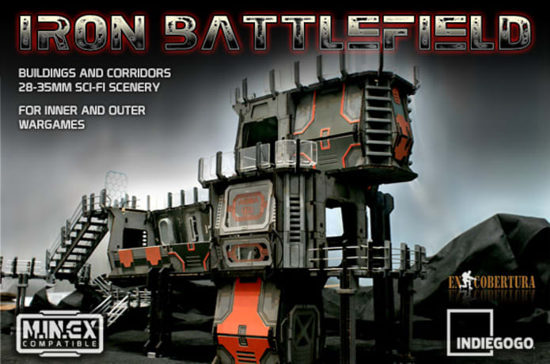

To me it seemed perfect for a Space Marine army. Bulky, dark metallic walls, floors, catwalks and grids, combined with
panels to customise it to an army (Space Wolves!). It also had a lot of extras that really bring it to life and add a
bit of colour, including metal and crystal fences, windows, computer panels, boxes, barrels and more.

## The Campaign

Some key features listed were:

- **Compatibility**: All rooms, corridors and catwalks can be connected in a range of different ways.
- **Versatility**: Not only are multiple connections possible, but everything can be broken down and used together to
create a range of designs.
- **Extensible**: Designed using the MINEX standard, so will be compatible with any new design that follows the same
standard.
- **Easy to assemble/paint**: Made with pre-painted lasercut MDF, adhesive plates with a metallic finish, and full
color stickers. Easy to wash and drybrush to create a more weathered effect.
- **Realistic textures**: To break up the MDF structure, metallic plates, resin and clear crystal pieces are included.
- **Inside and outside options**: Sections can be used externally for Warhammer 40.000, or internally for games like
Space Hulk, or as a combination.

Below are each of the core components with blueprints of the different sizes each comes in:

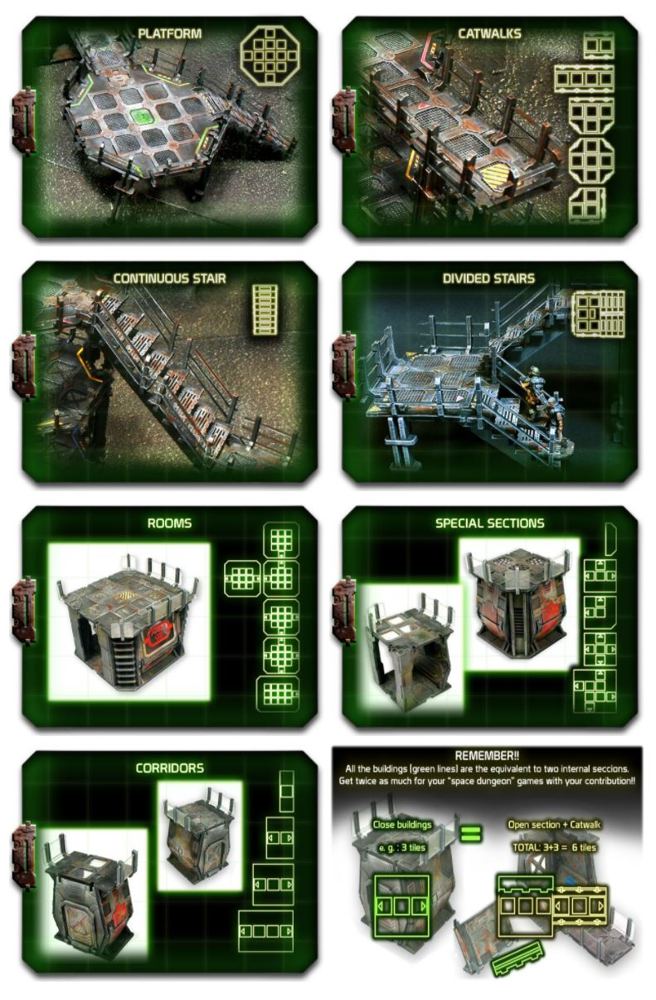

The key feature that convinced me to back the project was how enclosed rooms and corridors could be broken down to
reveal full sized interiors and walkways. This makes for some unique and really exciting games of 40k, as well as more
immersive games of Space Hulk. Here you get the idea of how a corridor can be switched up.

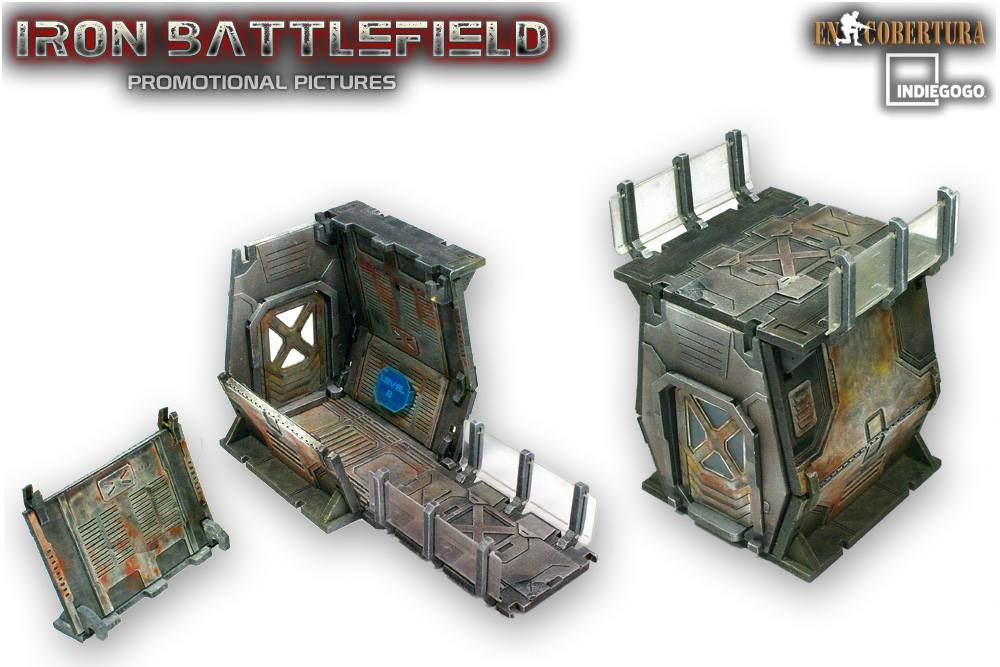

Just tell me this doesn't look like a great game of Space Hulk!

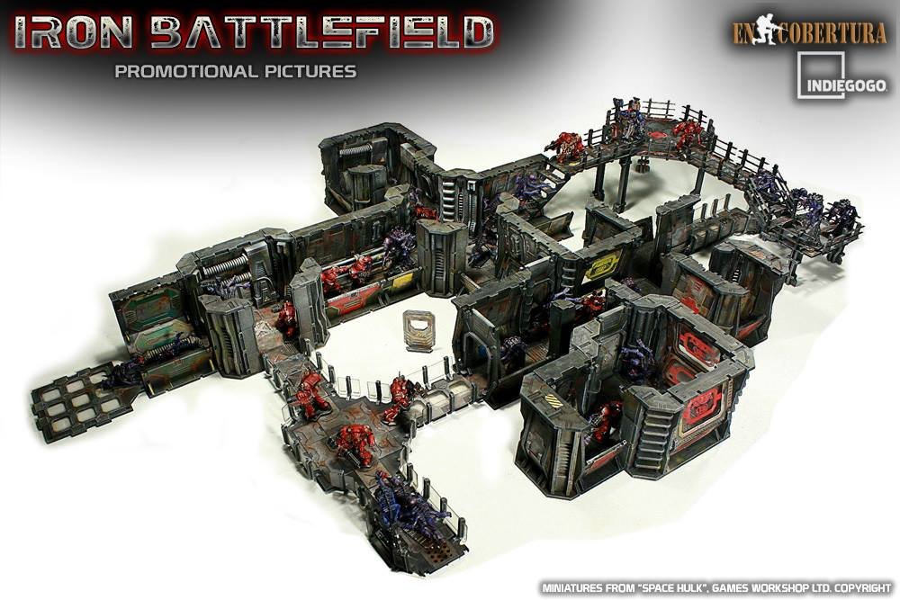

So what reward level did I go for? The one that includes everything to play a full game of Space Hulk of course! Oh and
a few extras.

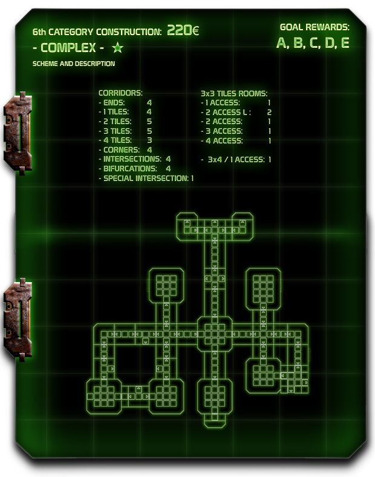

## It arrived!

Originally estimated to be delivered January 2016, deadlines started to slip. More and more things went wrong in the
manufacturing process, and it felt like it would never arrive. But what do you know it, in December 2017 a large box
arrives. A Christmas miracle!

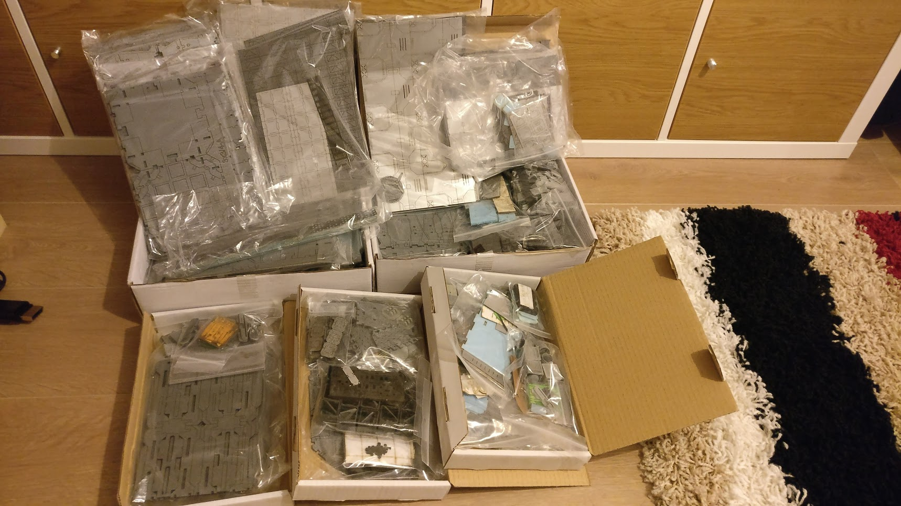

So it doesn't really show up in the photo but there were an unbelievable number of pieces. Even simplest corridor
has over 20 MDF components that each needed cutting out, filing and gluing. Before even getting to that stage though
pieces needed to be located and grouped as they came organised by type, not by unit. The instructions also didn't
explicitly list all the pieces needed for each unit, so trying to organise 1000s of pieces wasn't an easy job.

After around 3 months I'd finally built my first few pieces, and it was looking good!

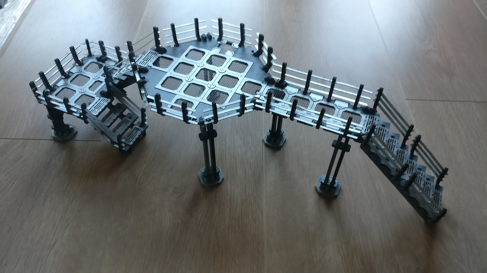

After another 6 months or, so I finally had it all built, and had even spray-painted some panels and given some of it a
first wash. This was by far the biggest hobby project I'd ever taken on!

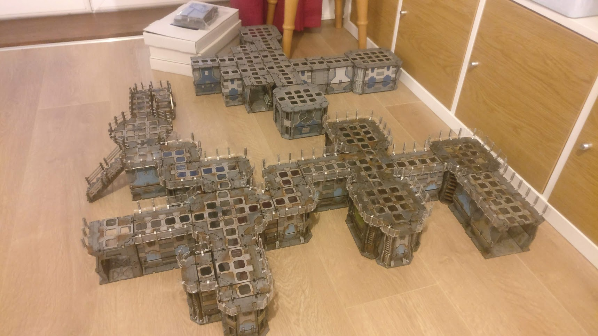

## It's done!

Anyway let's skip forward a little bit..., and it's done!

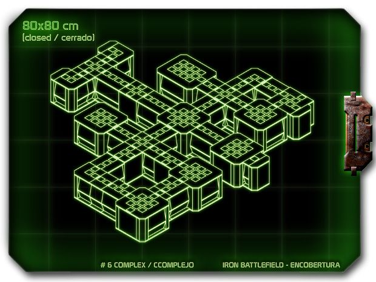
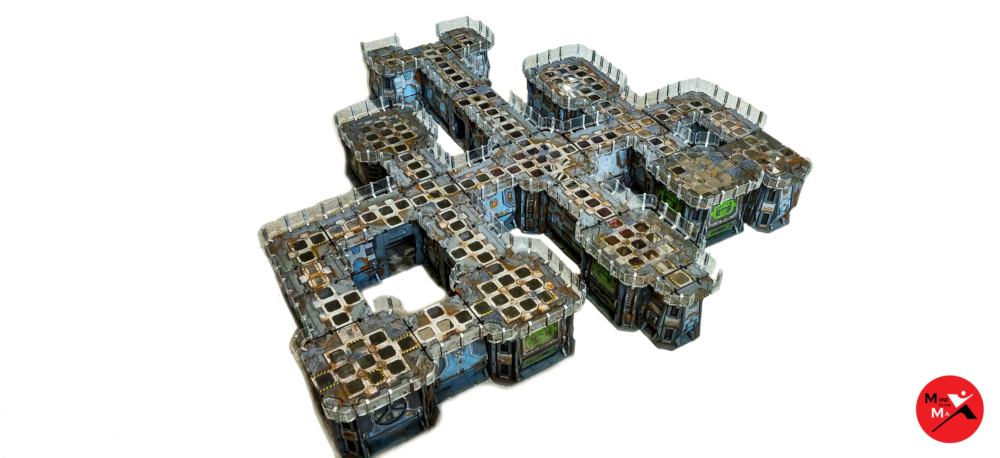

As I said it was a huge project, but totally worth it!

I decided to paint it to fit in nicely with my Space Wolves. The external armour plates are painted the traditional
Fenrisian Grey with windows and other accent features painted green to match the spot colour I use for gems on my sons
of Fenris.

Although Space Wolves are traditionally battle worn and heavily weathered, so far I've painted my army with fairly
pristine armour. This is for a couple of reasons. I've used a lot of gold to give them a regal feel and like to
think they would treat their armour with more respect than others in their chapter. The other reason being I've so far
not been happy with the results of my weathering techniques on smaller miniatures, so it's something I'll consider
applying to the whole army at a later date once I've honed my skills.

Despite this, having the battlefield in a pristine state just didn't look right. It was too uniform and looked more like
a toy than the usual battle-worn terrain that's expected in the grim future of 40k. I used a lot of AK Interactive's
weathering paints, including Streaking Grime, Winter Streaking Grime and Rust Streaks, as well as Games Workshop's
Typhus Corrosion and Ryza Rust.

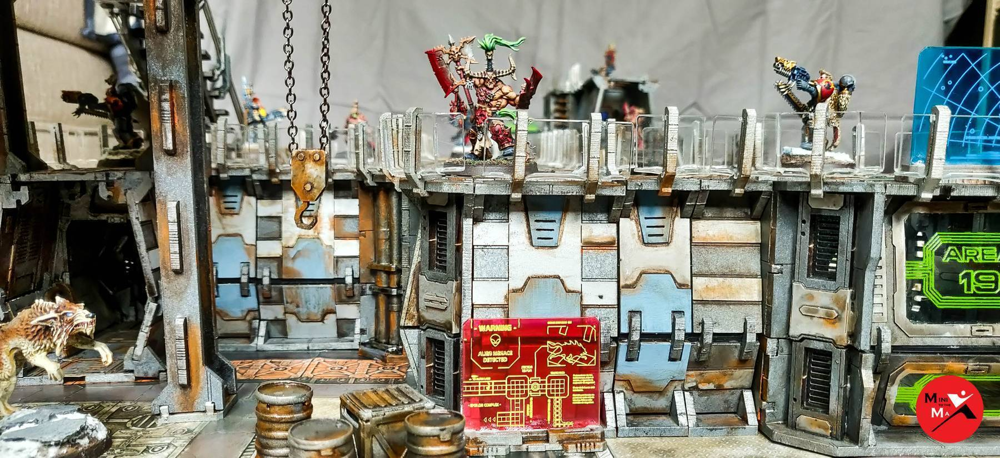

Having played around with building different structures, what I really like about the kit is the number of levels you
can create by stacking rooms and corridors on top of each other, as well as making use of the supports to add a lot of
height to the battlefield. Perfect for Necromunda games.

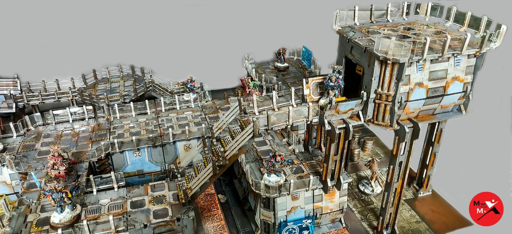

Anyway check out the photos below. There's a lot of interesting details in there, both on the outside as well as the
interiors. I'm really looking forward to playing a range of different games using it. It'll look great on a flat Realm
of Battle board with some other scenery mixed in with it, but a lot of space will be needed if I want to use it all!