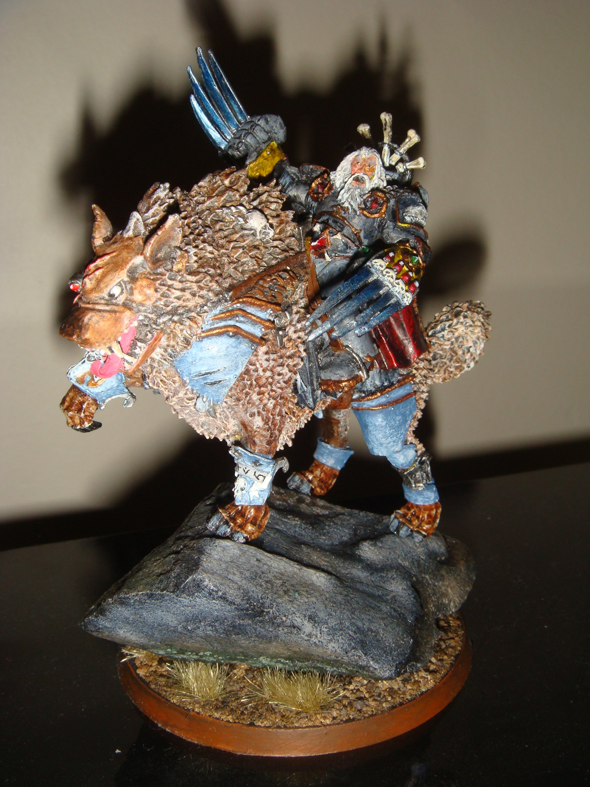

import Paint from "../../../../components/paint";

> Canis Wolfborn is one of the most feral and destructive warriors on all of Fenris. Raised by a pack of Fenrisian
> wolves in the snow-swept wilderness of Fenris, he is wolf-brother to mighty Fangir, the largest and most powerful of
> all the Thunderwolves. In battle they are an inseparable whirlwind of claws and fangs that combine brute strength
> with resourceful cunning.

## Miniature Review

Back to Thunderwolves already, but this time in HQ form. I wanted to have a leader for the unit, so I decided to take my
badly painted, metal Canis Wolfborn and repaint it. I think I'm just a big fan of dual lightning claws.

To make it obvious he was the leader of the pack I kept the height of the base. I think having the edge also
works nicely with the pose of the Thunderwolf. As for Canis himself I could tell he was an older miniature from a bit of
a lack of detail, but he's not bad, and I think fits in nicely with the rest of the unit.

## Painting Techniques

### Armour
<Paint name={'The Fang'} />
<Paint name={'Russ Grey'} />
<Paint name={'Agrax Earthshade'} />
<Paint name={'Fenrisian Grey'} />
<Paint name={'Blue Horror'} />

Fenrisian Grey is applied as an edge highlight and Blue Horror as an extreme edge highlight.

### Pelts
<Paint name={'Karak Stone'} />
<Paint name={'Agrax Earthshade'} />
<Paint name={'Ushabti Bone'} />
<Paint name={'Screaming Skull'} />

Ushabti Bone and Screaming Skull can be swapped out for Tyrant Skull and Terminatus Stone.
For fur apply the shade more heavily in the center.

### Bone & Fangs
<Paint name={'Morghast Bone'} />
<Paint name={'Rakarth Flesh'} />
<Paint name={'Agrax Earthshade'} />
<Paint name={'Ushabti Bone'} />
<Paint name={'Screaming Skull'} />

Alternatively use Zandri Dust, Reikland Fleshshade and Screaming Skull for a slightly different look.

### Red Armour & Leather
<Paint name={'Khorne Red'} />
<Paint name={'Mephiston Red'} />
<Paint name={'Evil Sunz Scarlet'} />
<Paint name={'Agrax Earthshade'} />
<Paint name={'Mephiston Red'} />
<Paint name={'Evil Sunz Scarlet'} />
<Paint name={'Wild Rider Red'} />

Brighter colours should be applied where the light would reflect the most, or parallel to edges when painting pack
markings on their shoulders.

### Runic Stone
<Paint name={'Mechanicus Standard Grey'} />
<Paint name={'Agrax Earthshade'} />
<Paint name={'Dawnstone'} />

### Runes & Lenses (Blue)
<Paint name={'Kantor Blue'} />
<Paint name={'Caledor Sky'} />
<Paint name={'Lothern Blue'} />
<Paint name={'White Scar'} />

### Lenses & Gems (Green)
<Paint name={'Warpstone Glow'} />
<Paint name={'Moot Green'} />
<Paint name={'Gauss Blaster Green'} />
<Paint name={'Corax White'} />

### Skin
<Paint name={'Bugmans Glow'} />
<Paint name={'Cadian Fleshtone'} />
<Paint name={'Reikland Fleshshade'} />
<Paint name={'Agrax Earthshade'} />
<Paint name={'Carroburg Crimson'} />
<Paint name={'Kislev Flesh'} />
<Paint name={'Pallid Wych Flesh'} />

Agrax Earthshade is thinned down and only applied to the deepest recesses.
Carroburg Crimson is applied in the recesses around the eyes and nose.

### Beige Hair
<Paint name={'Karak Stone'} />
<Paint name={'Agrax Earthshade'} />
<Paint name={'Ushabti Bone'} />
<Paint name={'Screaming Skull'} />

### Steel
<Paint name={'Leadbelcher'} />
<Paint name={'Nuln Oil'} />
<Paint name={'Leadbelcher'} />
<Paint name={'Runefang Steel'} />
<Paint name={'Stormhost Silver'} />

### Wolf Claws
<Paint name={'Kantor Blue'} />
<Paint name={'Caledor Sky'} />
<Paint name={'Alaitoc Blue'} />
<Paint name={'White Scar'} />

The claws were broken down into quarters, starting with the darkest blue towards the base and moving towards white at
the tip. To blend each adjacent quarter I mixed the two paints together and applied it in the middle. I then repeated
this over and over, always saving a bit of each mixture, until achieving a smooth transition. A final edge highlight of
White Scar was applied along the sharpest edges.

### Weapon Casings & Seals
<Paint name={'Corvus Black'} />
<Paint name={'Mechanicus Standard Grey'} />
<Paint name={'Administratum Grey'} />

Mechanicus Standard Grey is applied as an edge highlight and Administratum Grey as an extreme edge highlight.

### Gold
<Paint name={'Retributor Armour'} />
<Paint name={'Agrax Earthshade'} />
<Paint name={'Retributor Armour'} />
<Paint name={'Liberator Gold'} />
<Paint name={'Stormhost Silver'} />

### Cloth & Parchment
<Paint name={'Morghast Bone'} />
<Paint name={'Rakarth Flesh'} />
<Paint name={'Seraphim Sepia'} />
<Paint name={'Ushabti Bone'} />
<Paint name={'Screaming Skull'} />

### Purity Seals
<Paint name={'Khorne Red'} />
<Paint name={'Mephiston Red'} />
<Paint name={'Agrax Earthshade'} />
<Paint name={'Mephiston Red'} />
<Paint name={'Evil Sunz Scarlet'} />

Screamer Pink, Emperor's Children and Nuln Oil can be used instead to differentiate from other reds.

### Leather
<Paint name={'Mournfang Brown'} />
<Paint name={'Nuln Oil'} />
<Paint name={'Mournfang Brown'} />
<Paint name={'Tuskgor Fur'} />
<Paint name={'Baneblade Brown'} />

### Yellow Armour
<Paint name={'Averland Sunset'} />
<Paint name={'Yriel Yellow'} />
<Paint name={'Flash Gitz Yellow'} />

### Thunderwolf

#### Fur
<Paint name={'Zandri Dust'} />
<Paint name={'Seraphim Sepia'} />
<Paint name={'Reikland Fleshshade'} />
<Paint name={'Agrax Earthshade'} />
<Paint name={'Karak Stone'} />
<Paint name={'Tyrant Skull'} />
<Paint name={'Bestigor Flesh'} />
<Paint name={'Longbeard Grey'} />
<Paint name={'Screaming Skull'} />

Only apply the Reikland Fleshshade to the top darker parts, and the Agrax Earthshade within that.
The Karak Stone is used to lightly highlight the darker areas, while the Tyrant Skull should only be used to highlight
the lighter areas.
The Bestigor Flesh was used to highlight the areas between light and dark to create a transition.
The Longbeard Grey and Screaming Skull is used to highlight areas such as the ears and lightest parts of the fur.

#### Gums
<Paint name={'Cadian Fleshtone'} />
<Paint name={'Carroburg Crimson'} />
<Paint name={'Emperors Children'} />
<Paint name={'Agrax Earthshade'} />
<Paint name={'Screaming Skull'} />

#### Bionic Eye
<Paint name={'Khorne Red'} />
<Paint name={'Evil Sunz Scarlet'} />
<Paint name={'Agrax Earthshade'} />
<Paint name={'Fire Dragon Bright'} />
<Paint name={'Flash Gitz Yellow'} />

## Basing

I cast some Fantascape Glacial Ruins bases using Instant Mold & Milliput, then glued some sand around the edges,
applying a second layer of watered down PVA to help it stuck.

### Stone
<Paint name={'Karak Stone'} />
<Paint name={'Agrax Earthshade'} />
<Paint name={'Karak Stone'} />
<Paint name={'Ushabti Bone'} />
<Paint name={'Seraphim Sepia'} />
<Paint name={'Screaming Skull'} />
<Paint name={'Pallid Wych Flesh'} />

The Seraphim Sepia was applied in patches to give a dirt stained look.

### Ice
<Paint name={'The Fang'} />
<Paint name={'Russ Grey'} />
<Paint name={'Fenrisian Grey'} />
<Paint name={'Etherium Blue'} />

### Dirt
<Paint name={'Mournfang Brown'} />
<Paint name={'Agrax Earthshade'} />
<Paint name={'Tallarn Sand'} />
<Paint name={'Zandri Dust'} />

### Base Edge
<Paint name={'Rhinox Hide'} />
<Paint name={'Mournfang Brown'} />

Finally, I applied some Mordheim Turf tufts and then a couple of layers of Deluxe's Scenic Snow.

## Roundup

It was fun to paint up an old miniature, and extra fun doing it without stripping the old paint. You can see I didn't
change the Thunderwolf dramatically at all, mainly just adding highlights and shadow.

I think Canis's face and armour had the most work doing to it and looks much sharper and more natual now. The blades
were also updated to match my new style, although I still quite like the old metallic effect.

I don't plan to paint any more of my older Space Wolves any time soon, as I much prefer the new models, but maybe one
day.