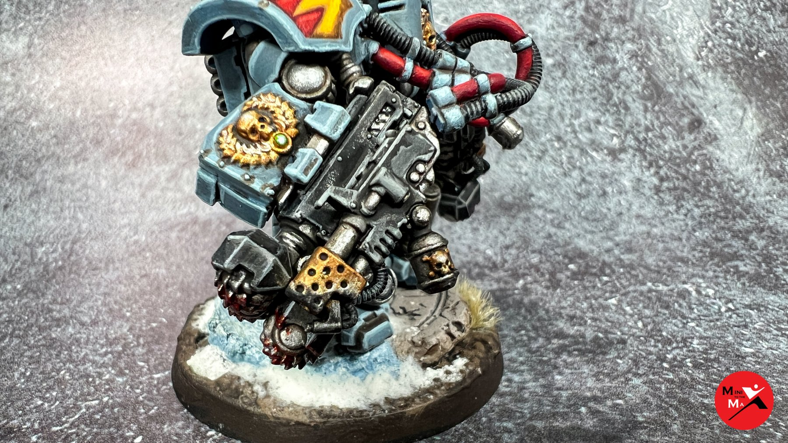

import Paint from "../../../../components/paint";

> Centurion Devastator Squads are long-range specialists who pound enemy positions with salvos of heavy weapons fire.
> They are primarily employed to besiege defended enemy positions, or used as mobile firebases to strengthen the Space
> Marine battle lines.

## Miniature Review

So I bought these buys a long time before the Primaris marines came out, with the idea that bigger equals better.
Having regular marines in suits allowing them to carry heavy weapons found more commonly on tanks is a cool idea,
even if a little silly.

Primaris Aggressors are the new beefed up terminators that are much more sensibly designed, but a part of the charm
of these guys is just how ridiculously chunky they are. The main thing I didn't like was the really stiff pose of
the legs as they come in the box.

To fix this I cut them mainly around the knees and where they connect to the feet and torso, allowing me to change
the angle of the feet and bend the knees. This helps make the suits look a lot easier to move around in, and even
makes one of them look like he's charging forwards.

With these changes, along with a number of Space Wolf pelts, skulls, runes, heads and a big wolf pelt cloak on the
captain they look a lot cooler in my opinion. I also magnetised all the weapon options, allowing me to test them all
out in the future. I've added photos from all angles in the gallery below, but here are the options from the front:

### Grav-cannons

### Heavy Bolters

### Lascannons

### Siege Drills

#### Flamer

#### Meltagun

## Painting Techniques

### Armour
<Paint name={'Russ Grey'} />
<Paint name={'Agrax Earthshade'} />
<Paint name={'Russ Grey'} />
<Paint name={'Fenrisian Grey'} />
<Paint name={'Blue Horror'} />

### Skin & Eyes
<Paint name={'Bugmans Glow'} />
<Paint name={'Cadian Fleshtone'} />
<Paint name={'Reikland Fleshshade'} />
<Paint name={'Agrax Earthshade'} />
<Paint name={'Bugmans Glow'} />
<Paint name={'Cadian Fleshtone'} />
<Paint name={'Kislev Flesh'} />
<Paint name={'Carroburg Crimson'} />
<Paint name={'Druchii Violet'} />
<Paint name={'Grey Seer'} />
<Paint name={'Corvus Black'} />

### Orange Hair
<Paint name={'Squig Orange'} />
<Paint name={'Agrax Earthshade'} />
<Paint name={'Troll Slayer Orange'} />
<Paint name={'Fire Dragon Bright'} />
<Paint name={'Lugganath Orange'} />

### Cloak
<Paint name={'Corvus Black'} />
<Paint name={'Eshin Grey'} />
<Paint name={'Mechanicus Standard Grey'} />
<Paint name={'Dawnstone'} />
<Paint name={'Administratum Grey'} />
<Paint name={'Nuln Oil'} />

### Weapon Casings & Seals
<Paint name={'Corvus Black'} />
<Paint name={'Eshin Grey'} />
<Paint name={'Mechanicus Standard Grey'} />
<Paint name={'Dawnstone'} />
<Paint name={'Administratum Grey'} />
<Paint name={'Nuln Oil'} />

### Red Armour
<Paint name={'Khorne Red'} />
<Paint name={'Mephiston Red'} />
<Paint name={'Agrax Earthshade'} />
<Paint name={'Mephiston Red'} />
<Paint name={'Evil Sunz Scarlet'} />
<Paint name={'Wild Rider Red'} />

### Red Leather
<Paint name={'Word Bearers Red'} />
<Paint name={'Wazdakka Red'} />
<Paint name={'Agrax Earthshade'} />
<Paint name={'Khorne Red'} />
<Paint name={'Mephiston Red'} />
<Paint name={'Evil Sunz Scarlet'} />

### Purity Seals
<Paint name={'Khorne Red'} />
<Paint name={'Mephiston Red'} />
<Paint name={'Agrax Earthshade'} />
<Paint name={'Khorne Red'} />
<Paint name={'Mephiston Red'} />
<Paint name={'Evil Sunz Scarlet'} />
<Paint name={'Evil Sunz Scarlet'} />
<Paint name={'Wild Rider Red'} />

### Yellow Armour
<Paint name={'Averland Sunset'} />
<Paint name={'Agrax Earthshade'} />
<Paint name={'Yriel Yellow'} />
<Paint name={'Flash Gitz Yellow'} />

### Pelts
<Paint name={'Karak Stone'} />
<Paint name={'Agrax Earthshade'} />
<Paint name={'Morghast Bone'} />
<Paint name={'Ushabti Bone'} />
<Paint name={'Screaming Skull'} />

### Bone & Fangs
<Paint name={'Karak Stone'} />
<Paint name={'Agrax Earthshade'} />
<Paint name={'Morghast Bone'} />
<Paint name={'Ushabti Bone'} />
<Paint name={'Screaming Skull'} />

### Cloth & Parchment
<Paint name={'Morghast Bone'} />
<Paint name={'Rakarth Flesh'} />
<Paint name={'Seraphim Sepia'} />
<Paint name={'Ushabti Bone'} />
<Paint name={'Screaming Skull'} />

### Leather
<Paint name={'Mournfang Brown'} />
<Paint name={'Nuln Oil'} />
<Paint name={'Mournfang Brown'} />
<Paint name={'XV88'} />
<Paint name={'Steel Legion Drab'} />

### Runic Stone
<Paint name={'Mechanicus Standard Grey'} />
<Paint name={'Agrax Earthshade'} />
<Paint name={'Dawnstone'} />
<Paint name={'Administratum Grey'} />

### Runes
<Paint name={'White Scar'} />
<Paint name={'Lothern Blue'} />
<Paint name={'Teclis Blue'} />
<Paint name={'Caledor Sky'} />

### Gems
<Paint name={'Warpstone Glow'} />
<Paint name={'Agrax Earthshade'} />
<Paint name={'Warpstone Glow'} />
<Paint name={'Moot Green'} />
<Paint name={'Gauss Blaster Green'} />

### Power Weapons
<Paint name={'Kantor Blue'} />
<Paint name={'Caledor Sky'} />
<Paint name={'Alaitoc Blue'} />
<Paint name={'White Scar'} />

### Steel
<Paint name={'Leadbelcher'} />
<Paint name={'Agrax Earthshade'} />
<Paint name={'Nuln Oil'} />
<Paint name={'Iron Hands Steel'} />
<Paint name={'Runefang Steel'} />
<Paint name={'Stormhost Silver'} />

### Gold
<Paint name={'Retributor Armour'} />
<Paint name={'Agrax Earthshade'} />
<Paint name={'Retributor Armour'} />
<Paint name={'Liberator Gold'} />
<Paint name={'Stormhost Silver'} />

## Basing

I cast some Fantascape Glacial Ruins bases using Instant Mold & Milliput, then glued some sand around the edges,
applying a second layer of watered down PVA to help it stuck.

### Stone
<Paint name={'Karak Stone'} />
<Paint name={'Agrax Earthshade'} />
<Paint name={'Karak Stone'} />
<Paint name={'Ushabti Bone'} />
<Paint name={'Seraphim Sepia'} />
<Paint name={'Screaming Skull'} />
<Paint name={'Pallid Wych Flesh'} />

I applied the Seraphim Sepia applied in patches to give a dirt stained look.

### Ice
<Paint name={'The Fang'} />
<Paint name={'Russ Grey'} />
<Paint name={'Fenrisian Grey'} />
<Paint name={'Etherium Blue'} />

### Dirt
<Paint name={'Mournfang Brown'} />
<Paint name={'Agrax Earthshade'} />
<Paint name={'Tallarn Sand'} />
<Paint name={'Zandri Dust'} />

### Base Edge
<Paint name={'Rhinox Hide'} />
<Paint name={'Mournfang Brown'} />

Finally, I applied some Mordheim Turf tufts and then a couple of layers of Deluxe's Scenic Snow.

## Roundup

I went for a lot chunkier highlight than I normally do to add a bit more contrast, and I'm pretty happy with how it came
out. They're a lot brighter and cleaner than my usual more gritty style. It makes them look great on their own, but
hopefully won't stop them from standing out too much from the rest of my army. I might try the technique again in the
next unit I paint and see how they all look together.

The yellow and red on the shoulders really help prevent them looking like a big grey blob, giving them a bit of shape.
They help to draw your eye to the face in the middle, where I gave them the classic Blood Claw orange hair as I'm
sure they'd be the only ones crazy enough to put on the armour.

At some point I might add some battle damage to help tie them in a bit better, but for now I'm enjoying the new off the
factory look.