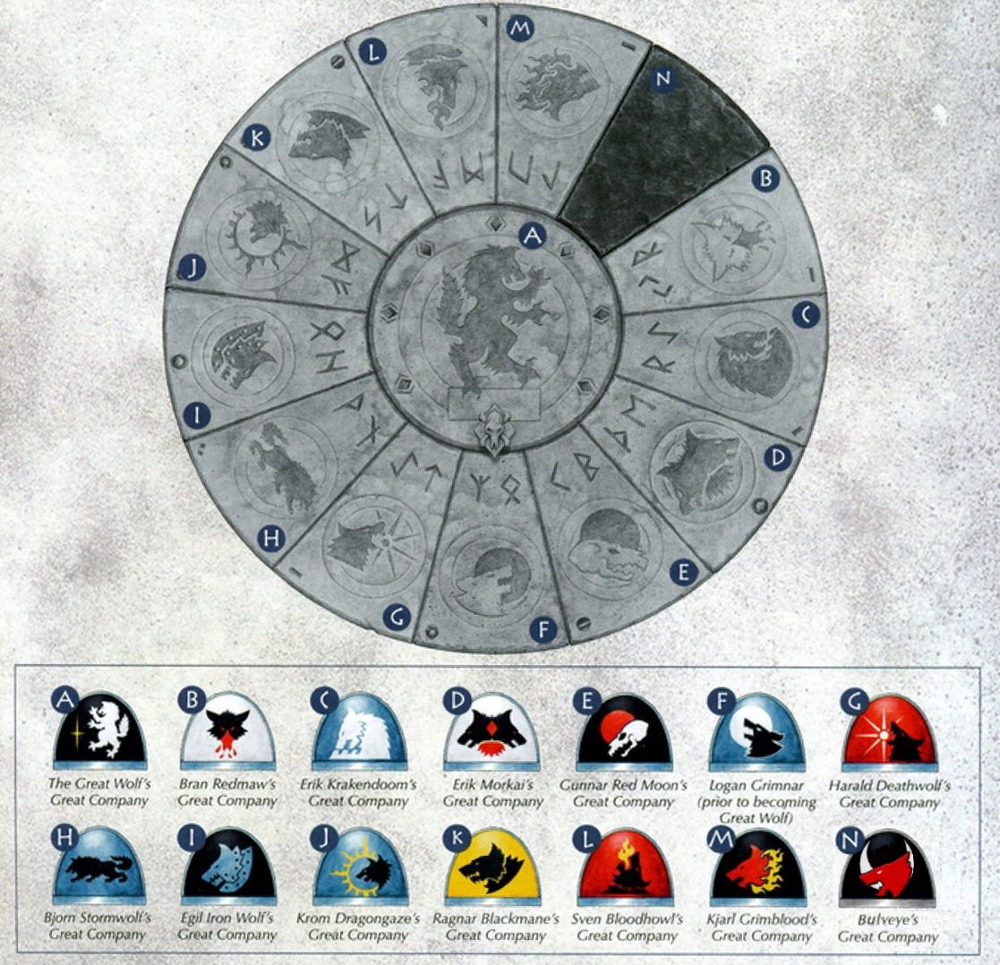
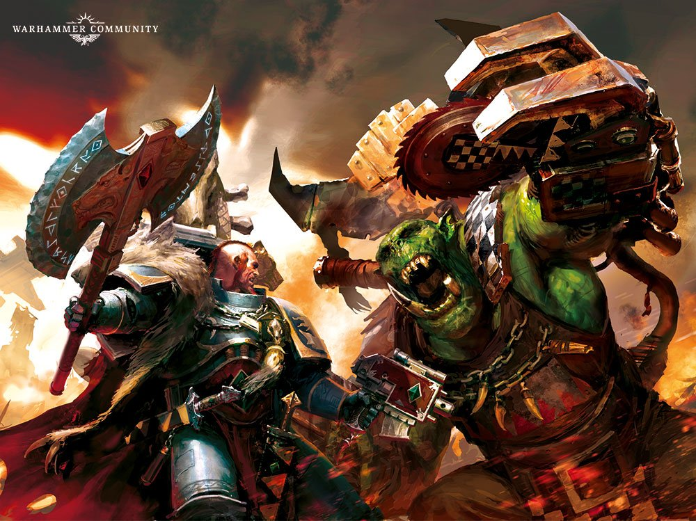
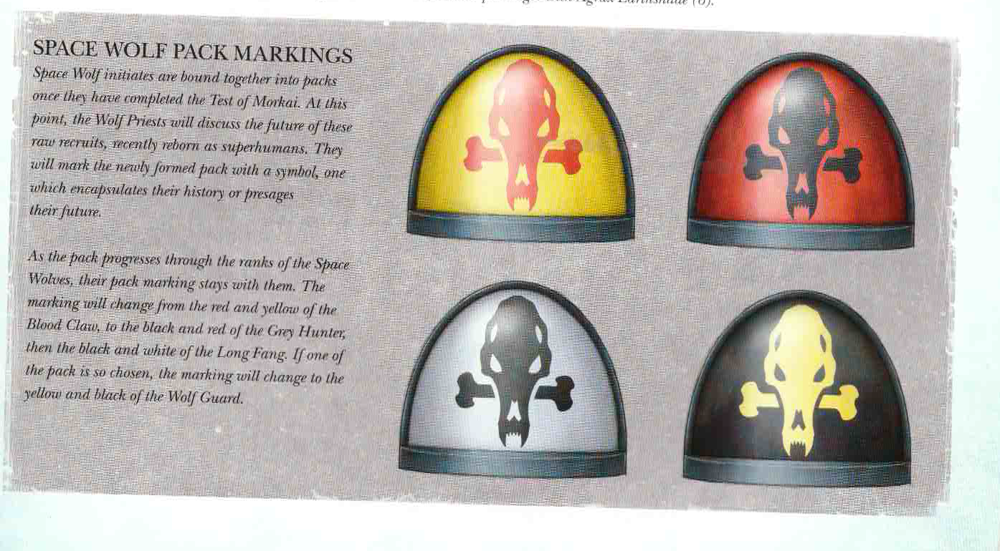

import Paint from "../../../../components/paint";

Now that's I've got a couple of boxed games finished, I want to take a bit of a break before diving straight into the
next one. I feel like I've neglected my Space Wolves army for so long, it's now time to start again. Rather than
building another Blackmane company it's time to choose a new one.

It was a tough call between the Firehowlers and the Drakeslayers.

The Firehowlers tattoo themselves not only with their volcanic icon, the Fire Breather, but also with runes and scenes
from their own sagas. They prefer to win their victories in the glory of close combat.

The Drakeslayers are known for issuing boasts and wagers during battle, yet are capable of incredible feats of strategy.
They seek nothing less than to be recognized as the greatest fighting force of the Chapter and have zero tolerance for
failure, which is brutally punished. Conversely, success is rewarded, with the Great Company having the most Wolf Guard
after the Champions of Fenris themselves.

The fire-breathing icon of the Firehowlers on the red background looks great, and adding various tattoos to units after
games to remember their sagas sounds like a great idea. However, I also really like the Krom Dragongaze miniature and
have read stories involving him to understand how the company, and his mind works.

In the end I decided to go with the Drakeslayers.

For me having an elite army of Space Wolves sounds great as it lets me add a lot of gold to their armour to represent
their status and make them stand out from other companies. It's also nice to not have to focus the army on one method
of combat, and to have some freedom when building the company compared to the very well documented Champions of Fenris
and the Blackmanes.

I plan to steal the idea of adding tattoos as sagas after battles, but may include trophies within the ranks as well as
tattoos. I'm also using a red background on their shoulder rather than the usual grey as it adds a bit more visual
interest.

So onto the first unit...

> The Grey Hunters are as hungry for battle as their Blood Claw brethren, but their aggression is tempered with
> experience that has taught them the value of patience and cunning. Grey Hunters excel at both attack and defense,
> and moreover are able to determine which approach best fits the tactical situation at hand. When on the offensive,
> they exhibit the pack skills of true hunters, advancing with deliberate suppression fire and flawless coordination,
> until they draw close enough to the enemy to unleash their savage charge

## Miniature Review

Where I think a lot of Space Marine tactical squads can look quite plain and boring, Space Wolves have a lot more
trinkets, pelts and other details that breaks up the uniform armour. Most don't wear helmets, so there's a lot of
opportunity to add different hairstyles with different colours.

This unit also has a lot of trim, allowing me to add a lot of gold, which along with their multitude of weapons makes
them look a lot more elite than a regular tactical unit. The colour markings used to identify units also adds a bit
more colour to the unit.

## Painting Techniques

### Armour
<Paint name={'The Fang'} />
<Paint name={'Russ Grey'} />
<Paint name={'Agrax Earthshade'} />
<Paint name={'Fenrisian Grey'} />
<Paint name={'Blue Horror'} />

Fenrisian Grey is applied as an edge highlight and Blue Horror as an extreme edge highlight.

### Pelts
<Paint name={'Karak Stone'} />
<Paint name={'Agrax Earthshade'} />
<Paint name={'Ushabti Bone'} />
<Paint name={'Screaming Skull'} />

Ushabti Bone and Screaming Skull can be swapped out for Tyrant Skull and Terminatus Stone.
For fur apply the shade more heavily in the center.

### Bone & Fangs
<Paint name={'Morghast Bone'} />
<Paint name={'Rakarth Flesh'} />
<Paint name={'Agrax Earthshade'} />
<Paint name={'Ushabti Bone'} />
<Paint name={'Screaming Skull'} />

Alternatively use Zandri Dust, Reikland Fleshshade and Screaming Skull for a slightly different look.

### Red Armour & Leather
<Paint name={'Khorne Red'} />
<Paint name={'Mephiston Red'} />
<Paint name={'Evil Sunz Scarlet'} />
<Paint name={'Agrax Earthshade'} />
<Paint name={'Mephiston Red'} />
<Paint name={'Evil Sunz Scarlet'} />
<Paint name={'Wild Rider Red'} />

Brighter colours should be applied where the light would reflect the most, or parallel to edges when painting pack
markings on their shoulders.

### Runic Stone
<Paint name={'Mechanicus Standard Grey'} />
<Paint name={'Agrax Earthshade'} />
<Paint name={'Dawnstone'} />

### Runes & Lenses (Blue)
<Paint name={'Kantor Blue'} />
<Paint name={'Caledor Sky'} />
<Paint name={'Lothern Blue'} />
<Paint name={'White Scar'} />

### Lenses & Gems (Green)
<Paint name={'Warpstone Glow'} />
<Paint name={'Moot Green'} />
<Paint name={'Gauss Blaster Green'} />
<Paint name={'Corax White'} />

### Skin
<Paint name={'Bugmans Glow'} />
<Paint name={'Cadian Fleshtone'} />
<Paint name={'Reikland Fleshshade'} />
<Paint name={'Agrax Earthshade'} />
<Paint name={'Carroburg Crimson'} />
<Paint name={'Kislev Flesh'} />
<Paint name={'Pallid Wych Flesh'} />

Agrax Earthshade is thinned down and only applied to the deepest recesses.
Carroburg Crimson is applied in the recesses around the eyes and nose.

### Beige Hair
<Paint name={'Karak Stone'} />
<Paint name={'Agrax Earthshade'} />
<Paint name={'Ushabti Bone'} />
<Paint name={'Screaming Skull'} />

### Orange Hair
<Paint name={'Squig Orange'} />
<Paint name={'Troll Slayer Orange'} />
<Paint name={'Agrax Earthshade'} />
<Paint name={'Troll Slayer Orange'} />
<Paint name={'Fire Dragon Bright'} />

### Steel
<Paint name={'Leadbelcher'} />
<Paint name={'Nuln Oil'} />
<Paint name={'Leadbelcher'} />
<Paint name={'Runefang Steel'} />
<Paint name={'Stormhost Silver'} />

### Power Weapons
<Paint name={'Kantor Blue'} />
<Paint name={'Caledor Sky'} />
<Paint name={'Alaitoc Blue'} />
<Paint name={'White Scar'} />

The sword was painted by treating each half as opposites. On the left side the white is at the top, and the darkest blue
is on the bottom, while on the right side this is reversed.

I then broke down each side into quarters, painting each with their respective colour. To blend each adjacent quarter
I mixed the two paints together and applied it in the middle. I then repeated this over and over, always saving a bit
of each mixture, until achieving a smooth transition. A final edge highlight of White Scar was applied.

For the plasma coil I also applied a wash of Drakenhof Nightshade after the base layer to create more of a contrast.
The brighter blues and white were focused on the raised areas and towards the center of the coil. This could be
reversed to create a different effect, with the inner coil being brighter showing the heat generated internally.

### Weapon Casings & Seals
<Paint name={'Corvus Black'} />
<Paint name={'Mechanicus Standard Grey'} />
<Paint name={'Administratum Grey'} />

Mechanicus Standard Grey is applied as an edge highlight and Administratum Grey as an extreme edge highlight.

### Gold
<Paint name={'Retributor Armour'} />
<Paint name={'Agrax Earthshade'} />
<Paint name={'Retributor Armour'} />
<Paint name={'Liberator Gold'} />
<Paint name={'Stormhost Silver'} />

### Cloth & Parchment
<Paint name={'Morghast Bone'} />
<Paint name={'Rakarth Flesh'} />
<Paint name={'Seraphim Sepia'} />
<Paint name={'Ushabti Bone'} />
<Paint name={'Screaming Skull'} />

### Purity Seals
<Paint name={'Khorne Red'} />
<Paint name={'Mephiston Red'} />
<Paint name={'Agrax Earthshade'} />
<Paint name={'Mephiston Red'} />
<Paint name={'Evil Sunz Scarlet'} />

Screamer Pink, Emperor's Children and Nuln Oil can be used instead to differentiate from other reds.

### Leather
<Paint name={'Mournfang Brown'} />
<Paint name={'Nuln Oil'} />
<Paint name={'Mournfang Brown'} />
<Paint name={'Tuskgor Fur'} />
<Paint name={'Baneblade Brown'} />

### Yellow Armour
<Paint name={'Averland Sunset'} />
<Paint name={'Yriel Yellow'} />
<Paint name={'Flash Gitz Yellow'} />

## Basing

I cast some Fantascape Glacial Ruins bases using Instant Mold & Milliput, then glued some sand around the edges,
applying a second layer of watered down PVA to help it stuck.

### Stone
<Paint name={'Karak Stone'} />
<Paint name={'Agrax Earthshade'} />
<Paint name={'Karak Stone'} />
<Paint name={'Ushabti Bone'} />
<Paint name={'Seraphim Sepia'} />
<Paint name={'Screaming Skull'} />
<Paint name={'Pallid Wych Flesh'} />

The Seraphim Sepia was applied in patches to give a dirt stained look.

### Ice
<Paint name={'The Fang'} />
<Paint name={'Russ Grey'} />
<Paint name={'Fenrisian Grey'} />
<Paint name={'Etherium Blue'} />

### Dirt
<Paint name={'Mournfang Brown'} />
<Paint name={'Agrax Earthshade'} />
<Paint name={'Tallarn Sand'} />
<Paint name={'Zandri Dust'} />

### Base Edge
<Paint name={'Rhinox Hide'} />
<Paint name={'Mournfang Brown'} />

Finally, I applied some Mordheim Turf tufts and then a couple of layers of Deluxe's Scenic Snow.

## Roundup

I think when starting a new army you always want to start with a core unit of troops to get a feel for how an army might
look, which you don't really get a feel of when only painting a single miniature.

The look is pretty much exactly what I was hoping for. A lot of gold and a lot of colour to break up the armour and make
them more visually interesting. The red on their shoulders blends in nicely with weapon hilts and pelt skins.

The green contrasts they grey nicely, and the blue of the power weapons helps them stand out, although maybe they could
have been green as well? Saving the yellow just for the Wolf Guard also helps to make him stand out as the leader of
the unit.