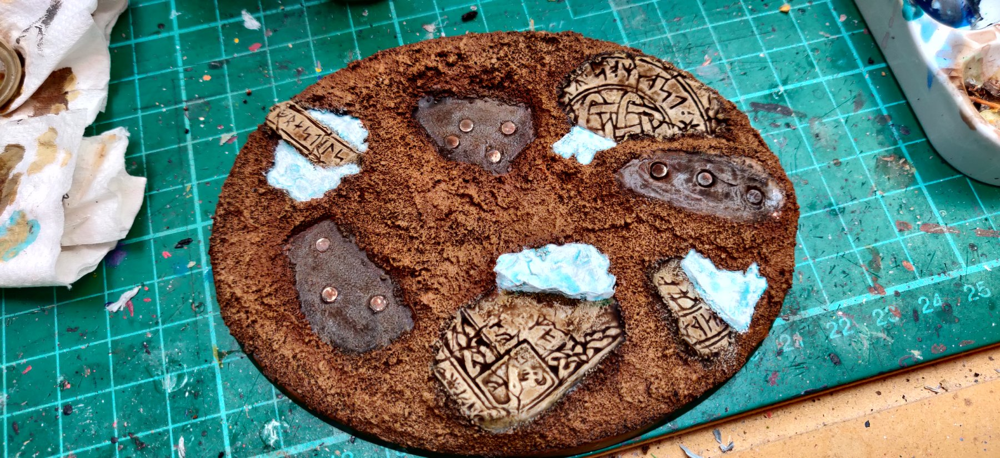

import Paint from "../../../../components/paint";

> Logan Grimnar epitomizes the noble fury of his people. He is a figure of awe and the warrior king of the Space Wolves.
> A fearsome warrior with immense martial pride Grimnar never backs down from a fight. Drawn into battle on an ancient
> relic of the Chapter known as Stormrider and armed with his axe Morkai - an ancient artefact of immense power - the
> Old Wolf inspires such unshakable loyalty that he has led the Sons of Russ into unimaginable terrors and emerged
> with victory grasped firmly in his claws.

## Miniature Review

I think the Logan Grimnar on Stormrider miniature is a love it or hate it kind of thing. Ignoring Santa's sled and
focusing on the actual Logan figure I think he's great. There's a huge amount of detail on him, which is what I feel
makes the whole Space Wolves range stand apart from other Space Marines. The wolf pelt and golden helmet add a huge
amount of weight to him, and despite being released before the Primaris marines he still looks huge.

The long flowing hair stands out compared to the usual small faces of most marines and along with the pose it helps to
make his pose look more dynamic. The original was good and shares a lot of the same features, but looks very stiff in
comparison.

I try not to think too much about the whole 'sled' idea, as I'd most likely start to think it looks silly and stop
liking it. Right now I really like the look, I mean I did buy it! The wolves add movement and scream Space Wolves,
exactly what you want from the leader of the chapter.

Stormrider has a lot of interesting detail on it as well, with both sides and even the shields telling different stories
in the Space Wolves history, including a battle against the Tyranids. The centre stone strongly resembles the Grand
Annulus, with the runes of each Wolf Lord. The chariot also adds some real height and size to Logan, there's no
mistaking him onm the battlefield for sure!

## Painting Techniques

### Step 1 - Basecoat
My first step is to get the base coat of every colour down on the miniature. It's great to visualise how the end
product will look, and at this stage it's really easy to make changes if needed.

You also learn a lot about the miniature at this stage as well and there's always lots of extra details I've missed or
not realised how far they extend. It's important to have everything covered now, rather than spotting something later
and trying to blend it in.

<Paint name={'Russ Grey'} />
<Paint name={'Karak Stone'} />
<Paint name={'Word Bearers Red'} />
<Paint name={'Mechanicus Standard Grey'} />
<Paint name={'Warpstone Glow'} />
<Paint name={'Bugmans Glow'} />
<Paint name={'Leadbelcher'} />
<Paint name={'Corvus Black'} />
<Paint name={'Retributor Armour'} />
<Paint name={'Rhinox Hide'} />
<Paint name={'Averland Sunset'} />

### Step 2 - Assemble
It can be hard to get the brush into every detailed when everything's glued together, so sometimes I find it easier to
paint pieces separately and assemble them down the line.

You can assemble later down the line to keep painting easy, but I find it's more difficult to get shading and
highlighting consistent if leaving it too late.

### Step 3 - Shade
This step is really simple, I just give every part of the miniature a good wash. It really helps bring everything
together and gets you around 80% of the way there in terms of looks, although the longest part is to come!

<Paint name={'Agrax Earthshade'} />
<Paint name={'Nuln Oil'} />

I also decided to highlight the hair now, as it was looking too similar to the wolf pelt and made the miniature as a
whole too beige.

<Paint name={'Ulthuan Grey'} />
<Paint name={'White Scar'} />

### Step 4 - The Fur
At this point I like to focus on one material at a time. For Space Marines this is normally the armour, as it makes up
the majority of the miniature and is where I'm most likely to make mistakes and accidentally paint over other details.
It's normally a good idea to work inside out, focusing on the larger most recessed parts first, then finishing with
the smaller, raised details last.

In this case I actually started with the fur on the cloak. It was the largest blank area and even after highlighting the
hair I wasn't 100% sure on how to tie it in with the rest of the miniature. I ended up using lots of thin layers of
contrast paints to slowly darken it more and more towards the centre, then gave it a final highlight.

<Paint name={'Snakebite Leather'} />
<Paint name={'Gore Grunta Fur'} />
<Paint name={'Wyldwood'} />
<Paint name={'Ushabti Bone'} />

### Step 5 - The Face

I always like the get the face painted early on. I find it really adds life to the miniature and at this stage I'd be
happy with calling it battle ready. I also hate leaving it until last, as getting it right can really make or break
the entire paint job.

I slowly highlighted the face up, then applied the crimson wash around the eyes and cheeks. I then blended this in
using Cadian Fleshtone. The grey was used for the eyebrows and the whites of the eyes to reduce the contrast pure
white would give, then finished by adding the pupils.

<Paint name={'Cadian Fleshtone'} />
<Paint name={'Kislev Flesh'} />
<Paint name={'Carroburg Crimson'} />
<Paint name={'Cadian Fleshtone'} />
<Paint name={'Ulthuan Grey'} />
<Paint name={'Corvus Black'} />

### Step 6 - The Axe

Once again breaking my own rules. I would normally leave the axe until last as it's the most likely point I'll touch
and rub paint off of. I think when I can't visualise exactly how I want something to look I like to get it done early,
as it might make me change my mind elsewhere.

I painted staggered lines of different lengths from the edge of the blade heading towards the centre, then slowly
highlighted them to different depths with brighter and brighter colours. The aim was to create the look of demonic
energy emanating from heart of the axe.

<Paint name={'Khorne Red'} />
<Paint name={'Mephiston Red'} />
<Paint name={'Evil Sunz Scarlet'} />
<Paint name={'Wild Rider Red'} />
<Paint name={'Troll Slayer Orange'} />
<Paint name={'Fire Dragon Bright'} />
<Paint name={'Flash Gitz Yellow'} />

### Step 7 - The Cloak

Having painted the fur earlier I wanted to finish off the cloak as it completes a large part of the miniature.

This was a pretty simple step of highlighting up the raised areas with multiple layers of thinned down reds.

<Paint name={'Khorne Red'} />
<Paint name={'Mephiston Red'} />

### Step 8 - Starting the Details

Now I start picking out some of the details that make the biggest differences.

Adding the yellow to the Stormbolter and pauldron...

<Paint name={'Yriel Yellow'} />
<Paint name={'Flash Gitz Yellow'} />

adding the glow effect to the runes...

<Paint name={'Dawnstone'} />
<Paint name={'Administratum Grey'} />
<Paint name={'Kantor Blue'} />
<Paint name={'Caledor Sky'} />
<Paint name={'Lothern Blue'} />
<Paint name={'Blue Horror'} />
<Paint name={'White Scar'} />

and picking out the gems...

<Paint name={'Warpstone Glow'} />
<Paint name={'Moot Green'} />
<Paint name={'Gauss Blaster Green'} />

### Step 9 - Finishing the Details

I then added the highlights that make less of a difference. Having said earlier that I always highlight the bigger areas
first, normally the armour followed by steel and gold, for some reason I left these last here.

Steel...
<Paint name={'Iron Hands Steel'} />
<Paint name={'Runefang Steel'} />
<Paint name={'Stormhost Silver'} />

Gold...
<Paint name={'Retributor Armour'} />
<Paint name={'Liberator Gold'} />
<Paint name={'Stormhost Silver'} />

Weapon casings and seals...
<Paint name={'Eshin Grey'} />
<Paint name={'Mechanicus Standard Grey'} />
<Paint name={'Dawnstone'} />
<Paint name={'Administratum Grey'} />

Bone...
<Paint name={'Morghast Bone'} />
<Paint name={'Ushabti Bone'} />
<Paint name={'Screaming Skull'} />
<Paint name={'Agrax Earthshade'} />

Straps...
<Paint name={'Rhinox Hide'} />
<Paint name={'Agrax Earthshade'} />
<Paint name={'Mournfang Brown'} />
<Paint name={'Baneblade Brown'} />

### Step 10 - The Armour

For some unknown reason I left the armour to last, meaning I had to be super careful not to ruin anything I'd already
painted.

<Paint name={'Russ Grey'} />
<Paint name={'Fenrisian Grey'} />
<Paint name={'Blue Horror'} />

## All Colours

### Armour
<Paint name={'Russ Grey'} />
<Paint name={'Agrax Earthshade'} />
<Paint name={'Russ Grey'} />
<Paint name={'Fenrisian Grey'} />
<Paint name={'Blue Horror'} />

### Pelts
<Paint name={'Karak Stone'} />
<Paint name={'Agrax Earthshade'} />
<Paint name={'Snakebite Leather'} />
<Paint name={'Gore Grunta Fur'} />
<Paint name={'Wyldwood'} />
<Paint name={'Ushabti Bone'} />

### Bone & Fangs
<Paint name={'Karak Stone'} />
<Paint name={'Agrax Earthshade'} />
<Paint name={'Morghast Bone'} />
<Paint name={'Ushabti Bone'} />
<Paint name={'Screaming Skull'} />
<Paint name={'Agrax Earthshade'} />

### Leather
<Paint name={'Word Bearers Red'} />
<Paint name={'Agrax Earthshade'} />
<Paint name={'Khorne Red'} />
<Paint name={'Mephiston Red'} />

### Runic Stone
<Paint name={'Mechanicus Standard Grey'} />
<Paint name={'Agrax Earthshade'} />
<Paint name={'Dawnstone'} />
<Paint name={'Administratum Grey'} />

### Runes
<Paint name={'Kantor Blue'} />
<Paint name={'Caledor Sky'} />
<Paint name={'Lothern Blue'} />
<Paint name={'Blue Horror'} />
<Paint name={'White Scar'} />

### Gems
<Paint name={'Warpstone Glow'} />
<Paint name={'Agrax Earthshade'} />
<Paint name={'Warpstone Glow'} />
<Paint name={'Moot Green'} />
<Paint name={'Gauss Blaster Green'} />

### Skin
<Paint name={'Bugmans Glow'} />
<Paint name={'Agrax Earthshade'} />
<Paint name={'Cadian Fleshtone'} />
<Paint name={'Kislev Flesh'} />
<Paint name={'Carroburg Crimson'} />
<Paint name={'Cadian Fleshtone'} />
<Paint name={'Ulthuan Grey'} />
<Paint name={'Corvus Black'} />

### Hair
<Paint name={'Karak Stone'} />
<Paint name={'Agrax Earthshade'} />
<Paint name={'Nuln Oil'} />
<Paint name={'Ulthuan Grey'} />
<Paint name={'White Scar'} />

### Steel
<Paint name={'Leadbelcher'} />
<Paint name={'Agrax Earthshade'} />
<Paint name={'Nuln Oil'} />
<Paint name={'Iron Hands Steel'} />
<Paint name={'Runefang Steel'} />
<Paint name={'Stormhost Silver'} />

### Axe Blade
<Paint name={'Word Bearers Red'} />
<Paint name={'Agrax Earthshade'} />
<Paint name={'Khorne Red'} />
<Paint name={'Mephiston Red'} />
<Paint name={'Evil Sunz Scarlet'} />
<Paint name={'Wild Rider Red'} />
<Paint name={'Troll Slayer Orange'} />
<Paint name={'Fire Dragon Bright'} />
<Paint name={'Flash Gitz Yellow'} />

### Weapon Casings & Seals
<Paint name={'Corvus Black'} />
<Paint name={'Agrax Earthshade'} />
<Paint name={'Eshin Grey'} />
<Paint name={'Mechanicus Standard Grey'} />
<Paint name={'Dawnstone'} />
<Paint name={'Administratum Grey'} />

### Gold
<Paint name={'Retributor Armour'} />
<Paint name={'Agrax Earthshade'} />
<Paint name={'Retributor Armour'} />
<Paint name={'Liberator Gold'} />
<Paint name={'Stormhost Silver'} />

### Straps
<Paint name={'Rhinox Hide'} />
<Paint name={'Agrax Earthshade'} />
<Paint name={'Mournfang Brown'} />
<Paint name={'Baneblade Brown'} />

### Yellow Armour
<Paint name={'Averland Sunset'} />
<Paint name={'Agrax Earthshade'} />
<Paint name={'Yriel Yellow'} />
<Paint name={'Flash Gitz Yellow'} />

## Basing

I cast some Fantascape Glacial Ruins bases using Instant Mold & Milliput, then glued some sand around the edges,
applying a second layer of watered down PVA to help it stuck.

### Dirt
<Paint name={'Mournfang Brown'} />
<Paint name={'Agrax Earthshade'} />
<Paint name={'Tallarn Sand'} />
<Paint name={'Zandri Dust'} />

### Stone
<Paint name={'Karak Stone'} />
<Paint name={'Agrax Earthshade'} />
<Paint name={'Karak Stone'} />
<Paint name={'Ushabti Bone'} />
<Paint name={'Seraphim Sepia'} />
<Paint name={'Screaming Skull'} />
<Paint name={'Pallid Wych Flesh'} />

The Seraphim Sepia was applied in patches to give a dirt stained look.

### Ice
<Paint name={'The Fang'} />
<Paint name={'Russ Grey'} />
<Paint name={'Fenrisian Grey'} />
<Paint name={'Etherium Blue'} />

### Base Edge
<Paint name={'Rhinox Hide'} />
<Paint name={'Mournfang Brown'} />

Finally, I applied some Mordheim Turf tufts and several thick layers of Valhallan Blizzard, then a final layer of
Deluxe's Scenic Snow.

## Roundup

This was a big project, as I ended up magnetising Logan to the chariot, as well as the chariot and wolves to the base
and to each other. This makes it possible to pack away if I ever need to transport it, or just take Logan off to base
separately. I've not created a base for now though, I want to come up with something that still makes it obvious he is
the army leader.

I painted it similarly to the Heavy Metal version, but decided to emphasize the runes on the Grand Annulus to make it
easier to spot. I added a good amount of snow over everything as well to give it a really frosty look.