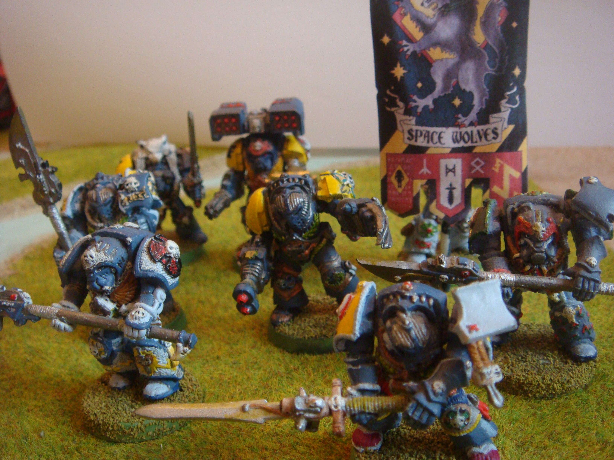

import Paint from "../../../../components/paint";

> Every Space Wolves warrior dreams of a place in the Wolf Guard. To be a member of this select brotherhood is to
> wield the very deadliest weapons of war while serving as the personal guard of their Wolf Lord.
>
> Clad in hulking suits of sacred Terminator armour, Wolf Guard Terminators are a brotherhood of nigh-invulnerable
> champions, each eager to dispense his own particular brand of death.

## Miniature Review

The whole reason I got into Warhammer back in the 90s was because of the old Space Wolf and Grey Knight Terminators.
In fact, here's a photo from over 10 years ago of the unit I painted a good 10 years or more before that.

Now for Space Wolves, I always associated Terminators with heavy hitting close combat units. Sure they can be great for
supplying the ranged support Space Wolves sometimes need, but deep striking into the heart of the enemy line and
smashing units apart up close is what it's all about.

For that reason I've created two units, one with thunder hammers and storm shields, and this unit with wolf claws. I
love the poses you can get with just a bit of adjustment to the arms. I think the leader of this unit is probably my
new favorite badass painted miniature. He's an absolute unit and with that patch looks a bit like a space pirate!

## Painting Techniques

### Armour
<Paint name={'Russ Grey'} />
<Paint name={'Agrax Earthshade'} />
<Paint name={'Russ Grey'} />
<Paint name={'Fenrisian Grey'} />
<Paint name={'Blue Horror'} />

### Skin & Eyes
<Paint name={'Bugmans Glow'} />
<Paint name={'Cadian Fleshtone'} />
<Paint name={'Reikland Fleshshade'} />
<Paint name={'Agrax Earthshade'} />
<Paint name={'Bugmans Glow'} />
<Paint name={'Cadian Fleshtone'} />
<Paint name={'Kislev Flesh'} />
<Paint name={'Carroburg Crimson'} />
<Paint name={'Druchii Violet'} />
<Paint name={'Grey Seer'} />
<Paint name={'Corvus Black'} />

### Black Hair
<Paint name={'Corvus Black'} />
<Paint name={'Eshin Grey'} />
<Paint name={'Mechanicus Standard Grey'} />
<Paint name={'Dawnstone'} />
<Paint name={'Administratum Grey'} />
<Paint name={'Nuln Oil'} />

### Pelts
<Paint name={'Corvus Black'} />
<Paint name={'Eshin Grey'} />
<Paint name={'Mechanicus Standard Grey'} />
<Paint name={'Dawnstone'} />
<Paint name={'Administratum Grey'} />
<Paint name={'Nuln Oil'} />

### Weapon Casings & Seals
<Paint name={'Corvus Black'} />
<Paint name={'Eshin Grey'} />
<Paint name={'Mechanicus Standard Grey'} />
<Paint name={'Dawnstone'} />
<Paint name={'Administratum Grey'} />
<Paint name={'Nuln Oil'} />

### Red Armour
<Paint name={'Khorne Red'} />
<Paint name={'Mephiston Red'} />
<Paint name={'Agrax Earthshade'} />
<Paint name={'Mephiston Red'} />
<Paint name={'Evil Sunz Scarlet'} />
<Paint name={'Wild Rider Red'} />

### Red Leather
<Paint name={'Word Bearers Red'} />
<Paint name={'Wazdakka Red'} />
<Paint name={'Agrax Earthshade'} />
<Paint name={'Khorne Red'} />
<Paint name={'Mephiston Red'} />
<Paint name={'Evil Sunz Scarlet'} />

### Purity Seals
<Paint name={'Khorne Red'} />
<Paint name={'Mephiston Red'} />
<Paint name={'Agrax Earthshade'} />
<Paint name={'Khorne Red'} />
<Paint name={'Mephiston Red'} />
<Paint name={'Evil Sunz Scarlet'} />
<Paint name={'Evil Sunz Scarlet'} />
<Paint name={'Wild Rider Red'} />

### Yellow Armour
<Paint name={'Averland Sunset'} />
<Paint name={'Agrax Earthshade'} />
<Paint name={'Yriel Yellow'} />
<Paint name={'Flash Gitz Yellow'} />

### Yellow Leather
<Paint name={'Averland Sunset'} />
<Paint name={'Agrax Earthshade'} />
<Paint name={'Yriel Yellow'} />
<Paint name={'Flash Gitz Yellow'} />

### Bone & Fangs
<Paint name={'Karak Stone'} />
<Paint name={'Agrax Earthshade'} />
<Paint name={'Morghast Bone'} />
<Paint name={'Ushabti Bone'} />
<Paint name={'Screaming Skull'} />

### Cloth & Parchment
<Paint name={'Morghast Bone'} />
<Paint name={'Rakarth Flesh'} />
<Paint name={'Seraphim Sepia'} />
<Paint name={'Ushabti Bone'} />
<Paint name={'Screaming Skull'} />

### Leather
<Paint name={'Mournfang Brown'} />
<Paint name={'Nuln Oil'} />
<Paint name={'Mournfang Brown'} />
<Paint name={'XV88'} />
<Paint name={'Steel Legion Drab'} />

### Runic Stone
<Paint name={'Mechanicus Standard Grey'} />
<Paint name={'Agrax Earthshade'} />
<Paint name={'Dawnstone'} />
<Paint name={'Administratum Grey'} />

### Runes
<Paint name={'White Scar'} />
<Paint name={'Lothern Blue'} />
<Paint name={'Teclis Blue'} />
<Paint name={'Caledor Sky'} />

### Gems
<Paint name={'Warpstone Glow'} />
<Paint name={'Agrax Earthshade'} />
<Paint name={'Warpstone Glow'} />
<Paint name={'Moot Green'} />
<Paint name={'Gauss Blaster Green'} />

### Power Weapons
<Paint name={'Thousand Sons Blue'} />
<Paint name={'Ahriman Blue'} />
<Paint name={'Temple Guard Blue'} />
<Paint name={'Baharroth Blue'} />
<Paint name={'White Scar'} />

### Steel
<Paint name={'Leadbelcher'} />
<Paint name={'Agrax Earthshade'} />
<Paint name={'Nuln Oil'} />
<Paint name={'Iron Hands Steel'} />
<Paint name={'Runefang Steel'} />
<Paint name={'Stormhost Silver'} />

### Gold
<Paint name={'Retributor Armour'} />
<Paint name={'Agrax Earthshade'} />
<Paint name={'Retributor Armour'} />
<Paint name={'Liberator Gold'} />
<Paint name={'Stormhost Silver'} />

## Basing

I cast some Fantascape Glacial Ruins bases using Instant Mold & Milliput, then glued some sand around the edges,
applying a second layer of watered down PVA to help it stuck.

### Stone
<Paint name={'Karak Stone'} />
<Paint name={'Agrax Earthshade'} />
<Paint name={'Karak Stone'} />
<Paint name={'Ushabti Bone'} />
<Paint name={'Seraphim Sepia'} />
<Paint name={'Screaming Skull'} />
<Paint name={'Pallid Wych Flesh'} />

I applied the Seraphim Sepia applied in patches to give a dirt stained look.

### Ice
<Paint name={'The Fang'} />
<Paint name={'Russ Grey'} />
<Paint name={'Fenrisian Grey'} />
<Paint name={'Etherium Blue'} />

### Dirt
<Paint name={'Mournfang Brown'} />
<Paint name={'Agrax Earthshade'} />
<Paint name={'Tallarn Sand'} />
<Paint name={'Zandri Dust'} />

### Base Edge
<Paint name={'Rhinox Hide'} />
<Paint name={'Mournfang Brown'} />

Finally, I applied some Mordheim Turf tufts and then a couple of layers of Deluxe's Scenic Snow.

## Roundup

I went with a similar style to how I painted the Centurions and once again I really like the effect. The extra
brightness and contrast really makes them stand out at a distance.

I wanted to darken them down a bit to other units so painted all the pelts black rather than the usual beige. Using
the yellow rather than red for the leather helps add the extra spot colour that neatly matches the chapter icon.

For the claws I normally use more pure blues, but this time I went with more turquoise blues to more closely resemble
ice. I think I need a darker colour at the base next time, but blending them was much easier than my usual mix. The
slight colour difference gives them a more chilling effect compared to the other power weapons I've painted, so it's
definitely a keeper!