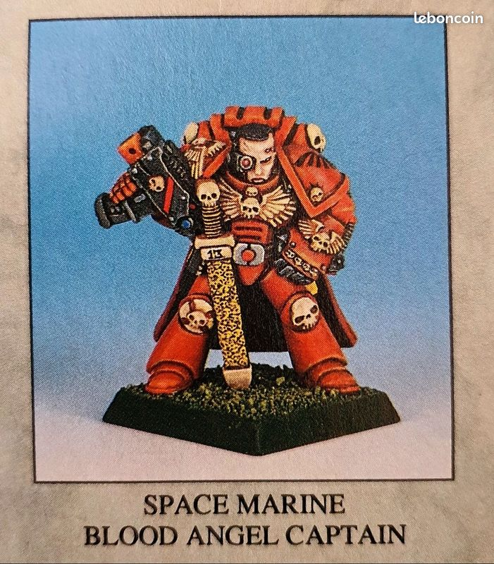

import Paint from '../../../../components/paint';

> The Wolf Guard are the most elite Veterans of the Space Wolves Space Marine Chapter, comparable to a Codex
> Astartes-compliant Chapter's Sternguard Veterans. They are the bravest warriors of each of the Chapter's Great
> Companies, hand-selected by their Great Company's Wolf Lord to serve as his chosen protectors and the vanguard of his
> forces.

## Miniature Review

I purchased this miniature, and another that will likely be my next post, back in April 2014 when Games Workshop
released their new website.

 
It is in fact a resculpt of a Games Day exclusive miniature from 1991.

 

I do quite like the miniature, but I don't think he looks much like a Space Wolf. I didn't want to make the miniature
unrecognisable so I only added a wolf skull to the halo and a horn to the backpack. I don't think he'll fit too well
with the rest of my Space Wolves as he's far too regal, but it will look great as a display piece.

## Painting Techniques

### Armour

<Paint name={'Russ Grey'} category="Citadel Air" />
<Paint name={'Fenrisian Grey'} category="Citadel Air" />
<Paint name={'Blue Horror'} category="Citadel Air" />

I made 2 oil washes using Winsor & Newton's Sansodor, a brown using Raw Umber and a black using Ivory Black. I applied
the brown largely over the entire model, applying more heavily in the recesses, then applied the black only to the
deepest recesses. I then used a brush with pure Sansodor to remove most of the wash from the raised areas.

<Paint name={'Fenrisian Grey'} />
<Paint name={'Blue Horror'} />

I then went back in to certain areas to add more highlights and refine the blending.

### Skin & Eyes

<Paint name={'Bugmans Glow'} />
<Paint name={'Cadian Fleshtone'} />
<Paint name={'Reikland Fleshshade'} />
<Paint name={'Agrax Earthshade'} />
<Paint name={'Bugmans Glow'} />
<Paint name={'Cadian Fleshtone'} />
<Paint name={'Kislev Flesh'} />
<Paint name={'Carroburg Crimson'} />
<Paint name={'Druchii Violet'} />
<Paint name={'Grey Seer'} />
<Paint name={'Corvus Black'} />

### Black Hair

<Paint name={'Corvus Black'} />
<Paint name={'Eshin Grey'} />
<Paint name={'Mechanicus Standard Grey'} />
<Paint name={'Dawnstone'} />
<Paint name={'Administratum Grey'} />
<Paint name={'Nuln Oil'} />

### Pelts

<Paint name={'Corvus Black'} />
<Paint name={'Eshin Grey'} />
<Paint name={'Mechanicus Standard Grey'} />
<Paint name={'Dawnstone'} />
<Paint name={'Administratum Grey'} />
<Paint name={'Nuln Oil'} />

### Weapon Casings & Seals

<Paint name={'Corvus Black'} />
<Paint name={'Eshin Grey'} />
<Paint name={'Mechanicus Standard Grey'} />
<Paint name={'Dawnstone'} />
<Paint name={'Administratum Grey'} />
<Paint name={'Nuln Oil'} />

### Red Armour

<Paint name={'Khorne Red'} />
<Paint name={'Mephiston Red'} />
<Paint name={'Agrax Earthshade'} />
<Paint name={'Mephiston Red'} />
<Paint name={'Evil Sunz Scarlet'} />
<Paint name={'Wild Rider Red'} />

### Red Leather

<Paint name={'Word Bearers Red'} />
<Paint name={'Wazdakka Red'} />
<Paint name={'Agrax Earthshade'} />
<Paint name={'Khorne Red'} />
<Paint name={'Mephiston Red'} />
<Paint name={'Evil Sunz Scarlet'} />

### Purity Seals

<Paint name={'Khorne Red'} />
<Paint name={'Mephiston Red'} />
<Paint name={'Agrax Earthshade'} />
<Paint name={'Khorne Red'} />
<Paint name={'Mephiston Red'} />
<Paint name={'Evil Sunz Scarlet'} />
<Paint name={'Evil Sunz Scarlet'} />
<Paint name={'Wild Rider Red'} />

### Yellow Armour

<Paint name={'Averland Sunset'} />
<Paint name={'Agrax Earthshade'} />
<Paint name={'Yriel Yellow'} />
<Paint name={'Flash Gitz Yellow'} />

### Yellow Leather

<Paint name={'Averland Sunset'} />
<Paint name={'Agrax Earthshade'} />
<Paint name={'Yriel Yellow'} />
<Paint name={'Flash Gitz Yellow'} />

### Bone & Fangs

<Paint name={'Karak Stone'} />
<Paint name={'Agrax Earthshade'} />
<Paint name={'Morghast Bone'} />
<Paint name={'Ushabti Bone'} />
<Paint name={'Screaming Skull'} />

### Cloth & Parchment

<Paint name={'Morghast Bone'} />
<Paint name={'Rakarth Flesh'} />
<Paint name={'Seraphim Sepia'} />
<Paint name={'Ushabti Bone'} />
<Paint name={'Screaming Skull'} />

### Leather

<Paint name={'Mournfang Brown'} />
<Paint name={'Nuln Oil'} />
<Paint name={'Mournfang Brown'} />
<Paint name={'XV88'} />
<Paint name={'Steel Legion Drab'} />

### Runic Stone

<Paint name={'Mechanicus Standard Grey'} />
<Paint name={'Agrax Earthshade'} />
<Paint name={'Dawnstone'} />
<Paint name={'Administratum Grey'} />

### Runes

<Paint name={'White Scar'} />
<Paint name={'Lothern Blue'} />
<Paint name={'Teclis Blue'} />
<Paint name={'Caledor Sky'} />

### Gems

<Paint name={'Warpstone Glow'} />
<Paint name={'Agrax Earthshade'} />
<Paint name={'Warpstone Glow'} />
<Paint name={'Moot Green'} />
<Paint name={'Gauss Blaster Green'} />

### Power Weapons

<Paint name={'Thousand Sons Blue'} />
<Paint name={'Ahriman Blue'} />
<Paint name={'Temple Guard Blue'} />
<Paint name={'Baharroth Blue'} />
<Paint name={'White Scar'} />

### Steel

<Paint name={'Leadbelcher'} />
<Paint name={'Agrax Earthshade'} />
<Paint name={'Nuln Oil'} />
<Paint name={'Iron Hands Steel'} />
<Paint name={'Runefang Steel'} />
<Paint name={'Stormhost Silver'} />

### Gold

<Paint name={'Retributor Armour'} />
<Paint name={'Agrax Earthshade'} />
<Paint name={'Retributor Armour'} />
<Paint name={'Liberator Gold'} />
<Paint name={'Stormhost Silver'} />

## Basing

I cast some Fantascape Glacial Ruins bases using Instant Mold & Milliput, then glued some sand around the edges,
applying a second layer of watered down PVA to help it stuck.

### Stone

<Paint name={'Karak Stone'} />
<Paint name={'Agrax Earthshade'} />
<Paint name={'Karak Stone'} />
<Paint name={'Ushabti Bone'} />
<Paint name={'Seraphim Sepia'} />
<Paint name={'Screaming Skull'} />
<Paint name={'Pallid Wych Flesh'} />

I applied the Seraphim Sepia applied in patches to give a dirt stained look.

### Ice

<Paint name={'The Fang'} />
<Paint name={'Russ Grey'} />
<Paint name={'Fenrisian Grey'} />
<Paint name={'Etherium Blue'} />

### Dirt

<Paint name={'Mournfang Brown'} />
<Paint name={'Agrax Earthshade'} />
<Paint name={'Tallarn Sand'} />
<Paint name={'Zandri Dust'} />

### Base Edge

<Paint name={'Rhinox Hide'} />
<Paint name={'Mournfang Brown'} />

Finally, I applied some Mordheim Turf tufts and then a couple of layers of Deluxe's Scenic Snow.

## Roundup

This was my first time using oil washes and I think he came out ok, although I did re-highlight quite a lot of the
miniature so it definitely wasn't a time saving exercise. I'm not sure how much of this was down to the washes or
because of my airbrushing. I definitely can improve a lot on both!

What I am happy with is the snow effects of the cloak. I really helps to tie him in nicely with the base, and is
something I will look to repeat in the future!
