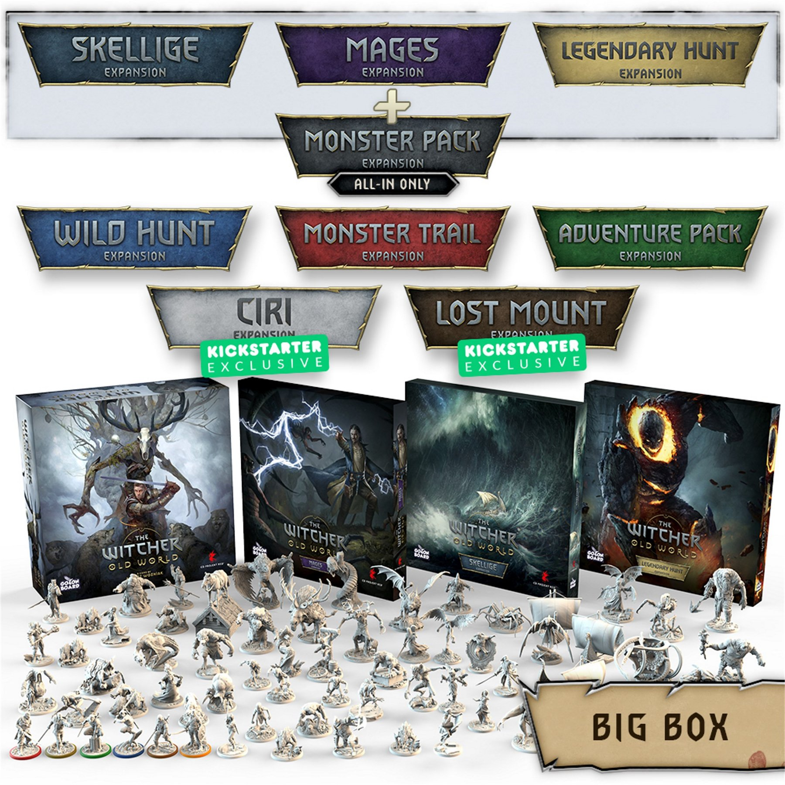

import Paint from '../../../../components/paint';

> Werewolves are therianthropes who transform into wolves or half-wolves. As other such creatures, they are hardly hurt
> by steel but very vulnerable to silver.

I was going to carry on with my Kruleboyz, but I finally had
[The Witcher: Old World](https://boardgamegeek.com/boardgame/331106/witcher-old-world) arrive after 2 years and it's
thrown that plan out the window for now.

I had the ALL-IN pledge which includes:

- Deluxe Box
- Mages Expansion
- Legendary Hunt Expansion
- Skellige Expansion
- Metal Coins
- Additional dice set
- Playmat
- All unlocked Stretch Goals

Plus I ordered the mounted Eredin, putting the box at around 70 miniatures. Plenty to kep me busy for a while.

## Miniature Review

To get things moving I decided to start with the Werewolf. The miniatures themselves aren't up to Games Workshop level,
but they have a much higher quality compared a lot of what I've ordered from other companies. The Werewolf is fairly
simple in terms of details, being a beast, but has some straps and ropes along with a few other details to add a bit
of color.

It's a good size compared to the other miniatures and has a great pose kneeling slightly on the rock. The detail in the
face is also really nice and overall it matches the artwork really well.

## Painting Techniques

### Skin

<Paint name={'Basilicanum Grey'} />
<Paint name={'Drakenhof Nightshade'} />
<Paint name={'Russ Grey'} />
<Paint name={'Fenrisian Grey'} />
<Paint name={'Blue Horror'} />

### Fur

<Paint name={'Ratling Grime'} />
<Paint name={'Karak Stone'} />

### Leather Straps

<Paint name={'Gore Grunta Fur'} />

### Leather Cloth

<Paint name={'Garaghaks Sewer'} />

### Rope

<Paint name={'Apothecary White'} />
<Paint name={'Nuln Oil'} />

### Claws & Nose

<Paint name={'Black Legion'} />
<Paint name={'Fenrisian Grey'} />
<Paint name={'Blue Horror'} />

### Gums

<Paint name={'Volupus Pink'} />

### Teeth

<Paint name={'Wraithbone'} />

### Eyes

<Paint name={'Yriel Yellow'} />
<Paint name={'Phalanx Yellow'} />

### Steel

<Paint name={'Iron Warriors'} />
<Paint name={'Grey Knights Steel'} />

### Blood

<Paint name={'Blood For The Blood God'} />

## Base

### Rock

<Paint name={'Basilicanum Grey'} />

### Dirt

<Paint name={'Garaghaks Sewer'} />
<Paint name={'Karak Stone'} />

### Rim

<Paint name={'Abaddon Black'} />

## Roundup

I've decided to jump on the slapchop bandwagon for painting these. Last weekend I used my airbrush to paint them all
black, then gave them a grey zenithal highlight. Finally I gave them all a heavy drybrush of White Scar.

This allowed me to minimize the amount of highlighting required, a lot of the time just sticking the single contrast
paint. The only real highlighting I focused on was the skin as it makes up a large portion of the miniature and without
it the overall look was too dark to see most of the detail.

I'm hoping with this technique I'll be able to complete several a week and not spend the rest of the year painting
through them. We'll see I guess!
