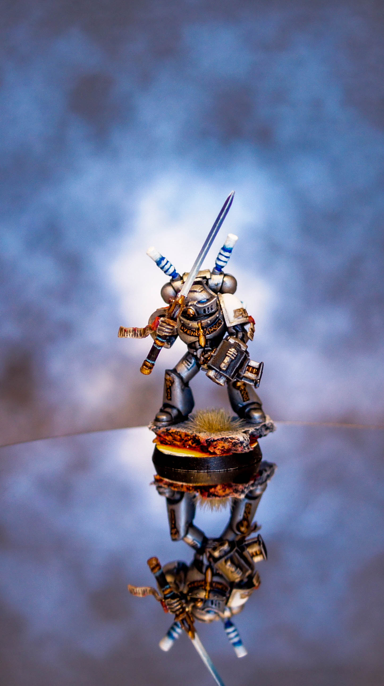
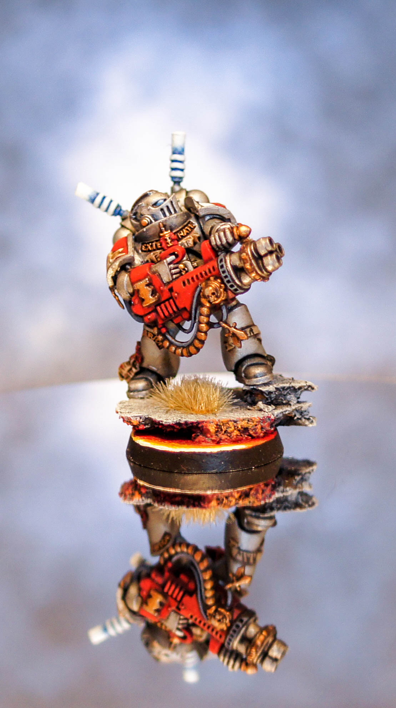
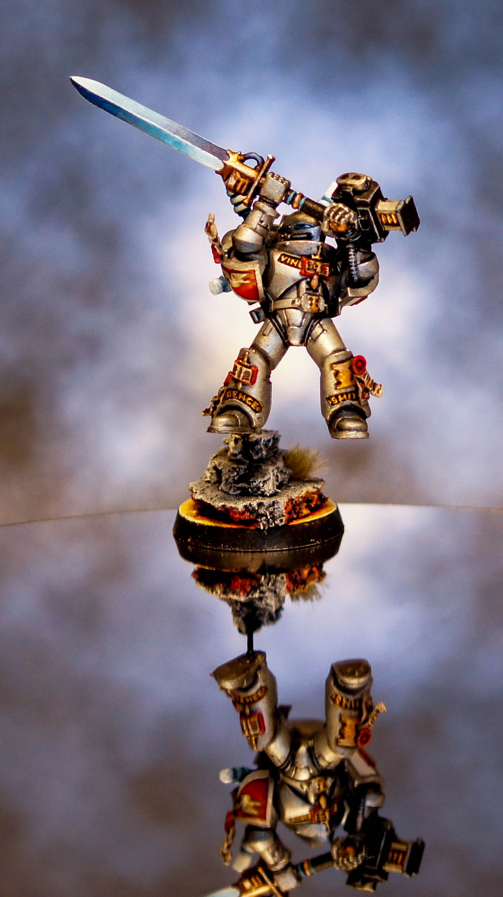
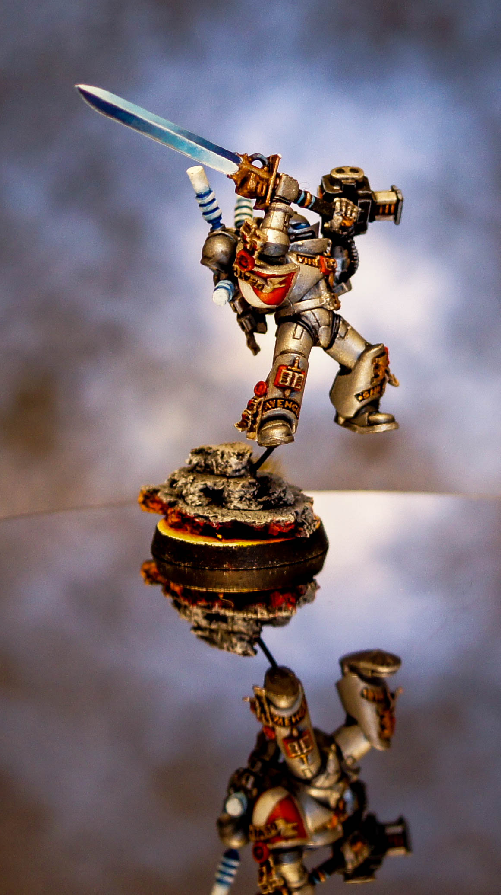
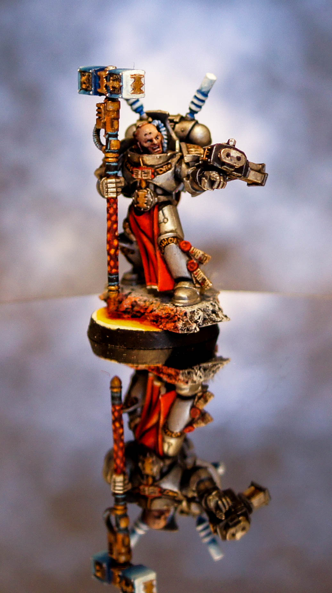
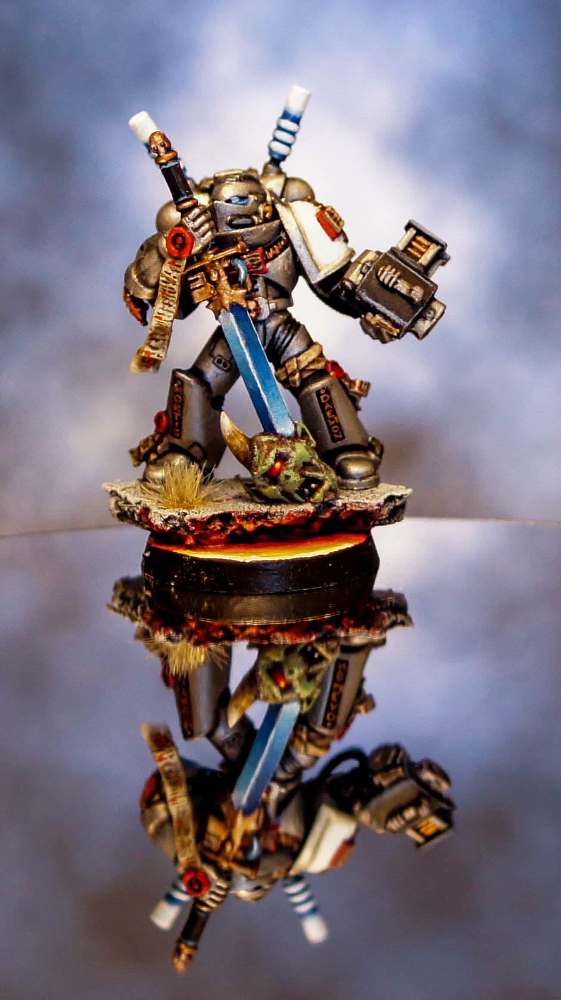
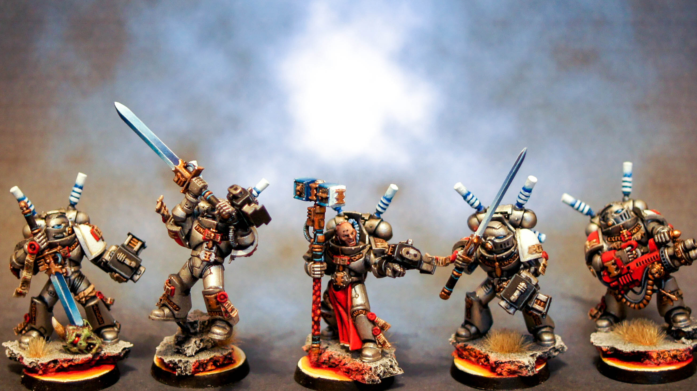

Today I completed my Grey Knight Interceptor Squad! As always it's taken longer than expected, but I'm really happy with the final result.

The first step was to try and pose them dynamically with a feel of movement as they are effectively the Grey Knight Assault Squad unit. However each interceptor has a unique jet pack that allows them to teleport, rather than boosting through the air. For this reason most of them are standing still, but I posed one using a paperclip to be flying through the air. Has he jumped? Has he teleported in at speed? I wish I could have reposed the legs slightly but I really like the angle of the sword, posed to strike down at whatever lurks below him.

I decided to paint the packs in a similar way to the swords. I was surprised that most people have painted them silver (a bit dull for me, not enough to make them stand out), bronze or solid blue with bronze. I wanted them to feel like they're cracking with energy and give them that extra bit of colour on the board. I also made the primary colour of both should pads white to make them contrast against some of the darker units and went up a shade brighter with the red, using an extra layer of Evil Sunz Scarlet.

I also did my final batch of bases for my Grey Knight infantry. The two remaining units and three remaining characters now have their bases complete. The only base left to do now is for my titan! I went for a lot hotter, brighter feel to the lava as I thought it gives a good contrast and catches the eye a lot better than previous versions. I will have to see how all the bases look once the army is together, as I believe ? I have now done 3-4 batches all in slightly different colours, but all following the same techniques.

As always let me know what you think below. Each post I'm trying to improve my photos and I'm slowly getting towards a style I like. Next up... Castellan Crowe!

## Gallery

```grid|3



```

```grid|3



```

```grid|1

```
