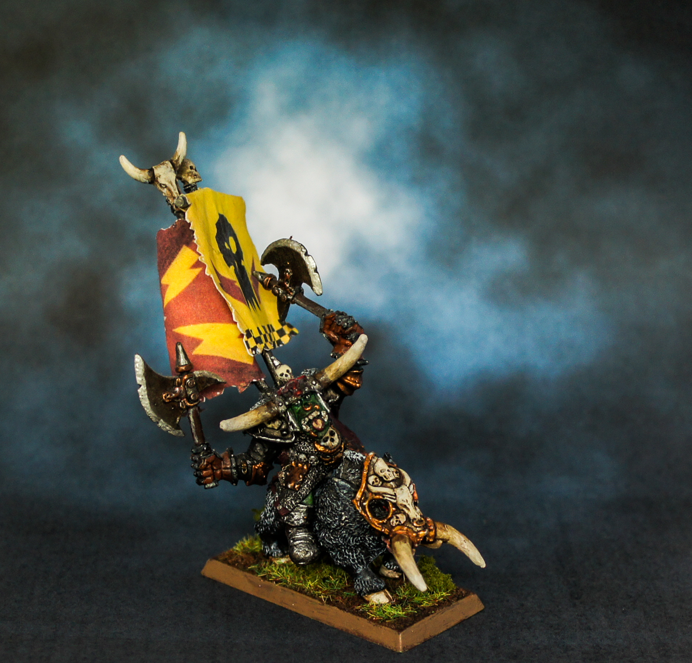
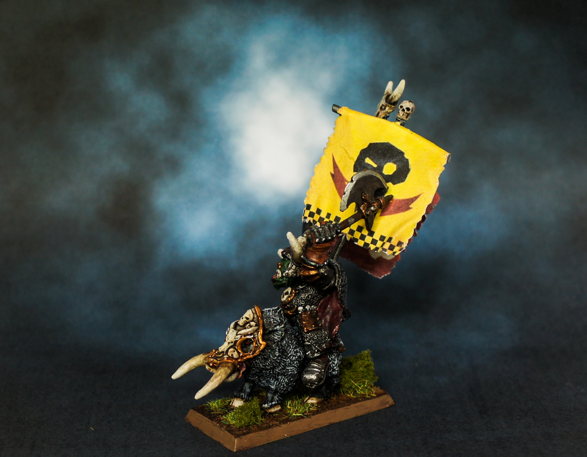

As mentioned in my previous article I've been working on my first Night Goblin character. Well he's no goblin, but is a really cool classic Black Orc Warboss and I think he should keep all those Gobos in line. Meet Morglum Necksnapper!

> Morglum Necksnapper was the leader of the mighty Necksnapper tribe of the Dark Lands. In 2488 he led his forces across the World's Edge Mountains and defeated a large Bretonnian errantry army which had been methodically cleansing the northern Badlands of greenskins for several years. As the Bretonnian duke and his surviving knights galloped frantically out of Death Pass towards the setting sun, pursued by hordes of Goblin Wolf Riders, Morglum Necksnapper made his famous pronouncement "Let 'em tell da King. Da east belongs to da Orcs. Da east belongs to Morglum. Da east is green.". Aided by his second-in-command, Oglok da 'Orrible, Morglum later united with the Orc Warboss, Gorfang Rotgut, to attack Karak Azul. The greenskins briefly took possession of the Hold and captured many of King Kazador's kin.

Painting this miniature was more of a touch up of a 10 year paint job rather than a completely starting from scratch. I'm quite happy how the banners came out seeing as they were simply printed on standard A4 paper, cut out and stuck round the poles and shaped.

I really love the character, it's a shame he hasn't appeared in the army book for a while but this is my way of keeping him alive!

## Gallery

```grid|3



```
