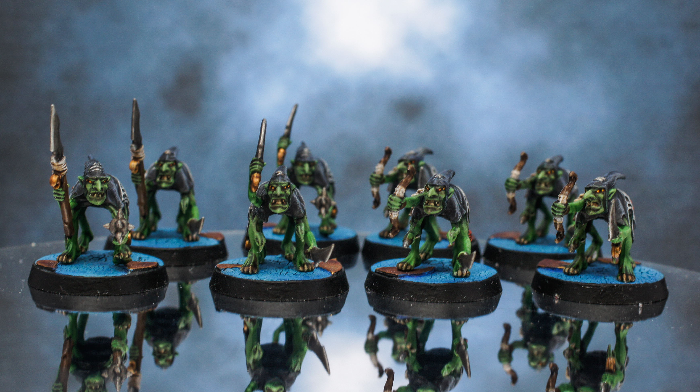

## Grot Scuttlings

> Grot Scuttlings are wily and tribal, half-arachnid greenskins whose poisons and webs are the bane of the unwary. Though individually weak and cowardly, when massed in great swarms the Scuttlings can overwhelm even the greatest of warriors, before dragging their venom-bloated corpses away to dangle in their carrion webs.
>
> Each unit fights with a variety of weapons; some of the grots are armed with two Stabbas, others carry a Stabba and a Grot Spear, and some are armed with a Stabba and a Huntin’ Bow.

It’s been a very hectic three months. Finding somewhere new to live and taking on a new project at work, but I finally got around to tackling the second unit in the Warhammer Quest box, the Grot Scuttlings. I thought it best to take on the joint biggest unit so that with them and the Kairic Acolytes painted the box is starting to look a lot more colourful.

## Miniature Review

The Grot Scuttlings are different to your usual Night Goblins or Moonclan Grots as they are now called. They have four legs, two arms and an extra set of mandible like arms giving them a very creepy arachnid appearance. They also have an extra set of eyes much like a spiders’. This produces a really nice effect which is much subtler at first glance than you would expect.

At first glance you clearly see that they’re Night Goblins, but you don’t really note anything is amiss until you look that bit closer and start spotting the extra appendages. This shows the mutations have been added in a very natural way to ensure nothing is out of place which I think is great.

I like the addition of the spider web on their clothing. They help brighten up the miniatures and the odd spider in the unit for some additional brightness. They also have the occasional moon icon that I was torn between painting bronze or bright yellow.

My only negative thoughts of these miniatures are the teeth. I feel there could have been more definition given to individual teeth to clearly separate them and add a bit more brightness to the face as there was on the claws.

## Painting Techniques

The cloaks were painted first using a base layer of Abbadon Black, followed by a medium drybrush of The Fang. This was followed by a wash of Druchii Violet. A light drubrush of Russ Grey was then given to highlight all the creases.

Next was the skin, which was a simple basecoat of Skarsnick Green, followed by a heavy wash of Biel-tan Green. Then several thin layers of Skarsnick Green were applied to highlight. I also added a wash of Carroburg Crimson around the face and ankles before starting the highlighting. This helped to add a further bit of depth and bruising.

The metalics were completed with a silver and bronze finished. Thee silver was done using Leadbelcher, Nuln Oil and Runefang Steel. The bronze was Warplock Bronze, Agrax Earthshade, then a final highlight of Gehenna’s Gold.

The teeth, fangs and arrows required a Rakarth Flesh basecoat, followed by an Agrax Earthshade wash. A Pallid Wych Flesh edge highlight finished them off.  
The bag was painted the same way as the spear using a Steel Legion Drag basecoat, followed by a heavy Agrax Earthshade wash, then highlighted lightly with Tallarn Sand.

Finally the spiders and eyes were given a Mephiston Red basecoat, followed by a wash of Carroburg Crimson. They were then highlighted with Squig Orange, then Troll Slayer Orange and finally Flash Gitz Yellow for the eyes.

## Basing

The bases were achieved in the same way as the rest of the box-set. Instructions can be found [here under Basing](http://www.minitothemax.com/showcase-warhammer-quest-kairic-acolytes/).

## Roundup

I really enjoyed painting these Grots. I think my last unit of 40 put me off for a while from painting more, but I think having 8 to paint was just the right amount. I do really like these miniatures and I’m quite happy with how they came out for the amount of time I spent on them. They provide that bit of darkness I think the box needs with a lot of colourful other units.

I’m hoping to keep the time down for all the units in the boxset and hopefully have it fully painted in the next few months all ready to play in the new year.  
As always give me your feedback below and let me know if my painting guides have helped at all. Thanks for reading!

## Gallery

```grid|3



```
