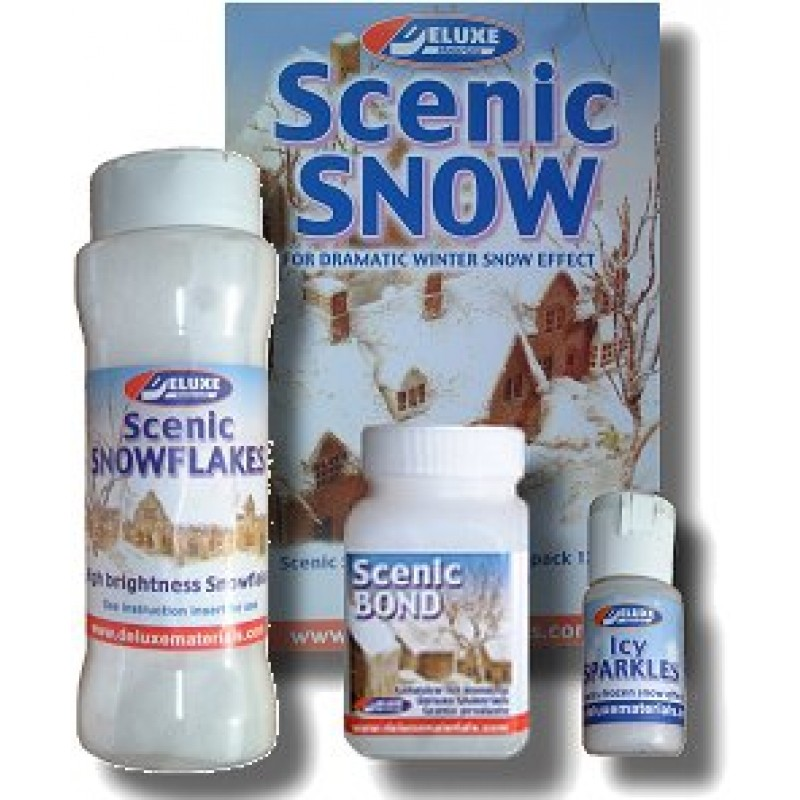

So after several months of periodic work my first piece of terrain, Skullvane Manse, is complete and matches perfectly with my Realm of Battle Boards. It’s not designed for 40k, but it looks so awesome I think I’ll still be using it in games. It doesn’t look massively out of place in my opinion, and fits in well with the boards now both have a coat of snow on them. **See the bottom of this post for more photos.**

So here is a brief colour guide tutorial on how I painted the majority of this piece.

## Rock & Bricks

Drybrush the following colours, applying thinner layers each time. Make sure to get a reasonable layer of Dawnstone down though, otherwise it looks far too dark (I had to give it a second drybrush after applying other details, as with other colours applied it looks much darker, so watch out.)

1.  Eshin Grey
2.  Skavenblight Dinge
3.  Dawnstone
4.  Administratum Grey

## Statues

From the above apply the following layers to the statues to make them stand out from the stone.

1.  Pallid Wynch Flesh
2.  Nuln Oil
3.  Pallid Wynch Flesh

## Bricks

The idea here is to randomly paint the bricks in different colours in different sized patches, otherwise it can look rather dull if they all look the same. The below colours were applied separately to different bricks. Basically 3+ different browns are what you need!

- Gothmor Brown
- Steel Legion Drab
- Bestial Brown
- Scorched Brown
- Dryad Bark

With the base layer applied you can now use a range of different washes to create an even more mis-matched effect.

- Agrax Earthshade
- Seraphim Sepia
- Reikland Fleshshade
- Nuln Oil

After this apply a very light drybrush of Rakarth Flesh to tie it all together. Remember, very light!

## Roof

Apply washes in patched areas to get different effects over each roof.

1.  Regal Blue
2.  Enchanted Blue
3.  The Fang – Drybrush
4.  Russ Grey – Light drybrush in patched areas.
5.  Druchii Violet
6.  Biel-Tan Green
7.  Guilliman Blue

For the bird poo:

1.  Rakarth Flesh
2.  Ushabti Bone
3.  Reikland Fleshshade

## Wood

1.  Dryad Bark
2.  Scorched Brown
3.  Nuln Oil
4.  Steel Legion Drab – Drybrush

## Silver

I applied heavy rusting to mine, if you don’t want that effect miss off the last couple of steps.

1.  Leadbelcher
2.  Chainmail
3.  Nuln Oil
4.  Typhus Corrosion – Apply in areas you want rust.
5.  Ryza Rust – Drybrush

## Bronze

As with the silver, leave of the last step if you don’t want to apply corrosion.

1.  Tin Bitz
2.  Gehenna’s Gold
3.  Agrax Earthshade
4.  Gehenna’s Gold
5.  Sycorax Bronze – Apply to the lower portion of what you are painting to get a good natural highlight.
6.  Nihilakh Oxide

## Skulls

1.  Rakarth Flesh
2.  Ushabti Bone
3.  Agrax Earthshade
4.  Ushabti Bone
5.  Screaming Skull
6.  Pallid Wych Flesh – Tiny amount or it’ll make them too bright!

## Mold

Applying this mold mix wash over the bottom rocks and in patches over the bricks really brings down the brightness of the model and makes it look well aged. With the corrosion added earlier, it really brings the whole thing together.

Add 1:1 mix of Deathworld Forest and Graveyard Earth and water down until slightly thicker than a normal wash, then apply to all the recesses.

## Lens

1.  Abaddon Black
2.  Thin Dawnstone layer round the edge of the bottom half.
3.  Thin Administratum Grey inside the Dawnstone layer.
4.  Skull White on the right hand side.
5.  Thick layer of ‘Ardcoat.

With all these layers I then applied the snow using the product below.

[](http://www.amazon.co.uk/DLXBD029-Deluxe-Materials-Scenic-Snow/dp/B00AMB7398/)

Its really great, as the glue provided is watered down, but has a much stronger bond than PVA. The snow is great and doesn’t fade or yellow, and the addition of the sparkles really makes it look realistic, which you don’t get with other powdered products.

Well that's it, let me know if you've found this useful, or have any other comments below.

## Gallery

```grid|3


```

```grid|3


```

```grid|3


```

```grid|3


```

```grid|3


```

```grid|2


```
