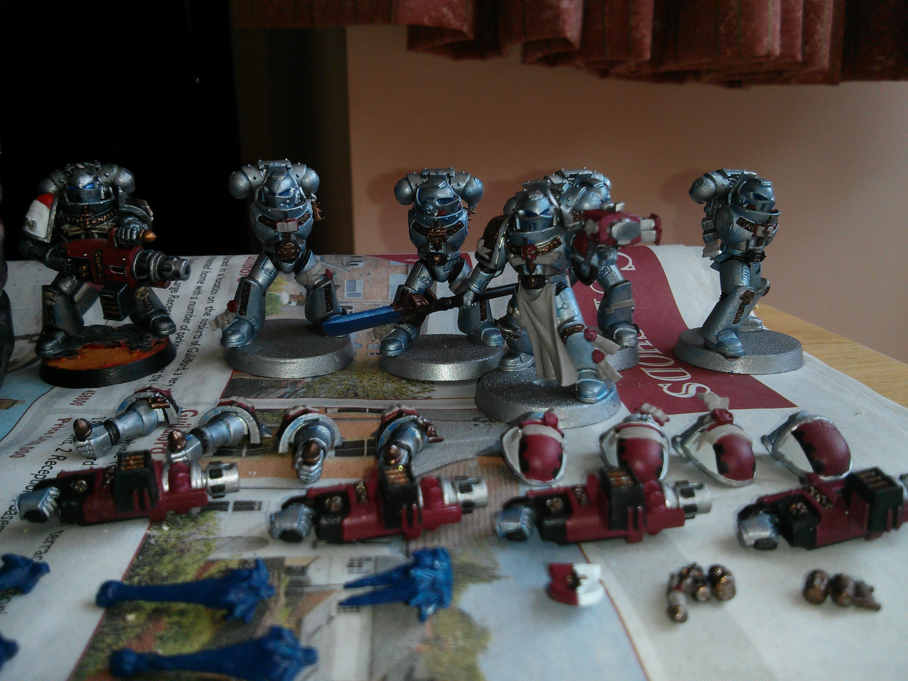
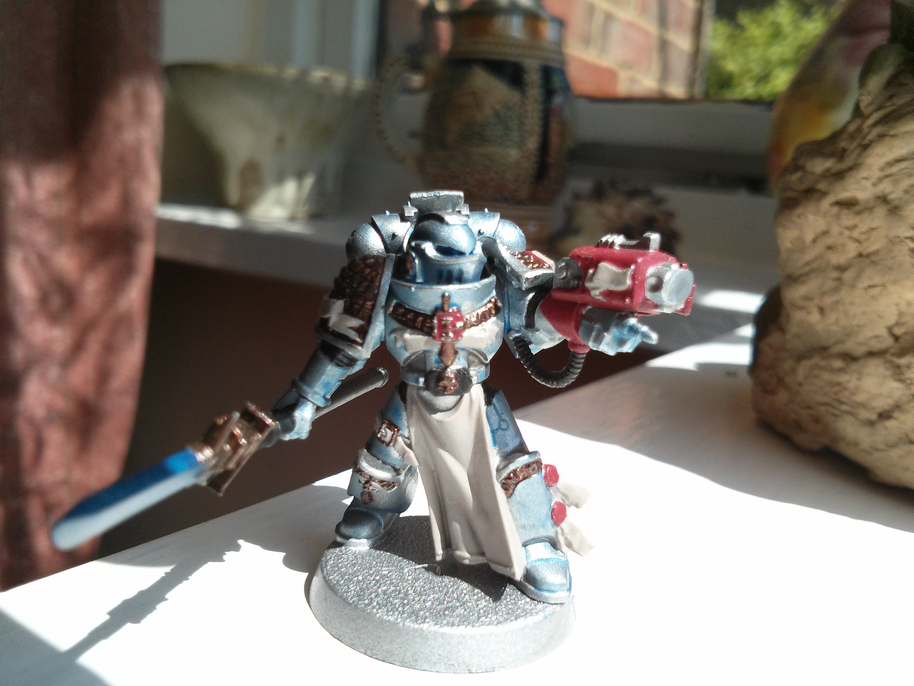
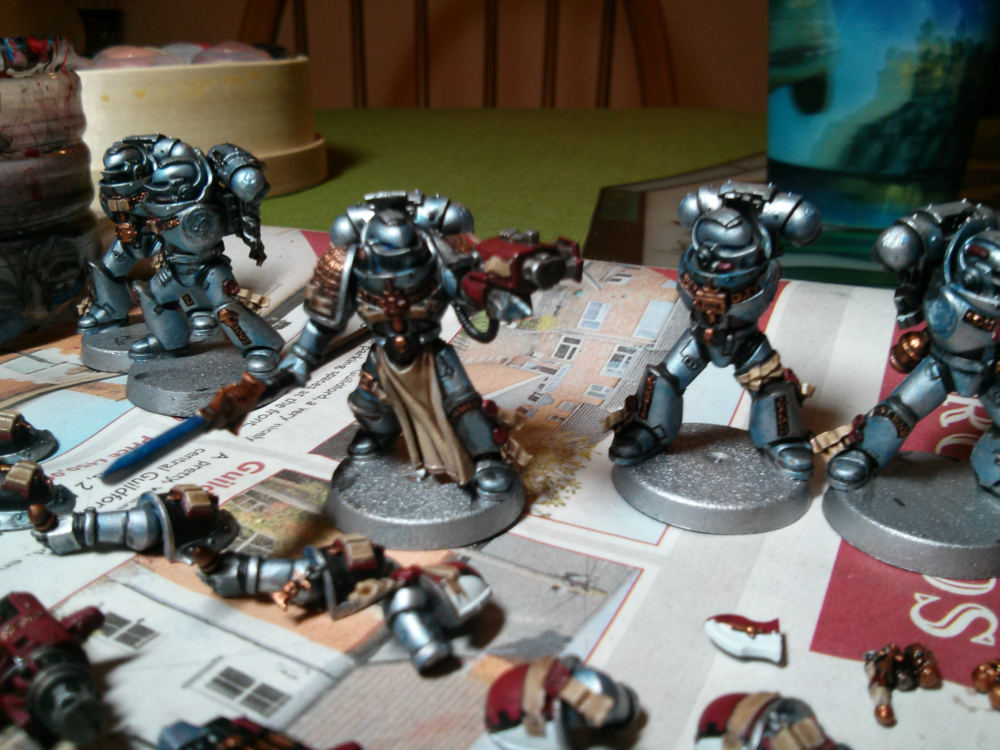
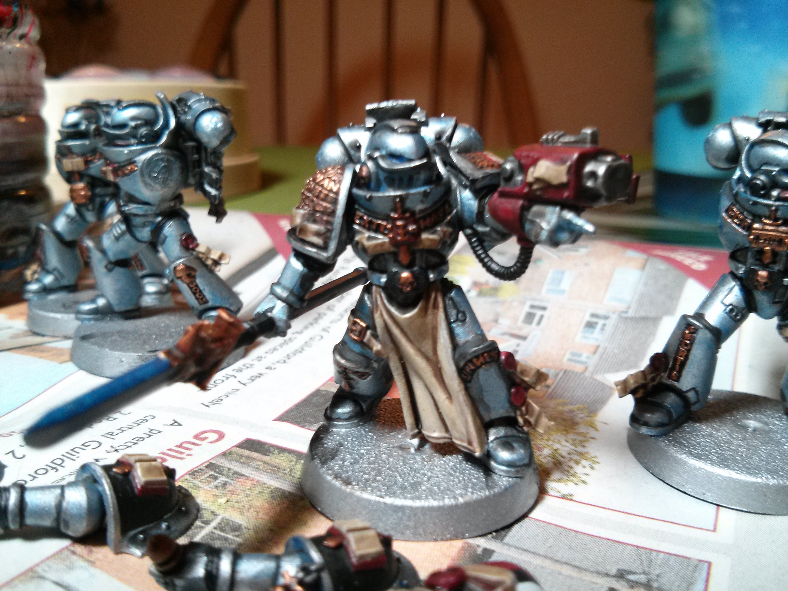
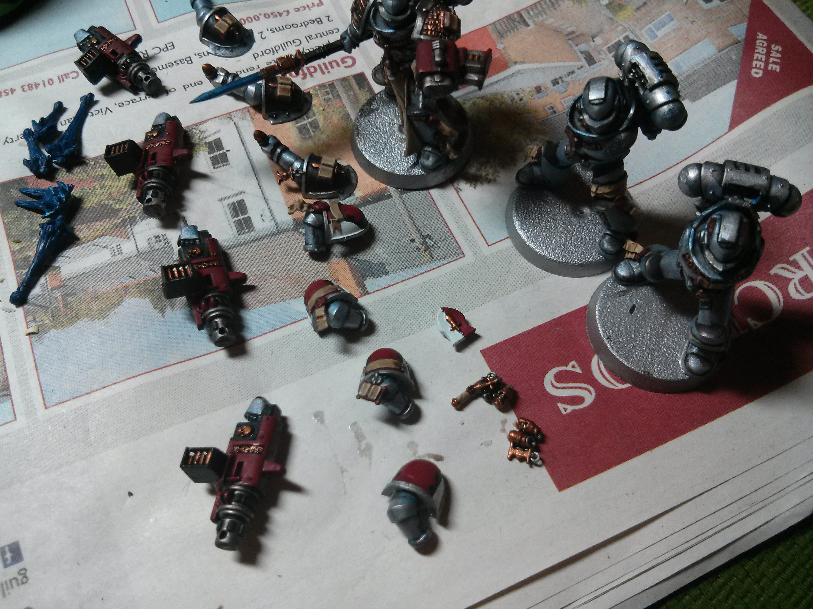
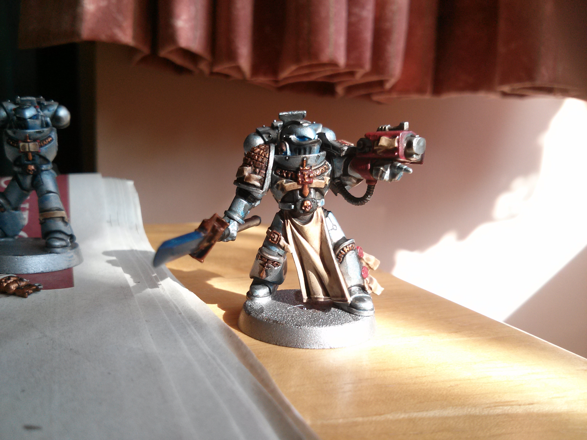
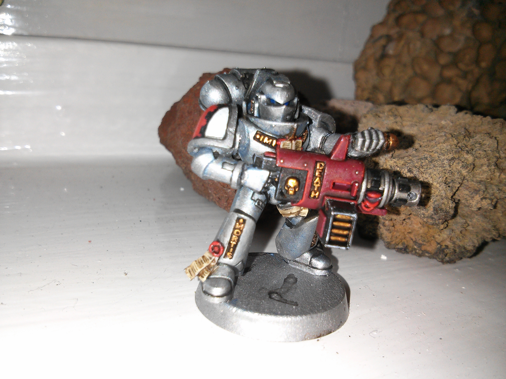
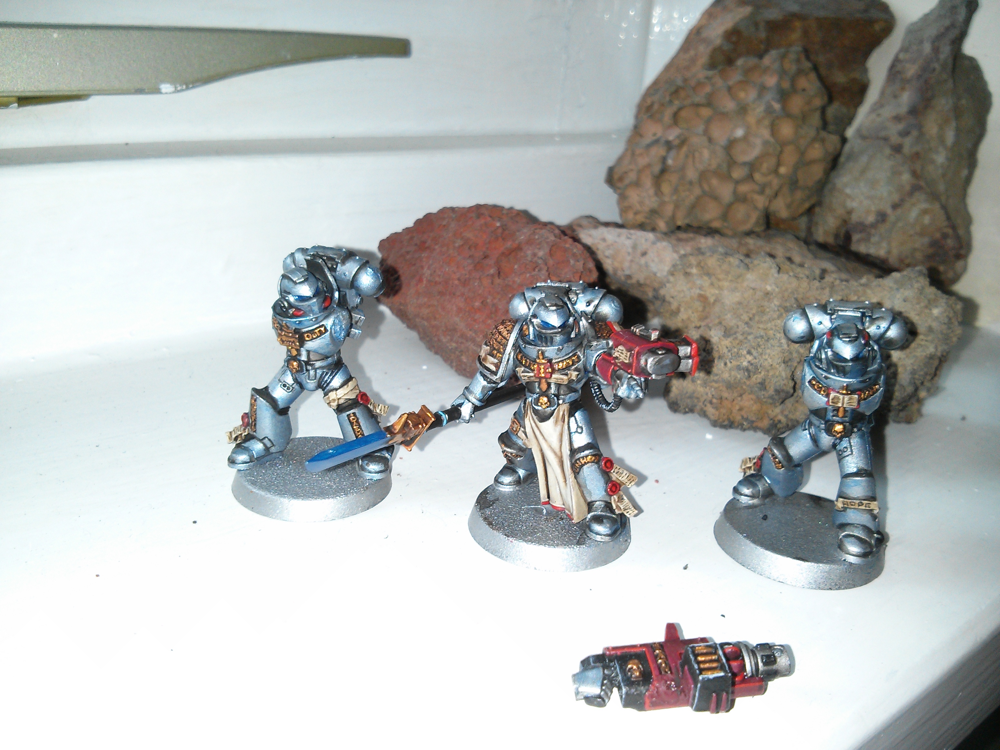

Now that I've painted a good portion of my Grey Knight army and have found a colour scheme I like, I thought it might be useful to those who enjoy my models to tell you how exactly I paint them.

The steps below are pretty time consuming, but I believe give good results.

## Stage 1 - Spray

The first step is to apply the first base coat to paint on top of. Ideally this should be a silver to make your life easier. Games Workshop did sell a Leadbelcher spray for a short time, but unfortunately has decided to not make it a permanent product.

If you have an airbrush then you can still give your models a [Leadbelcher](http://www.games-workshop.com/en-EU/Citadel-Base?s=99189950028) base coat. If not you can use [Chaos Black](http://www.games-workshop.com/en-EU/Chaos-Black-Spray-GLOBAL) spray and then use a large dry-brush to get the same result.

Finally, you can instead  go for a different brand with [Army Painter Gun Metal](http://www.amazon.co.uk/Painter-Colour-Primer-Gun-Metal/dp/B00OQ820JG). Unfortunately at the time this was unavailable, so instead I went for their [Plate Mail](http://www.amazon.co.uk/Army-Painter-Plate-Spray-Primer-x/dp/B005WH318Y/) spray instead, which was closer to [Ironbreaker](http://www.games-workshop.com/en-EU/Citadel-Layer?s=99189951059), so I used an extra wash over the top later on.

## Stage 2 - Base

**Warplock Bronze, Khorne Red, Abbadon Black, Rakarth Flesh, Pallid Wych Flesh, Regal Blue**

With the base coat for the armour sorted, the details now need their own base coat. Getting all these done at once means the next stage can be done in a single step, speeding up my old technique of working on a section at a time. The colours required are:

- Bronze Letters & Armour - Warplock Bronze
- Red Areas - Khorne Red
- Black Areas - Abbadon Black
- Cloth, Parchment & Skulls - Rakarth Flesh
- White Areas - Pallid Wych Flesh
- Force Weapons, Gun Flare & Eyes - Regal Blue

(In these images I have also applied the blue glaze from the following step).

## Stage 3 - Wash

**Nuln Oil, Agrax Earthshade, Guilliman Blue**

The armour should be given a thin glaze of **Guilliman Blue** into the recesses to create the effect of light reflecting off the armour.Once dry apply another wash of **Nuln Oil** to give it some depth.

The bronze, red, cloth, parchment and skulls should be washed using **Agrax Earthshade** reasonably heavily. You want the bronze letters to have the recesses completely filled, along with the eyes of any skulls. For all the red, cloth and parchment areas, focus the wash in the recesses. For any larger flat areas such as the shoulder pads and loincloths mix the wash 1:1 with water and coat the whole area.

## Stage 4 - Layer

**Ironbreaker, Hashut Copper, Mephiston Red, Dark Reaper, Ushabti Bone, Ceramite White**

Once everything has dried you the next step is to paint the main colour of the armour and other details. Think of the original base layer as how the armour should look with no direct sunlight. The shade has picked out the darkest areas, so now you need to pick out everywhere that the light hits.

This covers a large proportion of the model, just make sure not to cover the recesses marked out by the wash, paint up to them instead to give the model a feeling of depth. The other areas to avoid covering are the parts of the model that remain in shadow, such as under the legs and arms.

- Armour - Ironbreaker
- Bronze Letters & Armour - Hashut Copper
- Red Areas - Mephiston Red
- Black Areas - Dark Reaper
- Cloth, Parchment & Skulls - Ushabti Bone
- White Areas - Ceramite White

## Stage 5 - Highlight

**Runefang Steel, Gehenna's Gold, Evil Sunz Scarlet, Dawnstone, Administratum Grey, Screaming Skull, Pallid Wych Flesh**

Before starting this stage, you may wish to add a further glaze of Guilliman Blue to key parts of the armour where the light is reflected the most. After the Nuln Oil wash and Ironbreaker layer it is likely most of the blue wash has been hidden.

A highlight should be added to any raised areas and sharp edges that are most caught by the sunlight. These highlights should be very thin and should be focused most on the front of the model, or the side of the model you wish the sun to be shining from.

When highlighting the black you can use Dawnstone and Administratum Grey for a more natural look, or instead use Lothern Blue to help tie in the Storm Bolters to the Nemesis Force Weapons.

The brightest spots of the armour and details can even be given a final Pallid Wych Flesh or White Scar final highlight for a really reflective effect. This can look great of both armour edges and small raised areas such as bolts.

- Armour - Runefang Steel
- Bronze Letters & Armour - Gehenna's Gold
- Red Areas - Evil Sunz Scarlet
- Black Areas - Dawnstone, Administratum Grey OR Lothern Blue
- Cloth, Parchment & Skulls - Screaming Skull, Pallid Wych Flesh

## Stage 6 - Force Weapons & OSL

As this is a complex step it will be covered in a further tutorial.

## Result

So this is the result of the above steps. The Nemesis Force Weapons and eyes still need painting, as well as the gun flares. Once these steps are complete the models can be fully assembled and finally based.

