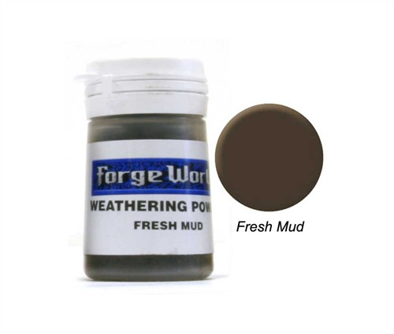

import Hello from '../../../../components/hello.tsx';

<Hello>{JSON.stringify(props)}</Hello>

Last week I was asked to put together a tutorial on how I created my Imperial Knight's base. Below I list the steps that were required, then go into detail behind each.

## Steps

1.  Apply Cork Board
2.  Apply Magnets
3.  Cast & Apply Ruins
4.  Apply Gravel
5.  Painting the Base
6.  Apply Weathering Powders
7.  Apply Grass, Snow & Icicles
8.  Apply Water Effects

### Step 1 - Cork Board

The first thing you want need is a sheet or cork board. Then to get the rough shape of the base you want to place it on the cork and draw round it. Then rather than cut it out you just want to tear it with your hands. This way you get a really natural rocky look. If you cut it the edges look very flat, whereas tearing it gives you a great 3D craggy look.

The effect looks great with multiple layers. My current rule is to have 1 layer for general infantry and 2 layers for characters to give them that extra bit of height to help them stand out. You can then add additional smaller pieces around the feet to stop the base looking too flat.

For my Imperial Knight base I chose to only add 1 layer as it certainly doesn't require any additional height to make it stand out! I left space around the edge of one half of the base so I could add the ice, with smaller pieces in the gaps as well as around the feet. I drew around the feet of the Imperial Knight only the base layer of cork before gluing it all down to make sure I left plenty of space for it to stand.

For more details you can check out my [Lava Bases](/blog/posts/tutorials/bases/lava) tutorial.

### Step 2 - Apply Magnets

I magnetised my Imperial Knight's torso to the legs (not the easiest task!). This makes it much easier to transport in two pieces. Because of that I didn't really want to keep a really bulky base attached to the feet, as it's much easier to pack flat. So for me it made sense to magnetise the legs to the base, feel free to skip this step if transportation isn't really an issue!

So what you need is to pick up some [2-5mm Neodymium Magnets](https://www.amazon.co.uk/Diameter-Neodymium-POWER-MAGNET-STORE/dp/B00P1P6EAY). The bigger the better, just make sure they fit! You'll need 16 to magnetise the feet to the base securely.

Under each foot you will notice each toe is hollow. What you need to do is fill each toe green stuff / milliput and push in a magnet into the centre so it sits dead flat in the circled areas. The easiest way is to push them half way in, make sure they are reasonably flat, then push the foot onto a flat surface at a 90° angle. This makes sure they don't go in too far, if that happens they won't make contact with the base giving a weak attraction. Scrape off any excess putty and leave to dry.

Once dry quickly paint on a blob of paint onto each magnet (I used red) and squash the feet down onto the base while the paint is still wet. Once you take the feet off you should have 8 points, one for where each magnet touches the base. At these points you need  to drill using a drill-bit the same width as your magnets and drill in the same depth as your magnets.

One at a time squeeze in a blob of superglue into each hole and push in your magnet, **IMPORTANT** making sure it's facing the right way!!!! Once dry scrape off any remaining paint and put a small layer or superglue round the outside of each magnet where it touches the putty/cork just to secure them and stop them breaking out.

### Step 3 - Cast & Apply Ruins

To add some extra interest to the base I wanted to add some ruins. A while back I purchased [these glacial ruins](http://www.fantascape.co.uk/119-glacial-ruins) from [http://www.fantascape.co.uk](http://www.fantascape.co.uk). They should look great once I finally get round to painting my Space Wolves. However, for this base I only needed the detailed section of the base.

To do this I cast several bases using Instamold and Milliput. I have a great [Instant Mold & Milliput](/blog/posts/reviews/tools/instant-mold/) tutorial so check it out, I find it comes in handy for almost every project. In this case you only put in enough milliput to get the ruins, not the circular base.

Once cast I just trimmed them down and glued them down to the base in the remaining gaps.

### Step 4 - Applying Gravel

This is the easiest step. To give the base some extra texture you want to add some extra gravel or sand to the base. I used Games Workshop's old sand tub, which acts nicely as a reasonably fine but variably grained gravel.

All you need to do is spread some PVA glue up around the case ruins to hide the joins, around some of the raised cork areas and over around half of the remaining flat areas. Note, don't glue any where the feet will sit! This is where having drawn around them really helps us out.

Once it's all set you will want to apply another layer of watered down PVA glue over the top so that it doesn't run off when you come to dry-brush it.

### Step 5 - Painting the Base

At this point you are ready to get the base painted. Once again my [Lava Bases](/blog/posts/tutorials/bases/lava) tutorial goes over the way I paint the cork rocks.

For the glacial ruins stone I applied a Karak Stone base, followed by a heavy Agrax Earthshade wash. I then highlighted it back up with Karak Stone, Ushabati Bone. Next I applied patched areas of Seraphim Sepia was, then very light final highlights of Screaming Skull and Pallid Wych Flesh.

For the ice I started with a The Fang base, then highlighted up using Russ Grey, Fenrisian Grey, then a final heavy drybrush of Etherium Blue.

The area of the base left flat for the water effects was painted in a similar way to the ice, but was washed in different areas wth Guilliman Blue, Druchii Violet and Biel-Tan Green. These colours will show through the water effects added later on.

### Step 6 - Apply Weathering Powders

At this point it's really worth adding some weathering onto the ruins, patches of gravel and around the feet to show how the ?Imperial Knight is really digging up the ground beneath it with its enormous weight.

For this I used Forge Worlds weathering powders. I like to start with Dry Mud, then move onto Fresh Mud, then finish with Light Earth.

On the ruins I simply apply a small amount of the powder to the stone, then rub it on forcibly with either an old dry-brush or my finger. Once you get the desired effect you want to seal it down using something like Games Workshop's Purity Seal, otherwise it will just rub off in the future.

For the gravel I mix the powder with PVA glue and blob it on to give it a really fresh wet muddy look.

### Step 7 - Apply Grass, Snow & Icicles

The first step is to apply your grass tufts. For this base I used Games Workshops Mordheim Turf. However, there area a lot of great grass tufts out there so take a look!

For the snow I really like Deluxe's Scenic Snow set. The bonding agent is really strong so you don't end up with snow rubbing off all the time. The snow itself looks great and so far I've not had any colorisation issues. Finally the addition of the icy sparkles gives the snow a great realistic effect.

If you want to go with a cheaper option PVA glue, a dab of white paint and Bicarbonate of Soda has worked well for me in the past. I've found Baking Powder has a tendency to froth up though so be careful!

Just glue the snow around the base of the glacial ruins where the snow would gather, then dot more around other areas of the base. I find adding little blobs to the grass tufts creates a really nice looking effect.

I also added a few icicles to the overhang of the ruins. I used Dragonforge icicles to do this, but it seems that they no longer sell them and I've not been able to find any decent alternatives. Sorry!

### Step 8 - Apply Water Effects

For the last step I added the water effects to give the appearance of a frozen lake surrounding the rock base.

Now  for this base I only used Woodland Scenics Water Effects and not their Realistic Water. I don't currently own their Realistic Water but I believe it may well have produced a nicer effect, or at least been a lot easier to apply. Water Effects is very much like a thick PVA glue so is quite hard to spread flat and evenly, whereas the Realistic Water is much thinner. You would have to be careful with it just running off the edge of the base, but you could tape some card round the edge to hold it's position until dried I suppose.

Anyway, when I applied the Water Effects I added it in lots of thin layers. You have to be careful because if you apply it too thickly you risk it not drying completely clear. It can also shrink as it dries so if you apply it too thickly you will see where it tears itself away from the edges of the cork when it sets.

When applying it you want to add a very tiny amount of Lothern Blue mixed with Ceramite White. Seriously I mean a very very small amount, just enough so it doesn't set completely clear but so you can see the painted bottom of the base. I **strongly **recommend practicing first before applying it to the base. It took me a lot of attempts to get it right and you don't want to ruin the base at this stage! Just slowly build up the layers letting each layer fully dry before applying the next and eventually you'll find yourself with a completed base!

###  Base Closeups

So at this stage I think I've wrapped everything up. I'm sorry for not including step by step images but I didn't photograph the base at each step and the miniature is currently on display so I''m not able to get additional photos of it complete. Hopefully the two below will give you a good idea of how it looks completed.

If you liked the tutorial or have any feedback or questions just let me know. Until next time!
