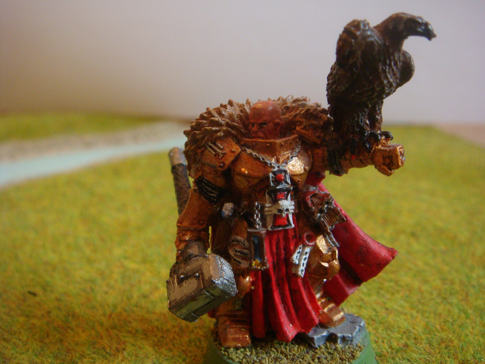
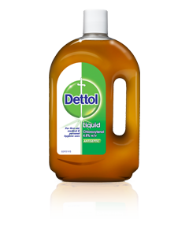
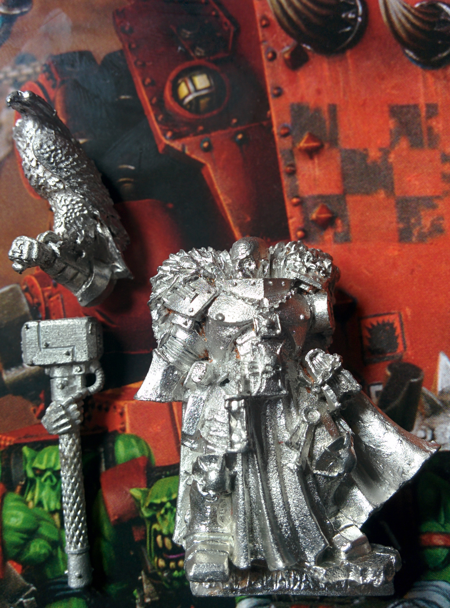

Inquisitor Coteaz used to be my favourite character back in 6th edition and always lead my army, although normally from the rear with my purgation squad. With their ability to shoot through walls so no one could return fire and his ability to let them re-roll hits with divination, as well as give them a free shooting phase against anyone who deep striked anywhere near them in an attempt to take them out, the two made a perfect match. All that and I've not even mentioned Dave the eagle! Ahhhh good memories!

Being a favourite character, I really want to repaint him. It’s a shame with the rest of my army being painted recently, while he was sits with a 10 year old paint job from when I was 12\. The main issue with repainting him is how thickly I used to blob on the paint. Being a great model, I didn't want the paint job to fall short, so I decided to look into how to remove the paint.

Being metal I knew I wouldn't need to look into obscure methods that finecast requires to avoid damaging the mini. The method I did find on paint stripping however works on both metal and plastic. The method is simple:

## Put it in the Dettol!

All you have to do is pour Dettol neat into a pot and submerge the model completely in it and leave it for several hours. I left mine for about 4 hours and it could have used a bit longer, the fur area didn't want to let go of the paint! You can’t damage the model in it, so you can leave it in for a day or even a week if you feel the urge. If you keep it in a pot with a lid, you can reuse it again and again. If you don’t use a lid, be careful as the stuff really stinks! You may want to keep it outside!

## Get your gloves & take it out!

After a reasonable length of time you you can see the paint comes lose from the model, so its time to take it out. BE CAREFUL THOUGH! You don’t want to be touching the stuff with your bare hands, as it will dry out your hands giving you blisters, even when running under a tap. I really suggest using gloves. I didn't have any to hand, but I improvised with some plastic sheeting I had lying around.

## Scrub off that paint!

Once out give it a good scrub to get the paint off. I suggest a tooth brush, I used the brush you used to get with the Games Workshop mold line remover. If there’s any paint remaining, just put it back in the Dettol and give it another brush later.

## Scrub off that Dettol!

With all the paint off, make sure to give the model a good wash with warm soapy water. It’s important, as if any Dettol is left on the miniature any base coat applied later on will simply strip off.

## Result!

Hopefully I've not missed anything. Here’s the results I had and I think you’ll agree it was pretty successful:

