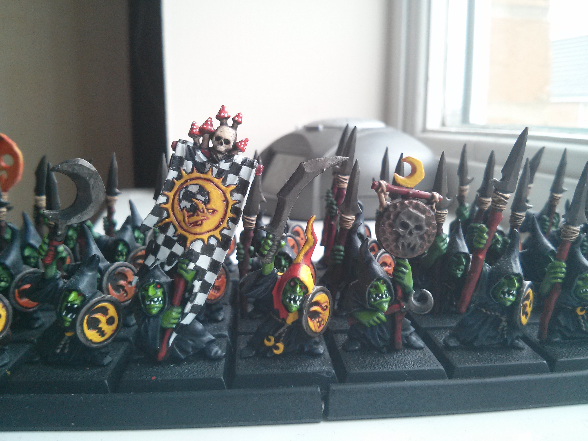
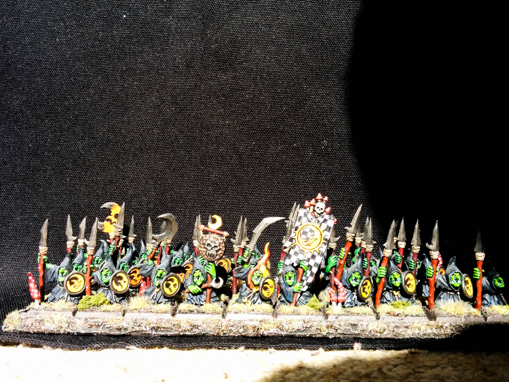
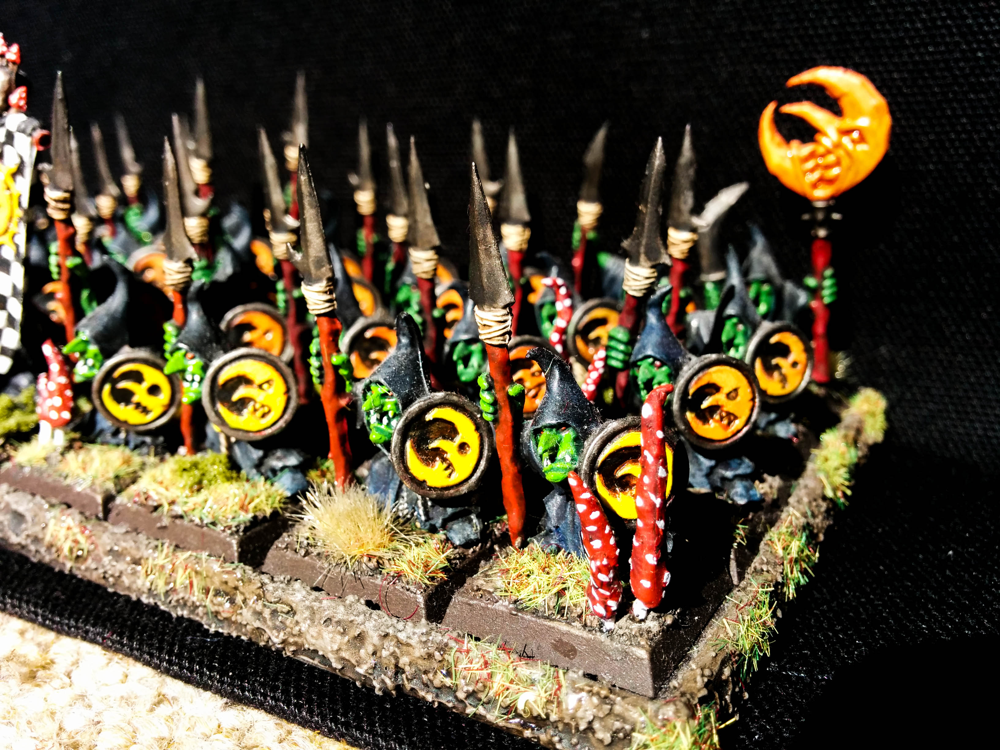

Here's a quick look of the start of my army of Night Goblins. This is a a unit of 40 Spearman, the largest unit of my army. The front row is more or less complete, while the other 3 rows are now just in need of a the final layer and highlight.

The trick with these guys has been to make them as colourful and as fun as possible, despite their cloaks being jet back. I made their cloaks that bit lighter and more colourful by giving them a purple highlight. The wooden spears I gave a red vanish and I made the yellow moons as bright as possible.

I also decided to do a bit of freehand and give the banner the standard night goblin checked pattern. The leader of the unit also has a freehand large checked red and yellow hat to tie in with the rest of the colours used in the unit.

For the movement tray I covered it in a special PVA glue that contains grit to give it a really dirty muddy look. I then added some of Game Workshop's [Citadel Scorched Grass](http://www.games-workshop.com/en-AU/Citadel-Scorched-Grass) as I don't have any grass bases for my other armies and I feel it is important to the fantasy look. It also matches the [Mangler Squigs](http://www.minitothemax.com/showcase-mangler-squigs-botb-painting-competition-winner/) I painted a while back, along with the added in clumped foliage.

I also made some mushrooms, being Night Goblins, from greenstuff rolled up and a paper clip cutting pushed into the end of each. I made some short and some long to give more visual interest and again painted them bright red to stand out and added white spots for the extra mushroomy look.

Let me know what you think below as always!

## Gallery

```grid|3



```
