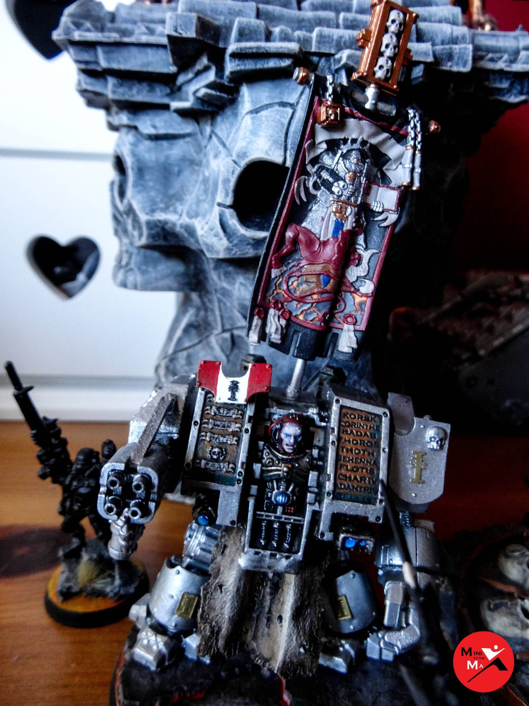

This is the current state of my Grey Knight army. I have better photos of each squad individually already uploaded to
the website if you want to check out a certain squad in more detail. I just wanted to show how it all looks together.
The painted squads currently include:

- Brother Captain Stern
- Librarian (Proxy Chaplain as I prefer the model)
- Terminator Squad
- Strike Squad 1
- Strike Squad 2
- Purgation Squad
- Dreadknight
- Stormraven

I am currently working on the company Dreadnought. It has a much older look than the rest of the army and I've tried
something different by giving it a human face, rather than the standard helmet and made it very pale to bring across 
the deathly feel.

What’s left to paint includes:

- Castellan Crowe
- Torquemada Coteaz
- Paladin Squad
- Terminator Squad
- Purifier Squad
- Interceptor Squad
- Vindicare Assassin
- Razorback
- Land Raider

I'll have to see if this list changes or expands in the future, but for now it definitely appears achievable to get
everything completed, something that seemed like it would never happen a few months ago.

The only model I don’t own that I want is
[Kaldor Draigo](https://www.games-workshop.com/en-GB/Grey-Knights-Lord-Kaldor-Draigo).
Well that’s all for now. Hoping to keep powering on and getting this army complete during my free time. Then I can
make a start on my Space Wolf army which I’m getting all kinds of plans on. I’m looking into all kinds of weathering
powders and scenic bases!
