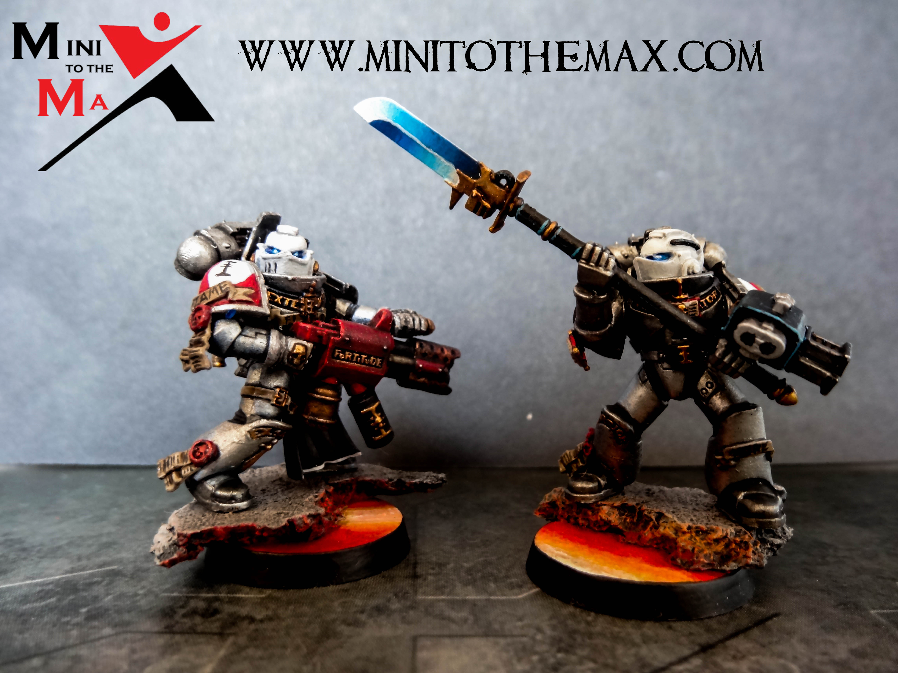
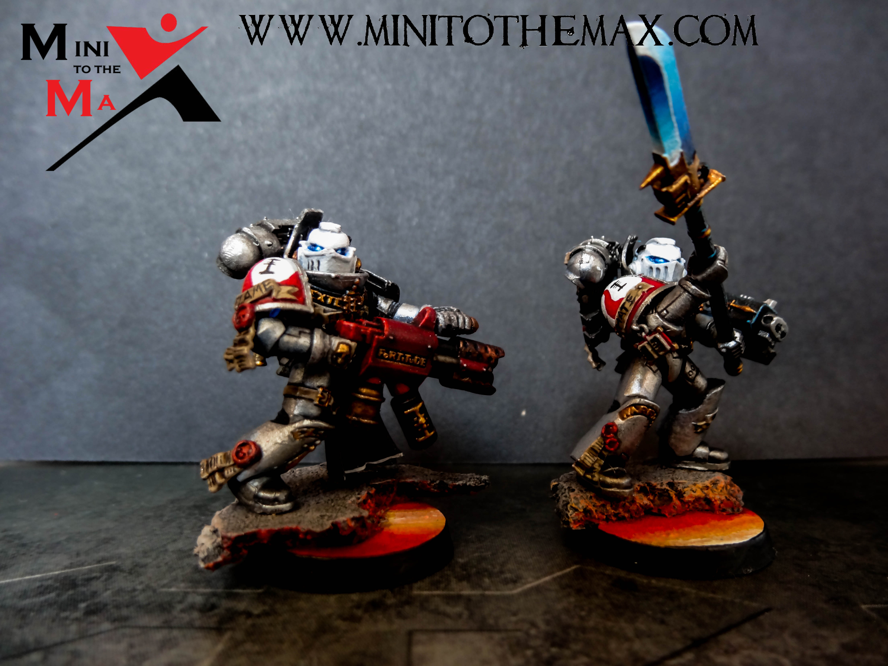
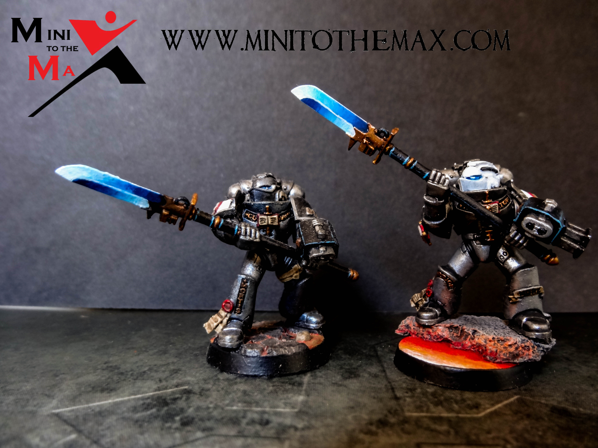

This is the latest update for my Grey Knight Purifiers. Rather than batch paint the unit I decided to work through a model at a time and try and complete each in a day.

For the helmet I started with a grey base coat, then slowly added layers of lighter an lighter grey until finally moving onto pure white for the final highlight. I also used the same technique for the shoulder pads as well. I like how the shading effect came out, but the paint did start to get a bit thick so I will lessen the layers next time and water the paint down that little bit more.

I added a blue and purple wash to the flamer to give a tarnished effect. I think it came out rather well. Better than just drybrushing the end black, so something I will use on flamer based weapons in the future.

I painted the eyes in the same way as normal, but only did the glow effect below the lenses. I think this makes the model look a lot neater, especially with the white helmet.

I also went with a new shoulder marking for the squad, I’ll add a close up of it when I get the chance and have the whole unit complete.

Hopefully I’m still improving with each squad. I feel like I've sped the process up slightly, but will definitely try and go back to batch painting for the next squad, I just haven't felt like I've had the time to make much progress painting that way recently.

I've been busy recently with other lots of other projects, but I finally got round to basing my purifiers and finished painting the second! Here they are below. I've added a watermark to photos just as a trial for now, let me know what you think below.

```grid|3



```
