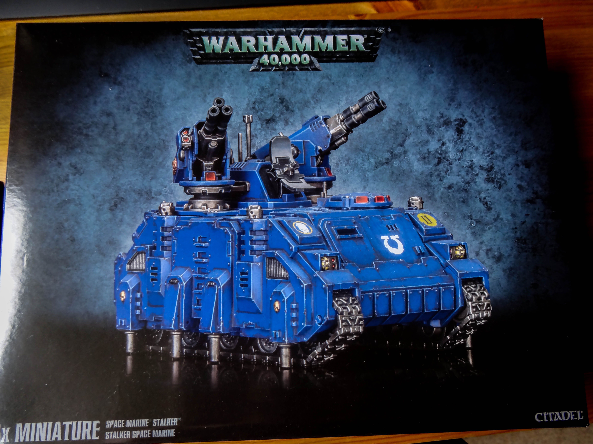
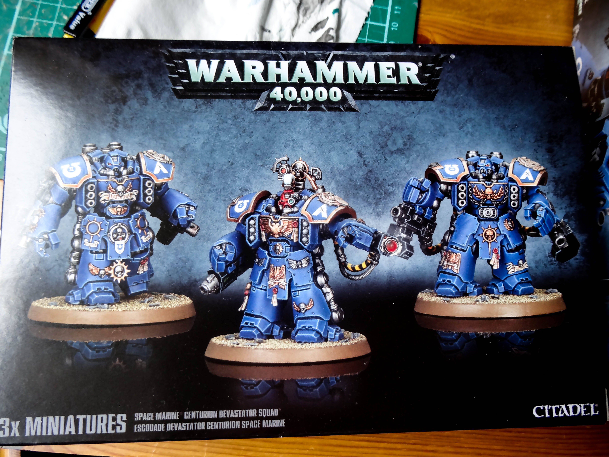
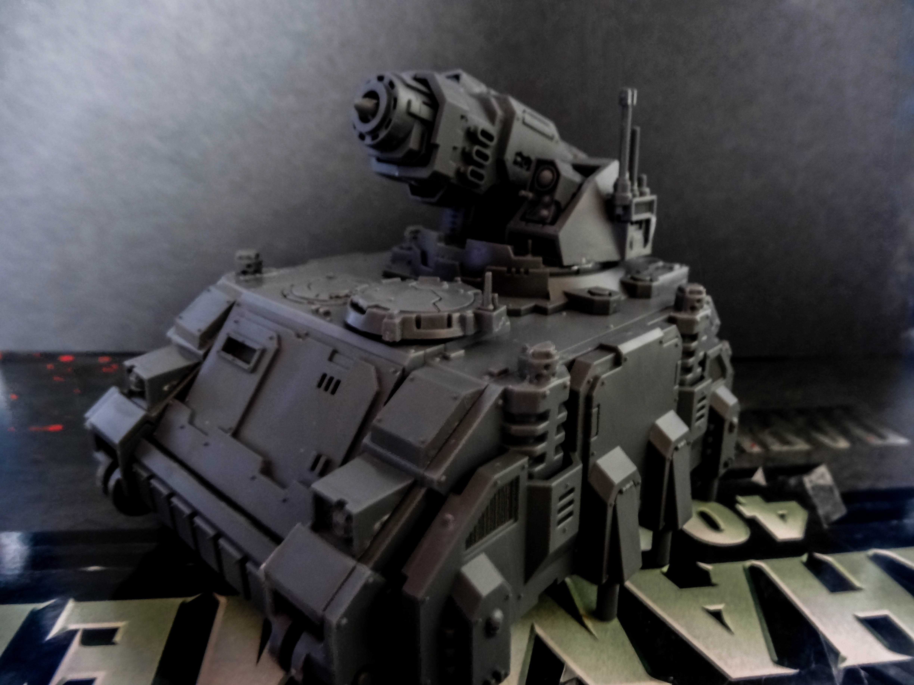
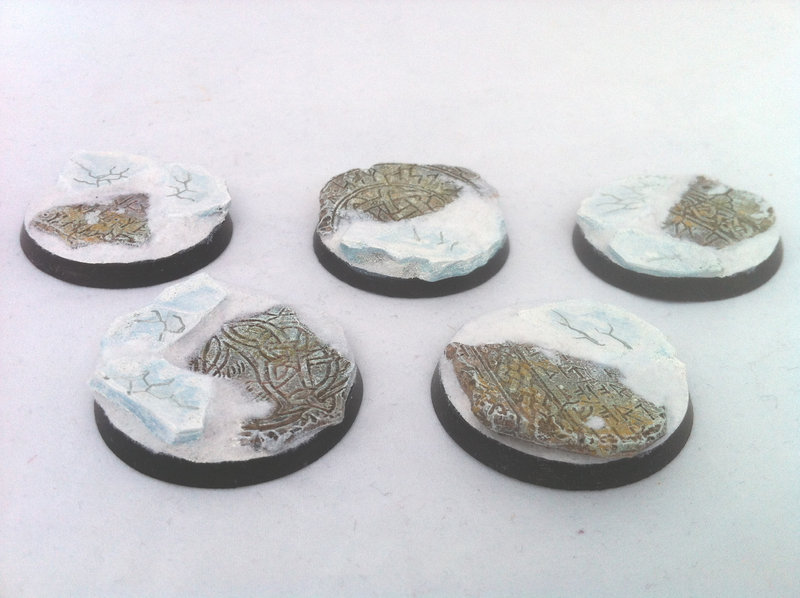
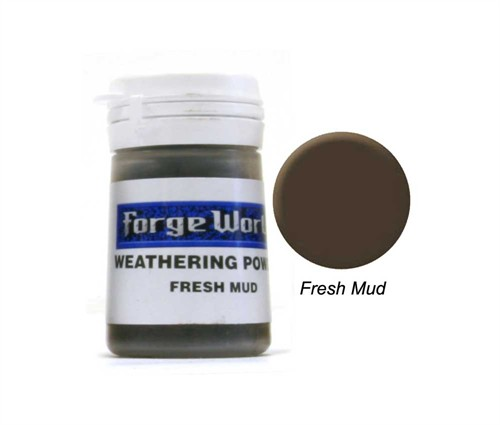

So I thought I'd post a quick update as I have loads planned and have bought some really cool bits. Unfortunately between the time I have to paint and the time it takes me to paint, all these projects will have to be kept for waaaay in the future as I really want to complete my Grey Knight army before I move onto my Space Wolves. However, I thought I’d let you all know what I have planned in the future.

First off, Space Marines! Along with the new codex (which is great!!) and the last cans of The Fang spray paint, I bought these:

I have the Hunter / Stalker tank fully assembled with both turrets. I am yet to assemble the Centurions as I want to magnetise all the weapon options and I'll tell you now there is a huge choice so that's going to keep me busy for a good while! I plan to spray all the parts with the relevant base-coat and have every piece painted before the final assembly.

Both of these buys also need to be ‘wolfified’ as they will be joining my Space Wolf army. I have plans to coat them in various wolf pelts by molding some wolf coats and other spare bits I have lying around. I'm hoping that I can take out the casts before they have completely set and reshape them to hang over the tank.

I know that Space Wolves don't have Centurions, or the Hunter / Stalker tank in their Codex, but I feel they really should have access to these models. I'm hoping people I play will be happy to allow me to take them along, otherwise I'll have to make a separate detachment to keep the army bound and legal.

I’ve also bought several of these:

They are from [http://www.fantascape.com](http://www.fantascape.com/) and I really like the look of them. I just got them in the post and they even come with the snow cast onto them, all the need is priming and painting. I’ll get them painted up at some point and then add this over them:

I found it via this review online, [http://www.youtube.com/watch?v=ADEZd-Hl76w](http://www.youtube.com/watch?v=ADEZd-Hl76w) a channel I have followed for a couple of years and I strongly suggest subscribing to. I will of course be writing a review on both once I’ve completed the bases.

Another product I will be reviewing in the future is Forge World’s weathering powders.

I bought 6, including Fresh Mud, Dry Mud, Dark Sand, Aged Rust, Orange Rust and Black Soot. I will be using the mud and soot on my Grey Knight tanks, and will be using all of them heavily when it comes to painting my Space Wolves.

Well that’s it for this update. Next up painting-wise is a squad of Interceptors and a squad of Purifiers. I'm going to try and paint these as a single batch, which will get all my standard marine Grey Knights completed. Wish me luck and hopefully it won’t take me too long before my next update!!
