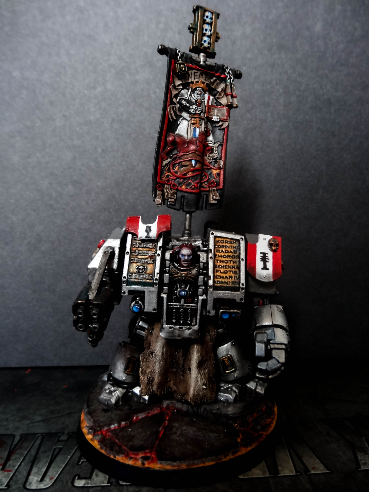
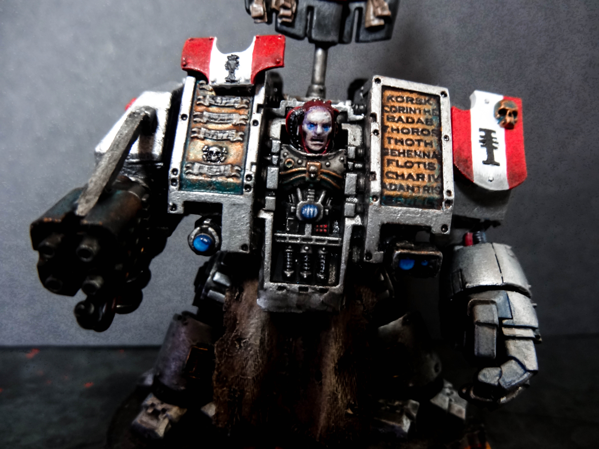
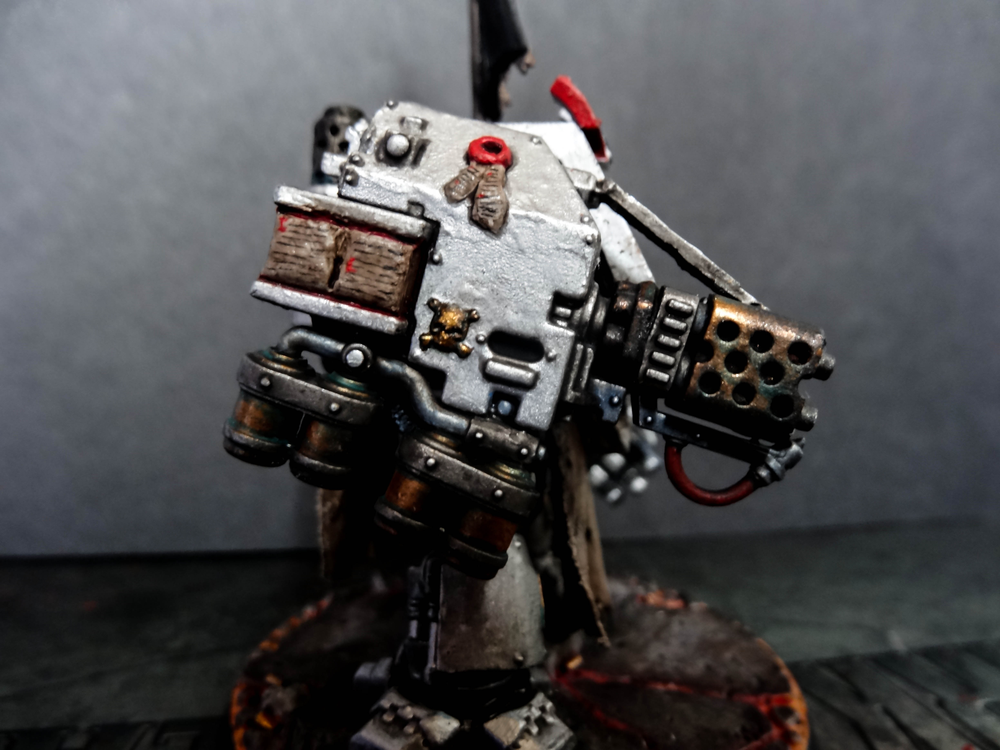
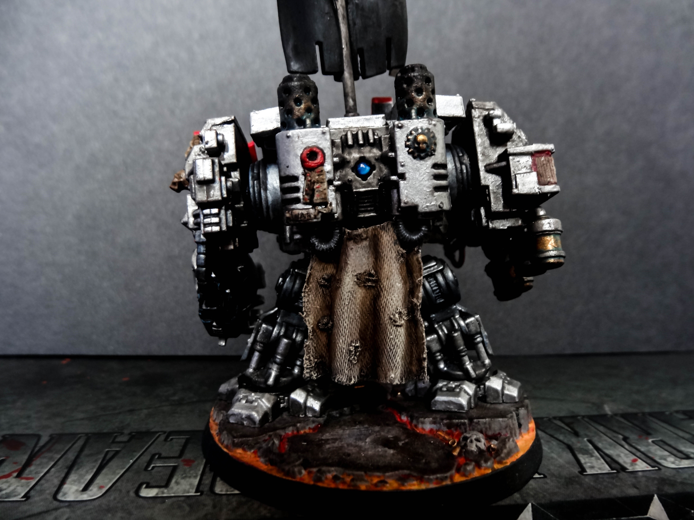

After spending odd mornings and weekends painting and modelling I’ve finally finished my Dreadnought. It started off as a standard Dreadnought, to which I added the Paladin/Terminator banner and Dreadknight incinerator head and fuel canisters, along with a metal support.

I also added the Dreadknight shields and pilot head I had spare , along with the Venerable Dreadnought front casing and powerfist. I then added bits of cloth sowed into shape and then made solid by adding layers of superglue, which was then frayed and notches cut out to represent bullet holes.

I know several people are unsure on having the space marine's face showing. However, according to the fluff a veteran space marine is held within a sarcophagus, so I took the extra step to have the face exposed and look deathly pale to make it stand out that little bit from other vehicles.

I finally added brass etchings on the legs and created a book on the side arm with greenstuff, along with other purity seals. I definitely have a long way to go with sculpting but it was a lot of fun to give it a go and a good paint job helps to hide any imperfections.

The painting scheme was similar to what I’ve posted in the past, but with one difference. I wanted to show the age of the Dreadnought, so to achieve that I focused on aging the bronze by adding patina. This was done by mixing Thrakka Green and Hawk Turquoise.

As always here’s the rest of the pics, let me know what you think of the look and paint job below!

## Gallery

```grid|2


```

```grid|2


```
