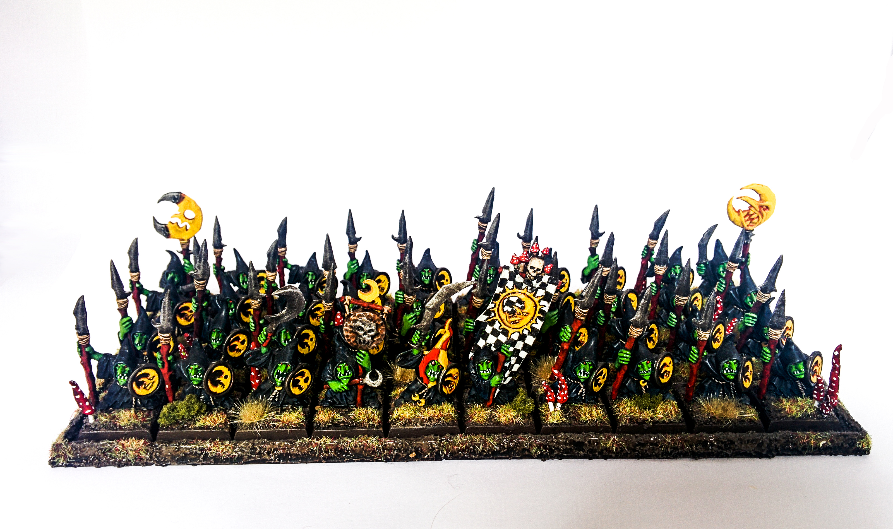
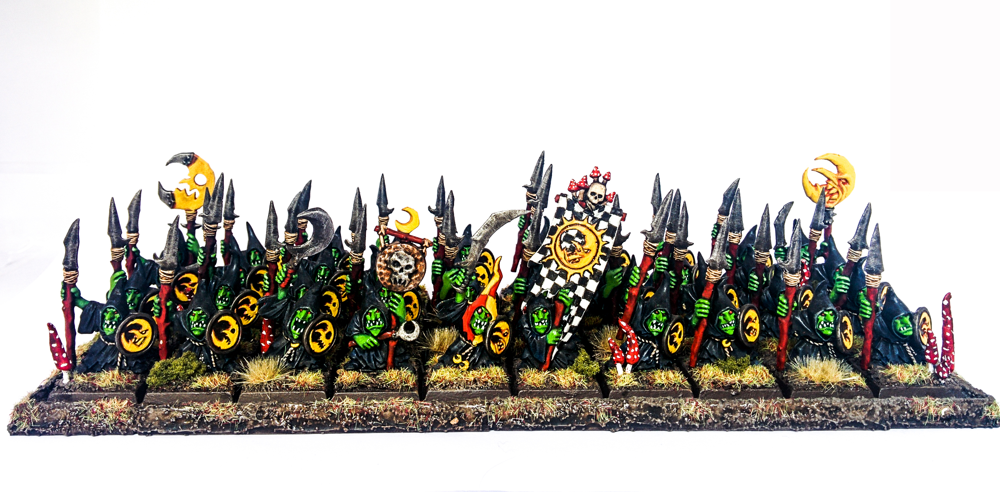
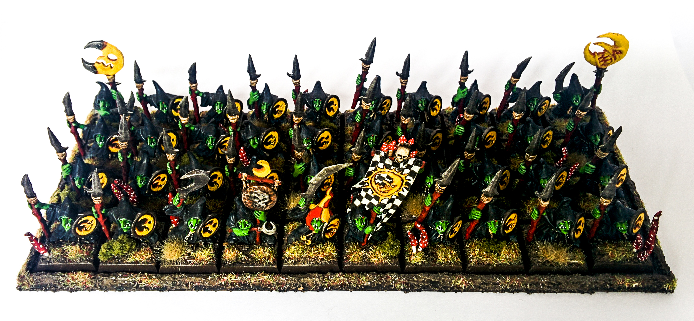

So I finally got round to finishing off my Night Goblins. This 40 strong unit of Night Goblin Spearmen ended up not requiring that much more work from when I last posted my WIP update.

From that past WIP post I went through the rear 3 rows adding several layers of green to bring out that colourful goblin skin, then picked out the eyes and teeth. I then highlighted all the yellow in the unit with the brightest yellow I had (Flash Gitz Yellow) and highlighted the silver of the spear tips.

I had planned to highlight the red spear poles, but am happy with the overall look and don't want to bring attention away from the faces or the yellow. I also didn't want to make them look unnaturally red either and think how they look now is about right.

As you can see I've tried using a new background for my photography. Unfortunately A4 was too small for this unit, I will need to see how I can get an A3 print in the future.I think it gives a good contrast to the plain white, giving me a different option on how I want each photo to come out.

With these goblins complete I have 2 more 20 man units to paint, along with a number of characters. However, other than one character I'm currently working on the rest will have to wait, as I have other projects I really want to complete first.

Leave your feedback as always, it's always appreciated!

## Gallery

```grid|3



```

```grid|2


```
