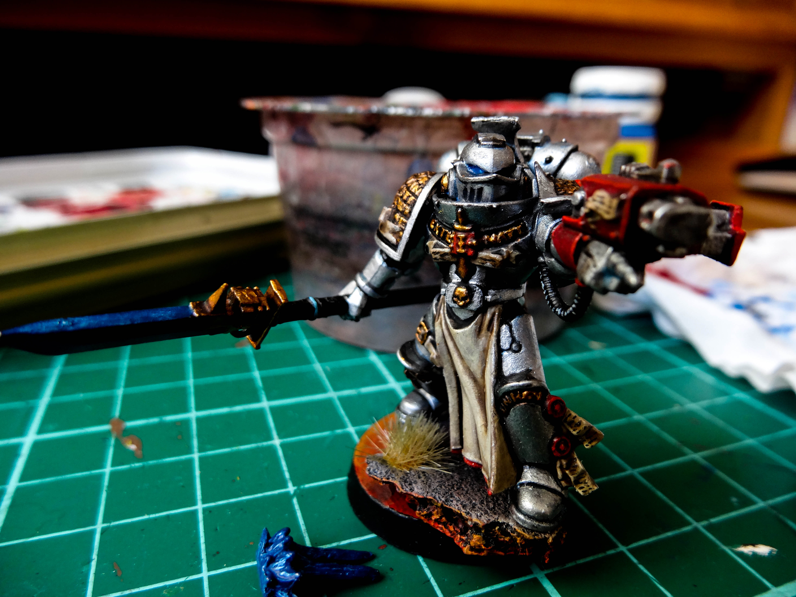
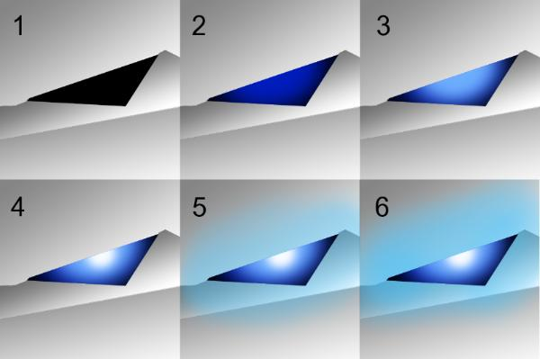
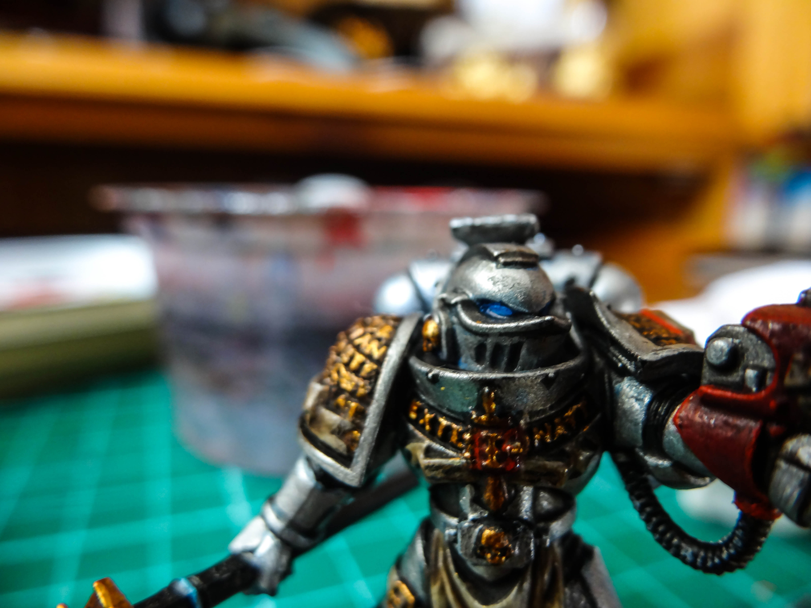
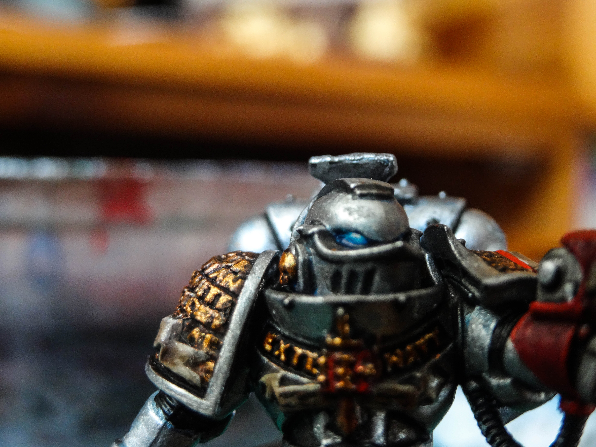
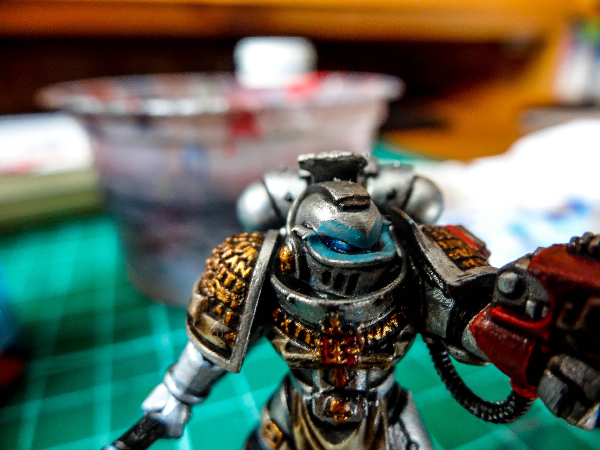
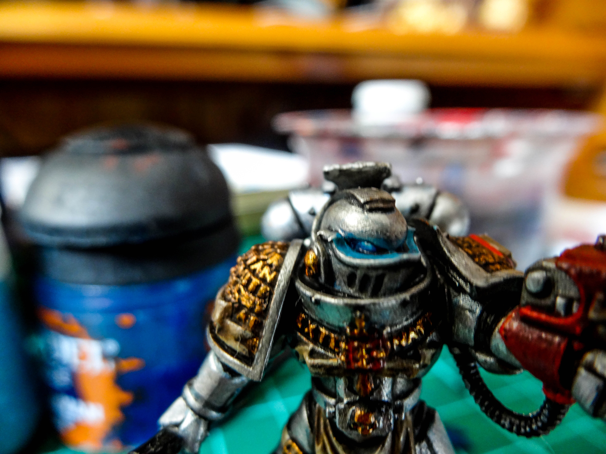
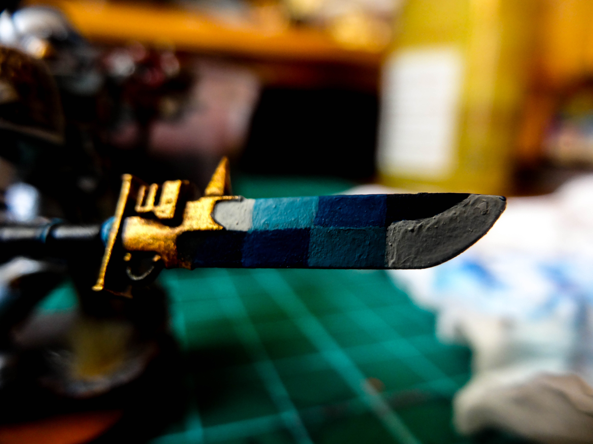
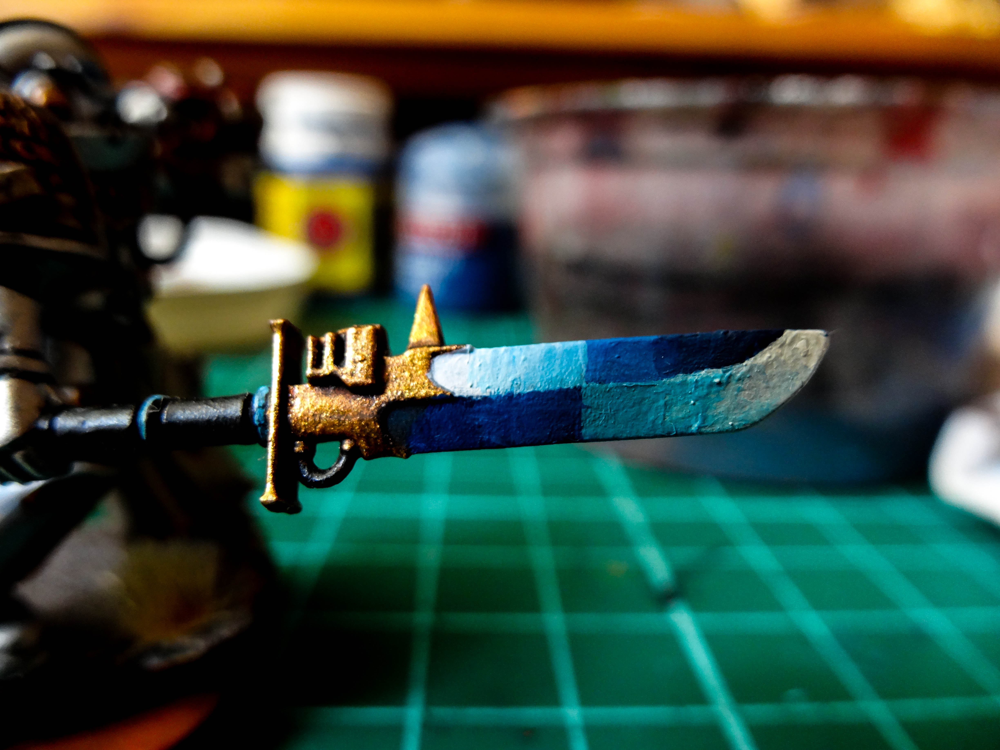
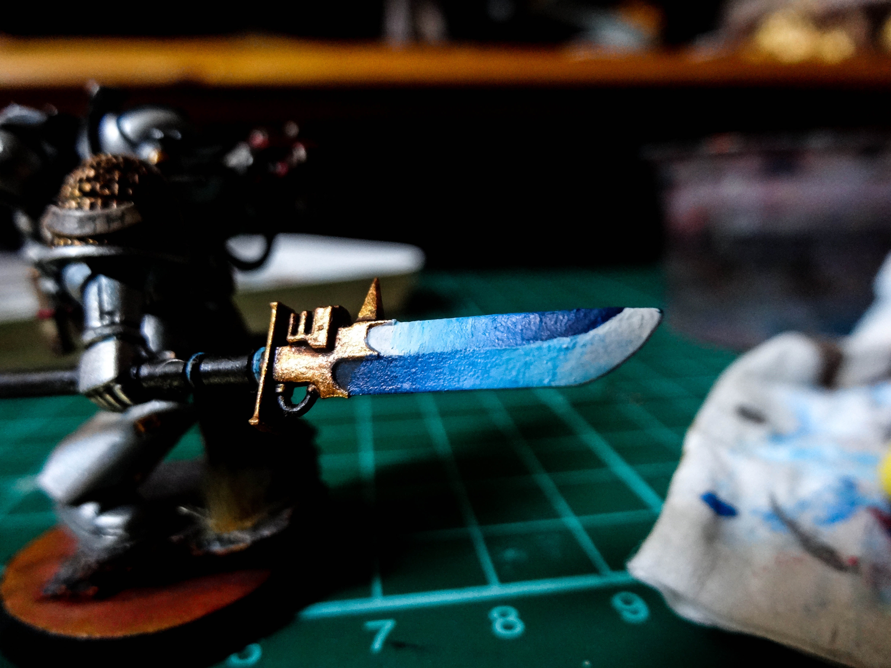

So here’s where we got to in Part 1 painting the Grey Knight and applying the Lava Bases:



The colours needed are:

**Kantor Blue, Caledor Sky, Lothern Blue, White Scar, Guilliman Blue, Druchii Violet**

## Eyes

The best place to start are the eyes. What I want to achieve is for the eyes to look like they're glowing through the lenses, while also radiating with a blue glow surrounding them. It just catches your eye that much better and gives the model a cooler look. Here’s a picture of what I want to achieve:



First I start with a dark blue base, **Kantor Blue** as seen above. Then I apply **Caledor Sky** to all but the corners of the eye:



Next I add** Lothern Blue** to the top of the eye:


Lastly I add a touch of **White Scar**:



Next I start the glow round the eyes. For this I use watered down **Lothern Blue** round the closest areas to the eyes:



Next I add a darker wash (**Guilliman Blue**) overlapping the outer regions of the first layer:


Now’s the tricky part of trying to blend it in with the silver. You just have to keep working with the wash and silver until it starts to blend in:



Above you can clearly see a line where the blue ends and the silver starts. That’s what you want to avoid. I'm still yet to master the technique but this is one of my better attempts so far (which after looking at the photo still doesn't look great):


## Gun Effects

The gun effects I'm using were purchased from **[Armorcast](https://armorcast.com/cinematic-effects/)**. They are made from white metal so I have recast them using an epoxy putty to stop the models from tipping. The casts are a good quality and so far I've not seen anything else like them out there.

In the same way as the eyes give them a dark blue base, then a lighter blue drybrush. At this point I also added a **Druchii Violet** wash around the blast area and back of the blast paths to give them a bit of extra colour. It also helps to tone down the brightness of the blue from the hottest part of the blast.

This same technique can be used for the larger blast effects. It should be darker close to the gun and get lighter the further out you get. The only exception is to add shading behind the orbs, so the back of the orb is darker than the front.


Next I added the lighter blue highlight and finally a white highlight, emphasizing the tips of the blast and right at the ends of the blast paths, as those would be the hottest areas. With that the blast is complete.


## Force Weapon

When painting force weapons you want the faces of the blade to go from dark blue to white. The key idea is to have each face opposite to the other. Personally I like having the lightest part of the blade to be the bottom tip, as its the catches the eye the best and is a larger area on halberds.

This means the bottom half of the blade will get darker as it gets closer to the hilt, meaning the top half must start light at the hilt and get darker towards the tip.

I find the best way to do this with a brush is to break each face into quarters. I use **Kantor Blue, Caledor Sky, Lothern Blue** and** White Scar **to paint the blade as shown below. Note that even though I've thinned down the paints its still pretty blobbly. This shows how careful you have to be at this stage and it will require lots of thin layers to get a smooth result. If this does happen to you, make sure that you water further layers down even more than usual and it should help smooth the surface down.



Next I mix the two darker blues together and add a stripe between them helping the transition. Then using the two paints watered down I finish blending them together. I then repeat this for the white and lighter blue.



Lastly I repeat the process for the middle colours to give the following result:



At this point the models are done! Here’s a few pics of the results:

```grid|2


```
