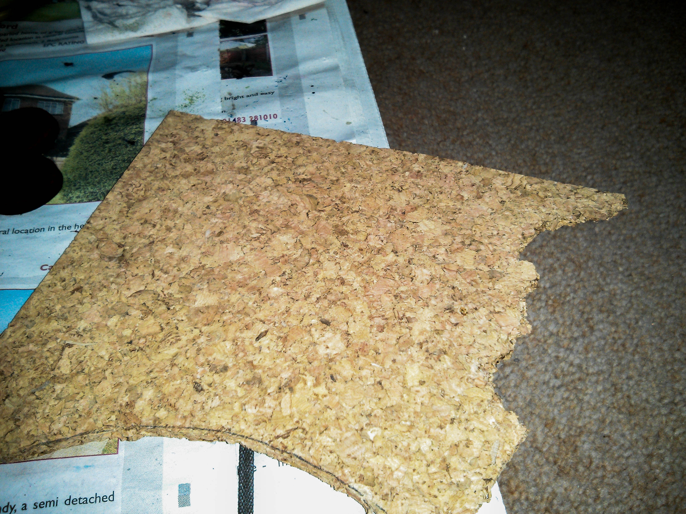

This tutorial concludes the series on how to paint Grey Knights by adding the classic lava bases, although this could be used for any miniatures. For the previous tutorials on painting Grey Knights see Part 1 and Part 2.

I find the base is just as important to the overall look of a model as the paint job itself. The time spent on the base should be proportionate to the time spent on the model, meaning more epic the model, more epic the base!

The good thing about bases are that they are pretty quick to do, but make a massive impact. A good base can make even a a basic tabletop quality model look professional on the battlefield as it really catches your eye.

It’s also perfect for the characters in your army, as height and scenic effects can be added to make them really stand out. I hate it when I see an amazingly painted model, but on a poor 30 second base as it drags down the overall quality of the model.

In this tutorial I'll show you how I make my lava bases for my Grey Knights. It’s best to keep all your bases consistent with the same material and colours to keep the army uniform. Normally I do all my bases in one large batch, but for this tutorial I've chosen to focus on a batch of five bases.

The materials you’ll need are:

- Cork Board – Plenty available on eBay as well as many local shops. Thickness can vary so go with what you prefer.
- [Super Glue](http://www.minitothemax.com/review-gale-force-nine-hobby-glue/) - Gale Force Nine.
- [Mordheim Turf](http://www.games-workshop.com/en-GB/Mordheim-Turf?_requestid=5217993) (Games Workshop)
- [Citadel Sand](http://www.games-workshop.com/en-GB/Citadel-Sand) (Games Workshop)
- Paints
  - Abbadon Black
  - Rhinox Hide
  - Dawnstone
  - Rakarth Flesh
  - Khorne Red
  - Evil Sunz Scarlet
  - Squig Orange
  - Troll Slayer Orange
  - Averland Sunset
  - Agrax Earthshade
  - Nuln Oil

First off you want to give your bases a base layer. Add a couple of layers of Khorne Red until you get a solid base colour, then add a thin layer of Evil Sunz Scarlet to give the base a slightly streaky appearance. This starts to give the feel of the lava moving. Then give the bases a heavy wash of Agrax Earthshade to give the appearance of the different temperatures of the lava. Lastly paint round the outside of each base with Abbadon Black to give a nice contrast.


With the bases given their base layer, we move onto the rocks.



Here you can see the cork I use for making the rocks. I find it's a great material to use as when torn the edges look great and when drybrushed it looks just like stone. It's also light weight compared to using actual stones and its flat on top making gluing on models nice and easy.

First I rip some off cork ensuring that there are no straight edges and try to get some different shapes and sizes to mix things up a bit. Then I give them a black base coat.


Next I add a Rhinox Hide drybrush just so the rocks won’t look plain grey at the end.


Next up is a heavy drybrush of Dawnstone.


Now wash heavily with both Nuln Oil and Agrax Earthshade to bring back the texture of the cork and give them more definition.


Next very lightly drybrush the cork using Rakarth Flesh. This gives the rocks a highlight that ensures detail isn't lost from the washes.


The final stage is to drybrush the edges of the cork with all your lava colours, moving from a red all the way up to yellow. This gives a nice OSL effect showing the heat of the glowing lava.

What you’re aiming for is where the rock meets the base to be dark red and the highest places the lava reaches on the rocks to be yellow, with a gradient in between. Note that you don’t want the lava going too high, as you don’t want your models feet getting hot!

With this done glue the rocks onto the bases in a way that the models feet can be glued to the rocks, avoiding the lava.


With the rocks attached, I start with Evil Sunz Scarlet, covering all but the lava closet to the rock. You want the lava closet to the rock to look cooler, while the lava further out looks hotter (brighter).


Next add the oranges (Squig Orange and  Troll Slayer Orange) leaving a thin ring of my last layer untouched each time. Then add the Averland Sunset as a final highlight, applying it carefully as you don’t want it to be too bright at this stage.


Agrax Earthshade is then added to help blend the colours together and to dampen the brightness of the colour, giving a real appearance of lava.


All that needs doing now is to smooth out those transitions a bit more using the watered down colours that match the relevant transition. An example being the left most base having an obvious line between the red and the orange. To fix this I watered down the Squig Orange and applied it over the line to blend the colours together.

Once complete a final yellow or even fine white highlight can then be added to bring out the temperature of the lava.

With the bases complete the models can be attached, along with the grass clumps to add further variety.


This  technique can be applied to the rest of your army. For character bases, I add an extra layer of rock and use Greenstuff to create bubbles, with the top of the bubble being brightest and the lower darker, like so..


This can even be applied for flying bases. The larger rocks are just lumps of bark found outside and cut into shape and the gravel is Citadel Sand.

## Gallery

```grid|2


```
