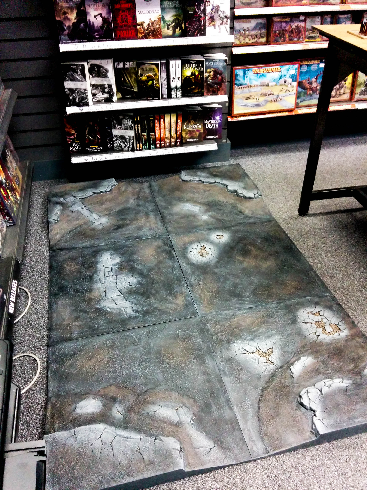
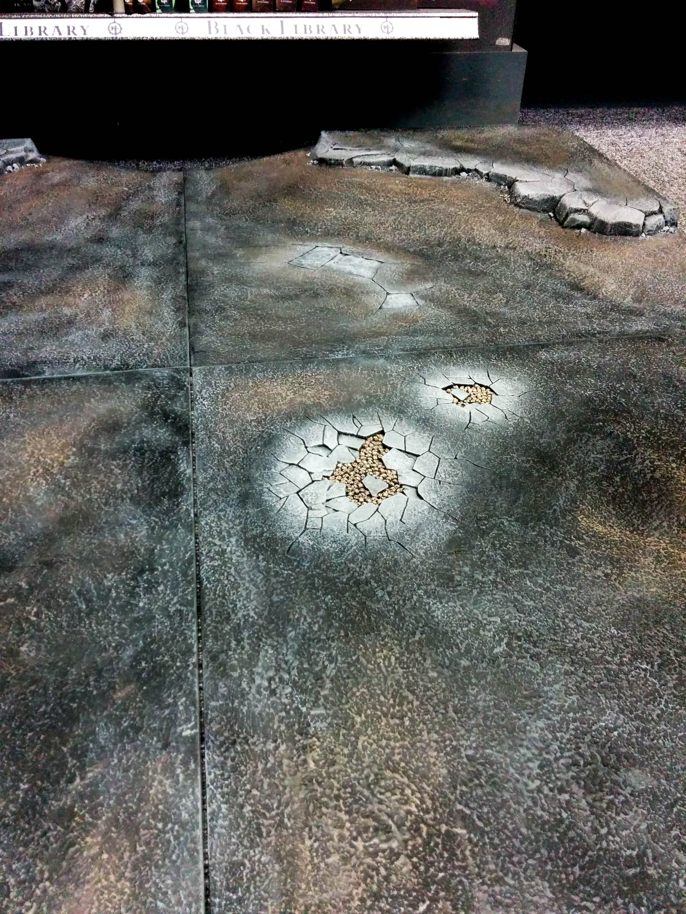
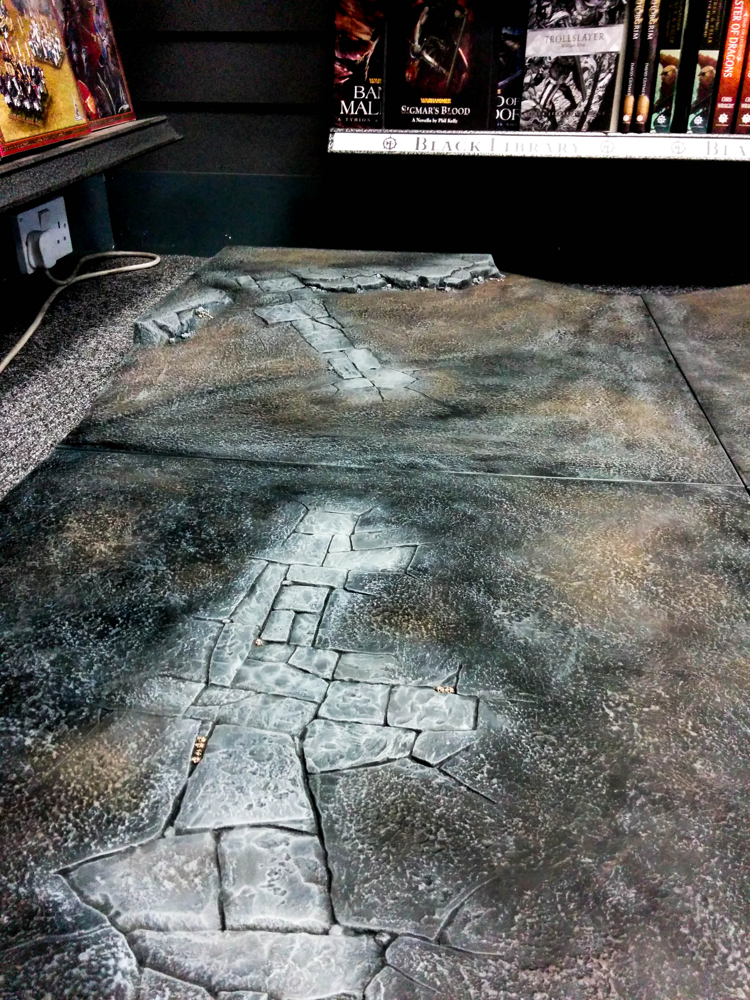
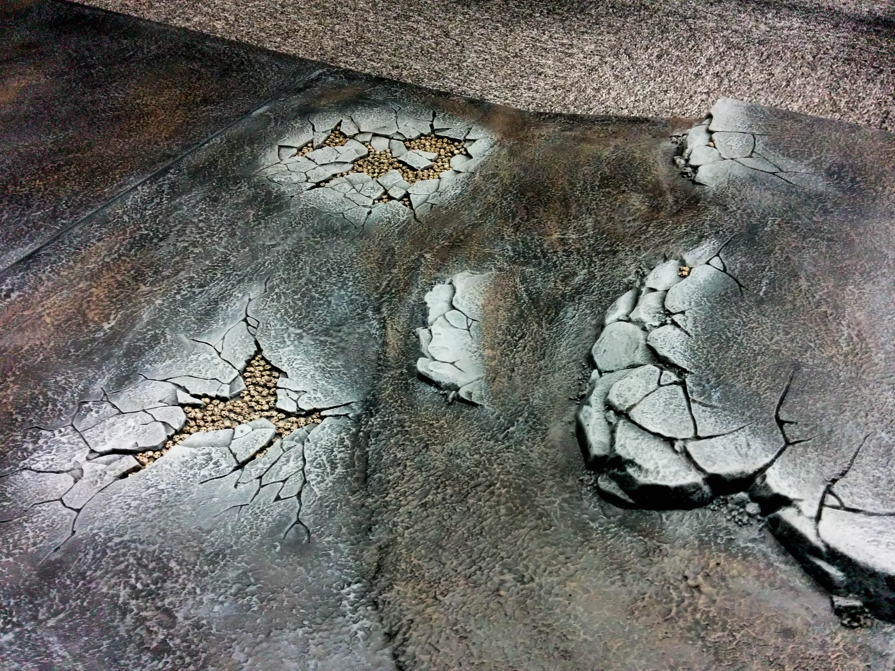

So I’ve been going down to my local Games Workshop for a couple of hours every other week and the result is a near complete set of Realm of Battle Boards! These battle boards are now fully painted and just in need of some snow and ice! They were pretty fun to paint and not too difficult. The more drybrushing you do the more it all starts to come together and look more and more realistic.

## Tutorial

Here’s the colours I used for each drybrushing step, each applied in a slightly different way:

1.  Abaddon Black - Spray basecoat.
2.  Eshin Grey - Very heavy drybrush, you don't want the boards to look too dark.
3.  Skavenblight Dinge - Another heavy drybrush just to brighten up the board.
4.  Dryad Dark - Patches, a few brown areas help to break up the solid grey colour of the boards.
5.  Dawnstone - Heavy on the rock areas, very light on the rest.
6.  Administratum Grey -Focus on rocks, only very light on other odd patches.
7.  Gorthor Brown - A highlight for the Dryad Dark patches to bring out the brown a little bit more after the previous grey highlights.

Next I used Nuln Oil in all the recesses to give more contrast on the cracks, making them look much deeper and putting more emphasis on them.

Lastly the skulls and bones were base coated with Rakarth Flesh, then layered with Bleached Bone (old paint), then washed heavily with Agrax Earthshade and finally drybrushed with Screaming Skull.

## WIP

I have bought all my materials for the ice and snow. I just need to have a good practice before applying it all on the boards. I need to find a way to apply the snow in a way that it won't easily brush off and I need to make sure I get the ratio correct between the water effects and paint when making the ice to ensure the skulls can still be seen.

Let me know what you think and here’s the rest of the pictures…

## Gallery

```grid|3



```

```grid|2


```
