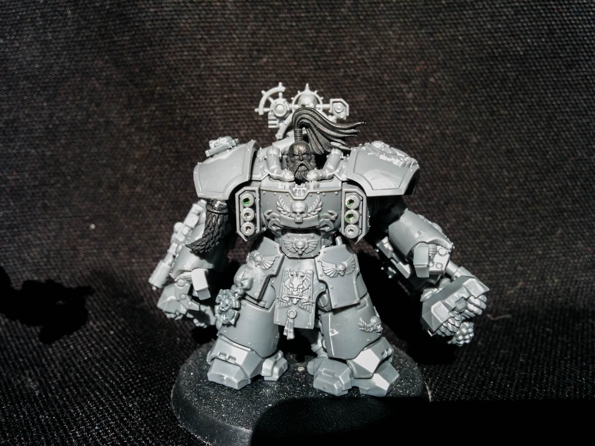
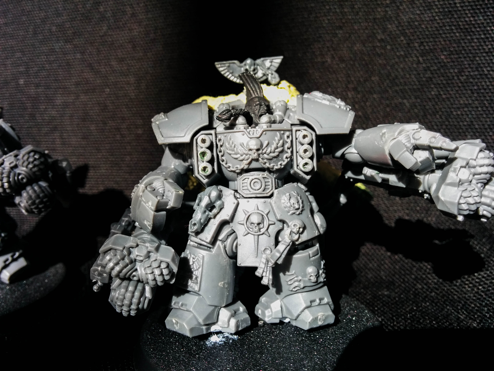
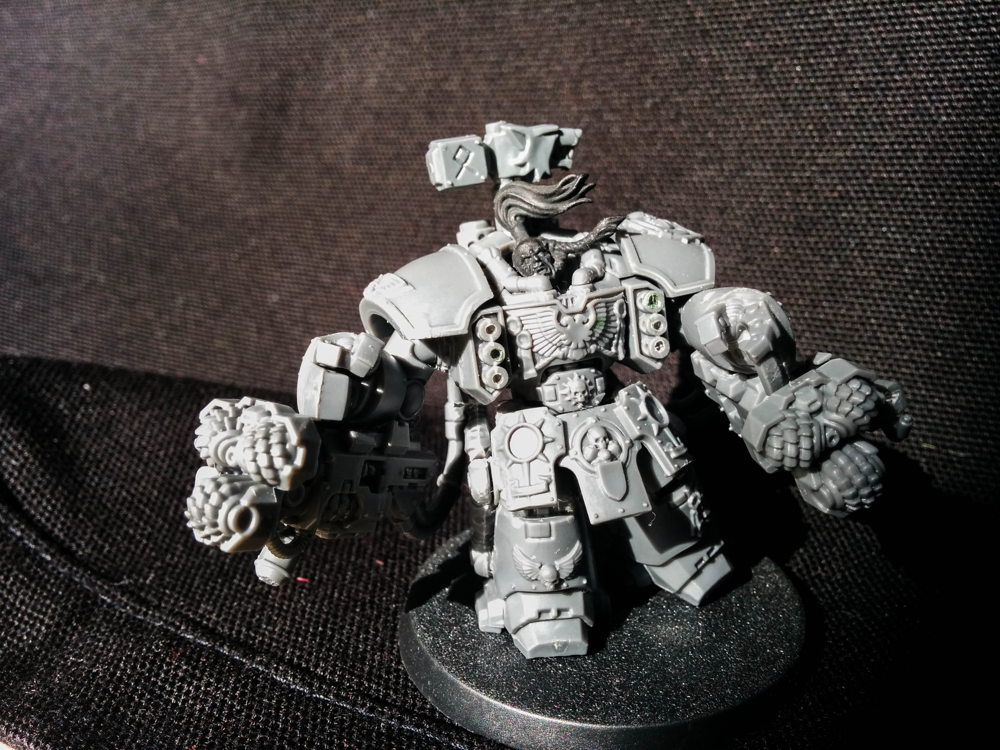
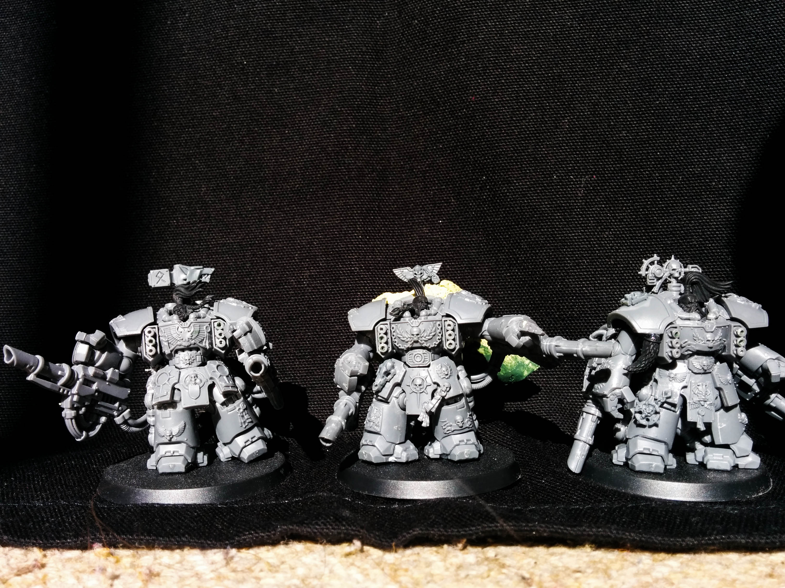
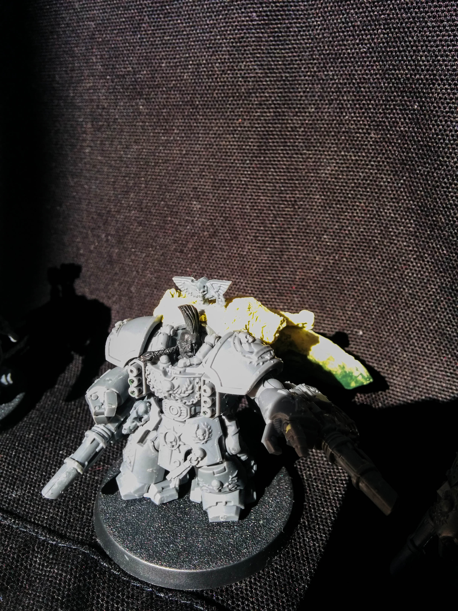
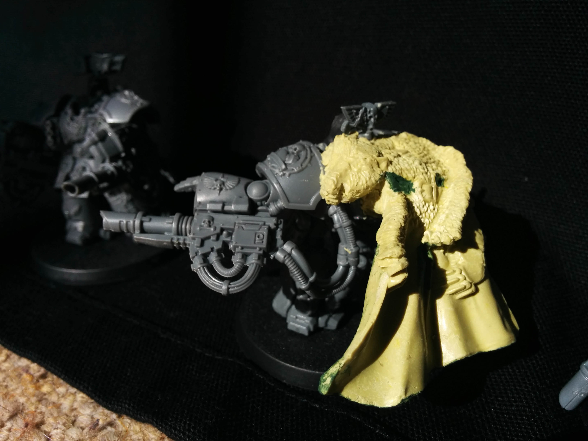

After my Space Marine purchases last week, I've finally got my Space Wolf Centurions fully assembled. I only added a few bits onto each to blend them into my Space Wolf army. The main change was to swap the heads, but a few more subtle additions include wolf pelts and trinkets, a forge hammer standard and a full blown wolf cloak for the captain.

Admittedly the cloak look absolutely massive right now, but I'm hoping that's more due to it being a different colour, rather than it being out of place. As it's meant to fit a terminator chaplain, I can't see it would be too big for a Centurion!

```grid|3



```

I did some work repositioning the legs to give them a bit more of a sense of movement. Despite the first two still looking fairly stationary, the pose of the legs now matches the pose of the arms much more closely and looks much more natural than the way they come in the box. Of the three Centurions I think the last is my favourite. The pose is great, like he's sprinting forward, full of bestial blood-lust desperate to tear open whoever or whatever he can.

```grid|3



```
